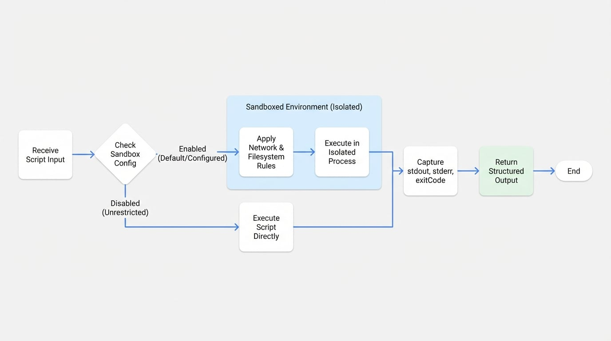

# Bash

Bash Agent 提供了一種安全且受控的方法，用於在代理工作流程中執行 shell 指令碼和命令列工具。本文件詳細介紹其功能、設定以及系統級操作的最佳實踐。透過本指南，您將學習如何整合和利用 Bash Agent 來執行檔案操作、程序管理和自動化等任務。

## 概述

Bash Agent 旨在受控環境中執行 bash 指令碼，利用 [Anthropic's Sandbox Runtime](https://github.com/anthropic-experimental/sandbox-runtime) 來增強安全性。它會擷取並串流標準輸出（`stdout`）、標準錯誤（`stderr`）以及最終的退出碼，從而提供關於指令碼執行的全面回饋。

下圖說明了 Bash Agent 如何在安全的沙箱內執行指令碼，控制檔案系統和網路存取，同時將輸出串流回傳給使用者。

<!-- DIAGRAM_IMAGE_START:architecture:16:9 -->

<!-- DIAGRAM_IMAGE_END -->

主要功能包括：
- **沙箱化執行**：指令碼在具有可設定安全策略的隔離環境中執行。
- **網路控制**：透過白名單或黑名單管理網路存取。
- **檔案系統控制**：為檔案和目錄定義特定的讀取和寫入權限。
- **即時輸出**：在指令碼執行時串流 `stdout` 和 `stderr`。
- **退出碼追蹤**：擷取指令碼的退出碼，以驗證成功或處理錯誤。

## 輸入

此 Agent 的輸入物件接受一個必要的參數。

<x-field-group>
  <x-field data-name="script" data-type="string" data-required="true" data-desc="要執行的 bash 指令碼。"></x-field>
</x-field-group>

## 輸出

此 Agent 回傳一個包含指令碼執行結果的物件。

<x-field-group>
  <x-field data-name="stdout" data-type="string" data-required="false" data-desc="指令碼產生的標準輸出串流。"></x-field>
  <x-field data-name="stderr" data-type="string" data-required="false" data-desc="指令碼產生的標準錯誤串流。"></x-field>
  <x-field data-name="exitCode" data-type="number" data-required="false" data-desc="指令碼完成後回傳的退出碼。值為 0 通常表示成功。"></x-field>
</x-field-group>

## 基本用法

使用 Bash Agent 最直接的方式是透過 YAML 設定檔。這種方式允許以宣告式的方法來定義 Agent 的行為和安全限制。

```yaml bash-agent.yaml icon=lucide:file-code
type: "@aigne/agent-library/bash"
name: Bash
# 沙箱預設啟用，並採用嚴格設定。
# 詳細選項請參閱「沙箱設定」部分。
```

若要執行此 Agent，您可以使用 AIGNE CLI，並將指令碼作為參數傳入。

```bash icon=lucide:terminal
aigne run . Bash --script 'echo "Hello from the Bash Agent!"'
```

## 設定

Bash Agent 可以使用多個選項進行設定，以調整其行為，特別是在執行環境方面。

### Agent 選項

這些選項在 Agent 的 YAML 定義的頂層指定。

<x-field-group>
  <x-field data-name="sandbox" data-type="object | boolean" data-required="false" data-default="true">
    <x-field-desc markdown>控制沙箱化的執行環境。設定為 `false` 可完全停用沙箱，或提供一個設定物件來自訂其限制。預設情況下，沙箱是啟用的。</x-field-desc>
  </x-field>
</x-field-group>

### 停用沙箱

對於受信任的環境或不支援沙箱的平台（例如 Windows），您可以停用它。

:::warning
停用沙箱會移除 Agent 提供的所有安全保護。只有在完全受信任且已知所執行的指令碼是安全的環境中，才應這樣做。
:::

```yaml bash-agent.yaml icon=lucide:file-code
type: "@aigne/agent-library/bash"
name: Bash
sandbox: false # 停用沙箱
```

## 沙箱設定

當 `sandbox` 選項啟用時，您可以提供一個設定物件，為網路和檔案系統存取定義精細的安全策略。

### 網路設定

透過指定允許和拒絕的網域來控制 Agent 的網路存取。

```yaml bash-agent.yaml icon=lucide:file-code
type: "@aigne/agent-library/bash"
name: Bash
sandbox:
  network:
    # 指令碼被允許連線的網域清單。支援萬用字元 (*)。
    allowedDomains:
      - "*.example.com"
      - "api.github.com"
    # 指令碼被禁止連線的網域清單。此項目的優先級高於 allowedDomains。
    deniedDomains:
      - "*.ads.com"
```

### 檔案系統設定

定義指令碼可以讀取和寫入檔案系統的哪些部分。

```yaml bash-agent.yaml icon=lucide:file-code
type: "@aigne/agent-library/bash"
name: Bash
sandbox:
  filesystem:
    # 允許指令碼寫入的檔案路徑或模式清單。
    allowWrite:
      - "./output"
      - "/tmp"
    # 禁止指令碼讀取的檔案路徑或模式清單。
    denyRead:
      - "~/.ssh"
      - "*.key"
    # 禁止指令碼寫入的檔案路徑或模式清單。
    denyWrite:
      - "/etc"
      - "/usr"
```

### 完整範例

以下是一個完整的範例，展示了用於執行開發工具的完整沙箱設定。

```yaml bash-agent.yaml icon=lucide:file-code
type: "@aigne/agent-library/bash"
name: Bash
sandbox:
  network:
    allowedDomains:
      - "*.npmjs.org"
      - "registry.npmjs.org"
      - "github.com"
      - "api.github.com"
    deniedDomains:
      - "*.ads.com"
  filesystem:
    allowWrite:
      - "./output"
      - "./logs"
      - "/tmp"
    denyRead:
      - "~/.ssh"
      - "~/.aws"
      - "*.pem"
      - "*.key"
    denyWrite:
      - "/etc"
      - "/usr"
      - "/bin"
      - "/sbin"
```

## 平台支援

Bash Agent 的功能因作業系統而異，主要在於沙箱的可用性。

| 平台 | 沙箱支援 | 直接執行 |
| :--- | :--- | :--- |
| **Linux** | ✅ 完整支援 | ✅ 支援 |
| **macOS** | ✅ 完整支援 | ✅ 支援 |
| **Windows** | ❌ 不支援 | ✅ 支援 |

:::info
在 Windows 上，不支援沙箱模式。您必須在設定中設定 `sandbox: false` 才能使用 Bash Agent。在 Windows 上直接執行可能需要安裝 Windows Subsystem for Linux (WSL) 或 Git Bash 等環境。
:::

## 最佳實踐

為確保安全有效地使用 Bash Agent，請遵循以下實踐。

- **應用最小權限原則**：僅授予指令碼運作所需的最低權限。避免過於寬鬆的規則，例如允許寫入 `/` 或對 `*` 的網路存取。
- **處理退出碼**：務必檢查 Agent 輸出中的 `exitCode`。非零值表示發生錯誤，應檢查 `stderr` 串流以了解詳細資訊。
- **保護敏感檔案**：明確拒絕對包含敏感資訊的目錄和檔案的讀取權限，例如 `~/.ssh`、`.env` 檔案或私鑰。
- **使用特定的萬用字元**：在為網路或檔案系統規則使用萬用字元時，使其盡可能具體（例如，使用 `api.example.com` 而不是 `*.com`）。
- **記錄與稽核**：對於安全性至關重要的應用程式，記錄所有指令碼的執行，包括輸入的指令碼和產生的輸出，以保留稽核軌跡。