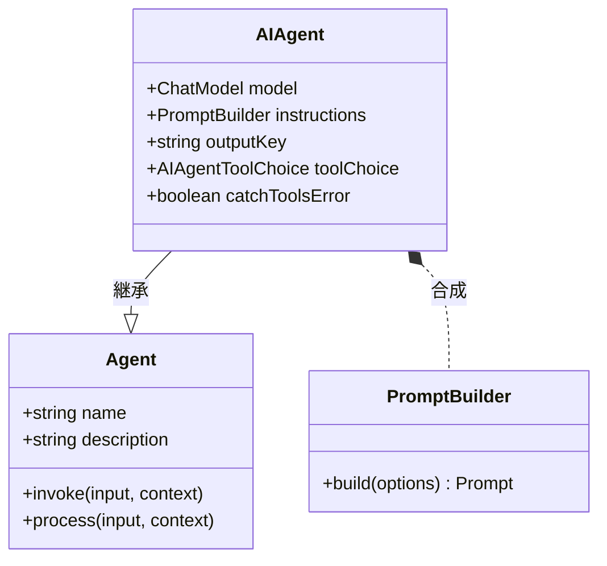

AI Agent は、チャットモデルを利用してユーザー入力を解釈し、応答を生成する特殊な Agent です。特定の指示、ツール（スキル）、メモリを設定して、幅広いタスクを処理できます。この Agent は、ユーザー、言語モデル、および提供する外部ツール間の橋渡しをするため、対話型 AI の作成において中心的な役割を果たします。

`AIAgent` の主な機能は次のとおりです。
- **直接的な LLM 統合**: 互換性のあるチャットモデルに接続し、インテリジェントで文脈を認識した応答を生成します。
- **カスタマイズ可能な指示**: プロンプトテンプレートを使用して、Agent の振る舞い、個性、タスクの焦点を調整します。
- **ツールと関数の呼び出し**: Agent に外部システム、API、またはデータベースと対話するスキルを付与します。
- **ストリーミング応答**: リアルタイムのトークンごとの応答を可能にし、ダイナミックなユーザーエクスペリエンスを実現します。
- **ルーターモード**: ユーザー入力に基づいて、他の特化した Agent にタスクをインテリジェントに委任するために Agent を使用します。
- **ステートフルなメモリ**: Agent にメモリを装備させ、以前の対話を記憶し、文脈を維持させます。

### クラス図

以下の図は、Agent 階層全体における `AIAgent` の位置を示しており、ベースの `Agent` クラスからの継承と `PromptBuilder` とのコンポジション（合成）関係を表しています。



## 設定オプション (AIAgentOptions)

`AIAgent` を作成する際に、`AIAgentOptions` オブジェクトを提供してその振る舞いをカスタマイズできます。このオブジェクトは、ベースの `AgentOptions` を拡張したものです。

| パラメータ | 型 | 説明 | デフォルト |
| --- | --- | --- | --- |
| `instructions` | `string \| PromptBuilder` | AI モデルの振る舞いをガイドするための指示。単純な文字列、または複雑なプロンプトテンプレート用の `PromptBuilder` インスタンスを指定できます。 | |
| `inputKey` | `string` | プライマリユーザーメッセージとして使用する、入力メッセージ内のキー。 | |
| `outputKey` | `string` | 応答メッセージの主要なテキスト出力に使用するキー。 | `"message"` |
| `toolChoice` | `AIAgentToolChoice \| Agent` | Agent がツールをどのように使用するかを制御します。enum 値またはルーターとして機能する別の Agent を指定できます。 | `auto` |
| `keepTextInToolUses` | `boolean` | `true` の場合、ツール実行中にモデルが生成したテキストは最終出力に保持されます。 | `false` |
| `catchToolsError` | `boolean` | `true` の場合、Agent はツール実行からのエラーをキャッチして処理を続行します。`false` の場合、エラーをスローします。 | `true` |
| `structuredStreamMode` | `boolean` | モデルのストリーミング応答を解析し、特定のタグで囲まれた構造化メタデータ（例：JSON）を抽出するモードを有効にします。 | `false` |
| `memoryAgentsAsTools` | `boolean` | `true` の場合、メモリ Agent は、モデルが情報を明示的に取得または保存するために呼び出せるツールとして公開されます。 | `false` |

### ツール選択オプション

`toolChoice` プロパティは、Agent が割り当てられたツール（スキル）を実行するために使用する戦略を決定します。

| 値 | 説明 |
| --- | --- |
| `auto` | 言語モデルが会話の文脈に基づいてツールを使用するかどうかを決定します。 |
| `none` | Agent のすべてのツール使用を無効にします。 |
| `required` | Agent に利用可能なツールのいずれかを使用させます。 |
| `router` | Agent はツールを 1 つだけ選択し、入力を直接そのツールにルーティングします。これは、委任者 Agent を作成するのに役立ちます。 |

## AIAgent の作成

`AIAgent` インスタンスは、そのコンストラクタまたは静的な `AIAgent.from()` ファクトリメソッドを使用して作成できます。最も一般的な方法は、YAML ファイルで設定を定義し、それを読み込むことです。

以下は、シンプルなチャット Agent の YAML 設定の例です。

**`chat.yaml`**
```yaml
name: chat
model: google/gemini-2.5-flash
task_title: "process: {{message}}"
alias:
  - chat-bot
  - bot
description: Chat agent
instructions: |
  You are a helpful assistant that can answer questions and provide information on a wide range of topics.
  Your goal is to assist users in finding the information they need and to engage in friendly conversation.
input_key: message
memory: true
skills:
  - sandbox.js
include_input_in_output: true
```

この設定は、Google Gemini モデルを使用し、明確な指示セットを持ち、メモリとサンドボックススキルを備えたチャット Agent を定義します。

## コアコンセプト

### 指示とプロンプティング

`instructions` プロパティは、`AIAgent` をガイドする主要な方法です。これはシステムプロンプトとして機能し、言語モデルのコンテキスト、個性、目標を設定します。静的な指示には単純な文字列を使用でき、入力やコンテキストから変数を組み込むことができる動的なプロンプトには `PromptBuilder` を活用できます。

### ツールの使用と関数の呼び出し

`skills`（他の Agent）を `AIAgent` に割り当てることで、テキスト生成以外のアクションを実行する能力を付与します。ユーザーのリクエストが外部アクションを必要とする場合、モデルは適切なツールへの「関数呼び出し」を開始できます。Agent はツールを実行し、結果を受け取り、その出力を使用して最終的な応答を生成します。これにより、Agent はデータの取得、API との対話、または計算を実行できます。

### 処理ワークフロー

`AIAgent` の内部 `process` メソッドは、言語モデルとツールとの対話を調整します。
1.  **プロンプトの構築**：システム指示、ユーザー入力、会話履歴（メモリ）、および利用可能なツールの定義を組み合わせて、モデルに送信される最終的なプロンプトを構築します。
2.  **モデルの呼び出し**：設定されたチャットモデルにリクエストを送信します。
3.  **応答の処理**：モデルの出力を処理します。出力は、直接的なテキスト応答か、ツールを呼び出すリクエストのいずれかです。
    - ツール呼び出しが要求された場合、Agent はツールを実行します。
    - ツールの出力は、新しいリクエストでモデルに送り返されます。
    - このループは、モデルがユーザーへの最終的な応答を生成するまで続きます。
4.  **ストリーミング出力**：最終的な応答は、リアルタイム出力を可能にする差分オブジェクトのストリームとして生成されます。