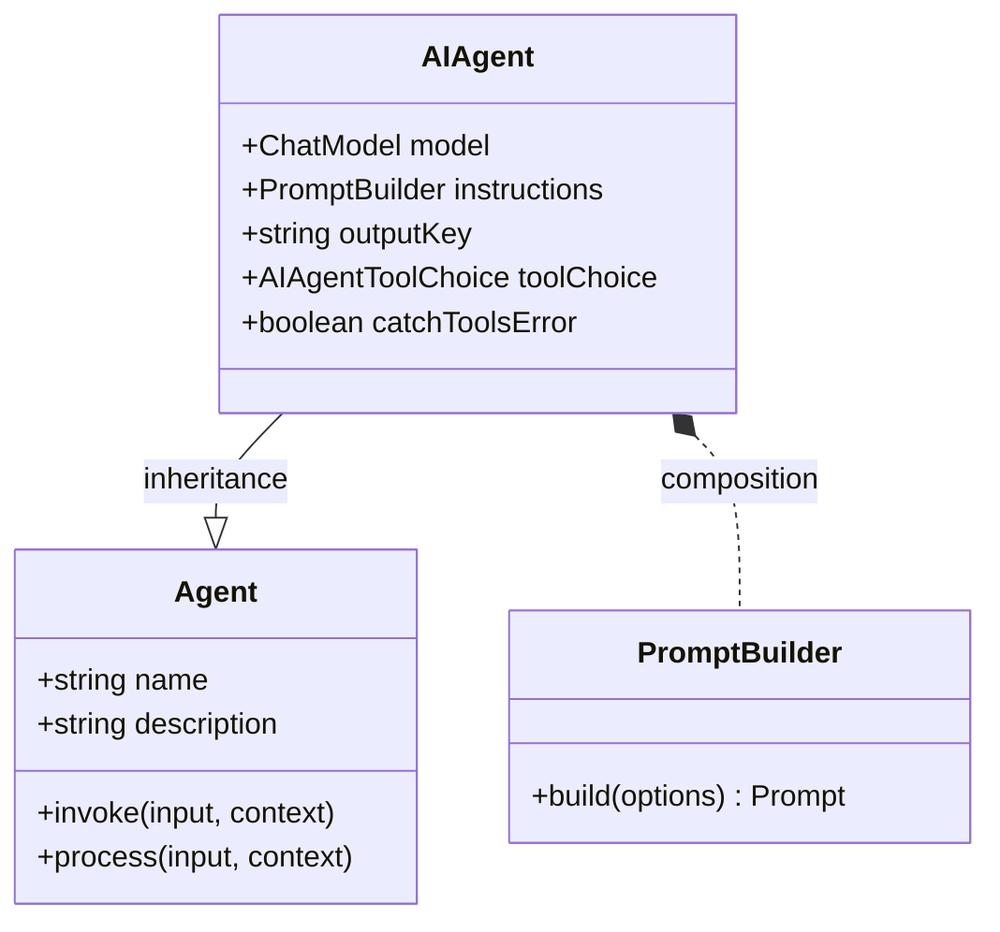

An AI Agent is a specialized agent that utilizes a chat model to interpret user input and generate responses. It can be configured with specific instructions, tools (skills), and memory to handle a wide range of tasks. This agent is central to creating conversational AI, as it forms the bridge between the user, the language model, and any external tools you provide.

The key features of the `AIAgent` include:
- **Direct LLM Integration**: Connects to any compatible chat model to generate intelligent and context-aware responses.
- **Customizable Instructions**: Tailor the agent's behavior, personality, and task focus using prompt templates.
- **Tool and Function Calling**: Grant the agent skills to interact with external systems, APIs, or databases.
- **Streaming Responses**: Enable real-time, token-by-token responses for dynamic user experiences.
- **Router Mode**: Use the agent to intelligently delegate tasks to other specialized agents based on user input.
- **Stateful Memory**: Equip the agent with memory to recall previous interactions and maintain context.

### Class Diagram

The following diagram illustrates the position of `AIAgent` within the overall agent hierarchy, showing its inheritance from the base `Agent` class and its composition with the `PromptBuilder`.



## Configuration Options (AIAgentOptions)

When creating an `AIAgent`, you can provide an `AIAgentOptions` object to customize its behavior. This object extends the base `AgentOptions`.

| Parameter | Type | Description | Default |
| --- | --- | --- | --- |
| `instructions` | `string \| PromptBuilder` | Instructions to guide the AI model's behavior. This can be a simple string or a `PromptBuilder` instance for complex prompt templating. | |
| `inputKey` | `string` | The key in the input message to use as the primary user message. | |
| `outputKey` | `string` | The key to use for the main text output in the response message. | `"message"` |
| `toolChoice` | `AIAgentToolChoice \| Agent` | Controls how the agent uses tools. Can be an enum value or another agent to act as a router. | `auto` |
| `keepTextInToolUses` | `boolean` | If `true`, text generated by the model during tool execution is preserved in the final output. | `false` |
| `catchToolsError` | `boolean` | If `true`, the agent will catch errors from tool execution and continue processing. If `false`, it will throw an error. | `true` |
| `structuredStreamMode` | `boolean` | Enables a mode where the model's streaming response is parsed to extract structured metadata (e.g., JSON) enclosed in specific tags. | `false` |
| `memoryAgentsAsTools` | `boolean` | If `true`, memory agents are exposed as tools that the model can call to explicitly retrieve or store information. | `false` |

### Tool Choice Options

The `toolChoice` property determines the strategy the agent uses for executing its assigned tools (skills).

| Value | Description |
| --- | --- |
| `auto` | The language model decides whether to use a tool based on the conversation context. |
| `none` | Disables all tool usage for the agent. |
| `required` | Forces the agent to use one of the available tools. |
| `router` | The agent selects exactly one tool and routes the input directly to it. This is useful for creating delegator agents. |

## Creating an AIAgent

You can create an `AIAgent` instance using its constructor or the static `AIAgent.from()` factory method. The most common way is by defining its configuration in a YAML file and loading it.

Here is an example of a YAML configuration for a simple chat agent:

**`chat.yaml`**
```yaml
name: chat
model: google/gemini-2.5-flash
task_title: "process: {{message}}"
alias:
  - chat-bot
  - bot
description: Chat agent
instructions: |
  You are a helpful assistant that can answer questions and provide information on a wide range of topics.
  Your goal is to assist users in finding the information they need and to engage in friendly conversation.
input_key: message
memory: true
skills:
  - sandbox.js
include_input_in_output: true
```

This configuration defines a chat agent that uses a Google Gemini model, has a clear set of instructions, and is equipped with memory and a sandboxing skill.

## Core Concepts

### Instructions and Prompting

The `instructions` property is the primary way to guide the `AIAgent`. It acts as the system prompt, setting the context, personality, and goals for the language model. You can use simple strings for static instructions or leverage the `PromptBuilder` for dynamic prompts that can incorporate variables from the input or context.

### Tool Usage and Function Calling

By assigning `skills` (other agents) to an `AIAgent`, you give it the ability to perform actions beyond generating text. When a user's request requires an external action, the model can initiate a "function call" to the appropriate tool. The agent executes the tool, receives the result, and uses that output to inform its final response. This allows the agent to fetch data, interact with APIs, or perform calculations.

### Processing Workflow

The `AIAgent`'s internal `process` method orchestrates the interaction with the language model and tools:
1.  **Prompt Construction**: It builds the final prompt sent to the model by combining system instructions, user input, conversation history (memory), and available tool definitions.
2.  **Model Invocation**: It sends the request to the configured chat model.
3.  **Response Handling**: It processes the model's output, which can be a direct text response or a request to call a tool.
    - If a tool call is requested, the agent executes the tool.
    - The tool's output is sent back to the model in a new request.
    - This loop continues until the model generates a final response to the user.
4.  **Streaming Output**: The final response is yielded as a stream of delta objects, allowing for real-time output.