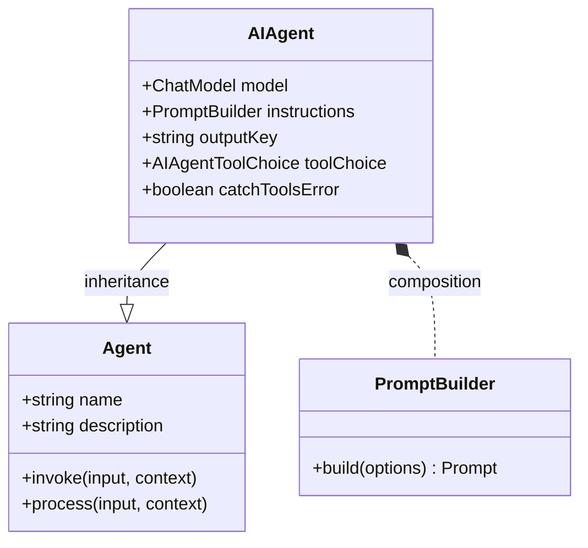

AI Agent 是一種特殊的 Agent，它利用聊天模型來解讀使用者輸入並生成回應。它可以配置特定的指令、工具（技能）和記憶體，以處理廣泛的任務。此 Agent 是建立對話式 AI 的核心，它構建了使用者、語言模型以及您提供的任何外部工具之間的橋樑。

`AIAgent` 的主要功能包括：
- **直接整合 LLM**：連接到任何相容的聊天模型，以生成智慧且具情境感知的回應。
- **可自訂的指令**：使用提示詞模板來客製化 Agent 的行為、個性和任務重點。
- **工具與函式呼叫**：賦予 Agent 與外部系統、API 或資料庫互動的技能。
- **串流回應**：啟用即時、逐詞元的回應，以提供動態的使用者體驗。
- **路由器模式**：使用 Agent 根據使用者輸入，智慧地將任務委派給其他專門的 Agent。
- **具狀態的記憶體**：為 Agent 配備記憶體，以回憶先前的互動並維持情境。

### 類別圖

下圖說明了 `AIAgent` 在整個 Agent 層級結構中的位置，展示了它對基底 `Agent` 類別的繼承關係，以及與 `PromptBuilder` 的組合關係。



## 設定選項 (AIAgentOptions)

在建立 `AIAgent` 時，您可以提供一個 `AIAgentOptions` 物件來自訂其行為。此物件擴充了基底的 `AgentOptions`。

| 參數 | 類型 | 說明 | 預設值 |
| --- | --- | --- | --- |
| `instructions` | `string \| PromptBuilder` | 用來指導 AI 模型行為的指令。可以是一個簡單的字串，或是一個用於複雜提示詞模板的 `PromptBuilder` 實例。 | |
| `inputKey` | `string` | 輸入訊息中用作主要使用者訊息的鍵。 | |
| `outputKey` | `string` | 回應訊息中用於主要文字輸出的鍵。 | `"message"` |
| `toolChoice` | `AIAgentToolChoice \| Agent` | 控制 Agent 如何使用工具。可以是一個列舉值或另一個充當路由器的 Agent。 | `auto` |
| `keepTextInToolUses` | `boolean` | 若為 `true`，模型在工具執行期間生成的文字將保留在最終輸出中。 | `false` |
| `catchToolsError` | `boolean` | 若為 `true`，Agent 將捕獲工具執行時的錯誤並繼續處理。若為 `false`，則會拋出錯誤。 | `true` |
| `structuredStreamMode` | `boolean` | 啟用一種模式，在該模式下，模型的串流回應會被解析，以提取包含在特定標籤內的結構化元資料（例如 JSON）。 | `false` |
| `memoryAgentsAsTools` | `boolean` | 若為 `true`，memory agents 會作為工具暴露出來，模型可以呼叫它們來明確地檢索或儲存資訊。 | `false` |

### 工具選擇選項

`toolChoice` 屬性決定了 Agent 執行其分配的工具（技能）時所使用的策略。

| 值 | 說明 |
| --- | --- |
| `auto` | 語言模型根據對話情境決定是否使用工具。 |
| `none` | 停用 Agent 的所有工具使用。 |
| `required` | 強制 Agent 使用其中一個可用的工具。 |
| `router` | Agent 會選擇一個工具，並將輸入直接路由到該工具。這對於建立委派者 Agent 很有用。 |

## 建立 AIAgent

您可以使用其建構函式或靜態的 `AIAgent.from()` 工廠方法來建立 `AIAgent` 實例。最常見的方式是在 YAML 檔案中定義其設定並載入它。

以下是一個簡單聊天 Agent 的 YAML 設定範例：

**`chat.yaml`**
```yaml
name: chat
model: google/gemini-2.5-flash
task_title: "process: {{message}}"
alias:
  - chat-bot
  - bot
description: 聊天 Agent
instructions: |
  您是一位樂於助人的助理，可以回答問題並提供關於各種主題的資訊。
  您的目標是協助使用者找到他們需要的資訊，並進行友好的對話。
input_key: message
memory: true
skills:
  - sandbox.js
include_input_in_output: true
```

此設定定義了一個聊天 Agent，它使用 Google Gemini 模型，有一套清晰的指令，並配備了記憶體和沙盒技能。

## 核心概念

### 指令與提示詞

`instructions` 屬性是指導 `AIAgent` 的主要方式。它作為系統提示詞，為語言模型設定情境、個性和目標。您可以使用簡單的字串進行靜態指令，或利用 `PromptBuilder` 來建立可以整合輸入或情境中變數的動態提示詞。

### 工具使用與函式呼叫

透過將 `skills`（其他 Agent）分配給 `AIAgent`，您賦予了它執行文字生成以外動作的能力。當使用者的請求需要外部動作時，模型可以對相應的工具發起「函式呼叫」。Agent 會執行該工具，接收結果，並使用該輸出資訊來生成最終回應。這使得 Agent 能夠擷取資料、與 API 互動或執行計算。

### 處理工作流程

`AIAgent` 的內部 `process` 方法協調與語言模型和工具的互動：
1.  **提示詞建構**：它透過結合系統指令、使用者輸入、對話歷史（記憶體）和可用的工具定義，來建構發送給模型的最終提示詞。
2.  **模型呼叫**：它將請求發送至設定的聊天模型。
3.  **回應處理**：它處理模型的輸出，輸出可能是一個直接的文字回應，也可能是一個呼叫工具的請求。
    - 如果請求了工具呼叫，Agent 會執行該工具。
    - 工具的輸出會在一個新的請求中傳回給模型。
    - 此循環會一直持續，直到模型為使用者生成最終回應為止。
4.  **串流輸出**：最終回應以差異物件串流的形式產生，從而實現即時輸出。