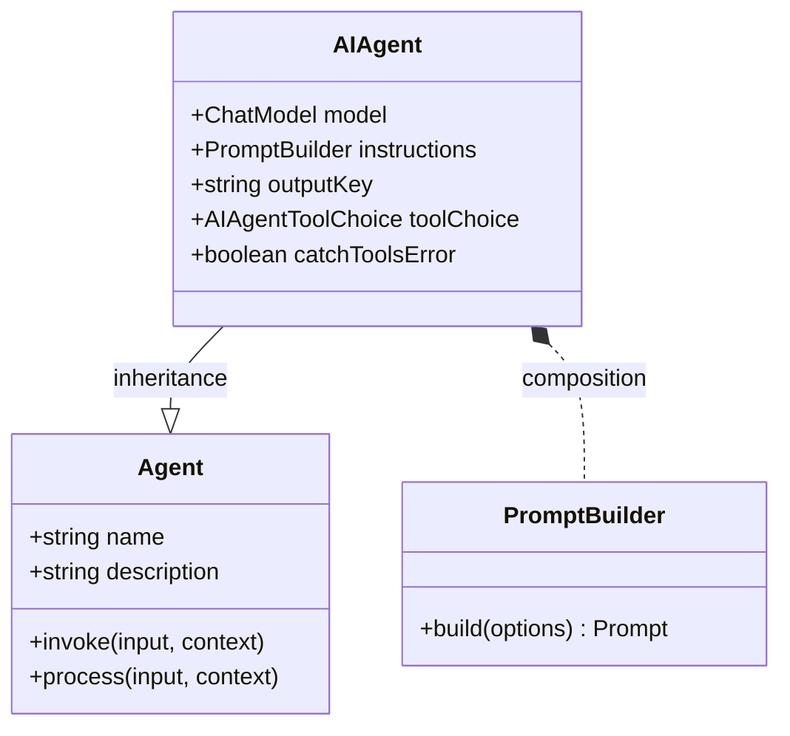

AI Agent 是一种专门的 Agent，它利用聊天模型来解释用户输入并生成响应。它可以配置特定的指令、工具 (技能) 和记忆，以处理广泛的任务。这种 Agent 是创建对话式 AI 的核心，因为它构成了用户、语言模型和您提供的任何外部工具之间的桥梁。

`AIAgent` 的主要特性包括：
- **直接 LLM 集成**：连接到任何兼容的聊天模型，以生成智能且具有上下文感知能力的响应。
- **可定制指令**：使用提示模板定制 Agent 的行为、个性和任务重点。
- **工具和函数调用**：赋予 Agent 与外部系统、API 或数据库交互的技能。
- **流式响应**：支持实时的、逐个令牌的响应，以实现动态用户体验。
- **路由器模式**：使用 Agent 根据用户输入智能地将任务委托给其他专门的 Agent。
- **有状态记忆**：为 Agent 配备记忆功能，以回忆之前的交互并保持上下文。

### 类图

下图说明了 `AIAgent` 在整个 Agent 层次结构中的位置，展示了它对基类 `Agent` 的继承以及与 `PromptBuilder` 的组合关系。



## 配置选项 (AIAgentOptions)

在创建 `AIAgent` 时，您可以提供一个 `AIAgentOptions` 对象来定制其行为。该对象扩展了基础的 `AgentOptions`。

| Parameter | Type | Description | Default |
| --- | --- | --- | --- |
| `instructions` | `string \| PromptBuilder` | 指导 AI 模型行为的指令。可以是一个简单的字符串，也可以是用于复杂提示模板的 `PromptBuilder` 实例。 | |
| `inputKey` | `string` | 输入消息中用作主要用户消息的键。 | |
| `outputKey` | `string` | 响应消息中用于主要文本输出的键。 | `"message"` |
| `toolChoice` | `AIAgentToolChoice \| Agent` | 控制 Agent 如何使用工具。可以是一个枚举值，也可以是另一个充当路由器的 Agent。 | `auto` |
| `keepTextInToolUses` | `boolean` | 如果为 `true`，模型在工具执行期间生成的文本将保留在最终输出中。 | `false` |
| `catchToolsError` | `boolean` | 如果为 `true`，Agent 将捕获工具执行中的错误并继续处理。如果为 `false`，它将抛出错误。 | `true` |
| `structuredStreamMode` | `boolean` | 启用一种模式，在该模式下，模型的流式响应被解析以提取包含在特定标签内的结构化元数据（例如 JSON）。 | `false` |
| `memoryAgentsAsTools` | `boolean` | 如果为 `true`，记忆 Agent 将作为工具暴露，模型可以调用这些工具来明确检索或存储信息。 | `false` |

### 工具选择选项

`toolChoice` 属性决定了 Agent 执行其分配的工具（技能）时所使用的策略。

| Value | Description |
| --- | --- |
| `auto` | 语言模型根据对话上下文决定是否使用工具。 |
| `none` | 禁用 Agent 的所有工具使用。 |
| `required` | 强制 Agent 使用可用工具之一。 |
| `router` | Agent 精确选择一个工具，并将输入直接路由到该工具。这对于创建委托 Agent 非常有用。 |

## 创建 AIAgent

您可以使用 `AIAgent` 的构造函数或静态工厂方法 `AIAgent.from()` 来创建实例。最常见的方法是在 YAML 文件中定义其配置并加载它。

以下是一个简单聊天 Agent 的 YAML 配置示例：

**`chat.yaml`**
```yaml
name: chat
model: google/gemini-2.5-flash
task_title: "处理: {{message}}"
alias:
  - chat-bot
  - bot
description: 聊天 Agent
instructions: |
  你是一个乐于助人的助手，可以回答问题并提供关于广泛主题的信息。
  你的目标是帮助用户找到他们需要的信息，并进行友好的交谈。
input_key: message
memory: true
skills:
  - sandbox.js
include_input_in_output: true
```

此配置定义了一个聊天 Agent，它使用 Google Gemini 模型，拥有一套清晰的指令，并配备了记忆和沙盒技能。

## 核心概念

### 指令和提示

`instructions` 属性是指导 `AIAgent` 的主要方式。它充当系统提示，为语言模型设定上下文、个性和目标。您可以使用简单的字符串作为静态指令，或利用 `PromptBuilder` 创建可以整合来自输入或上下文的变量的动态提示。

### 工具使用和函数调用

通过将 `skills`（其他 Agent）分配给 `AIAgent`，您可以赋予它执行生成文本之外的动作的能力。当用户的请求需要外部动作时，模型可以向适当的工具发起“函数调用”。Agent 执行该工具，接收结果，并使用该输出来为其最终响应提供信息。这使得 Agent 能够获取数据、与 API 交互或执行计算。

### 处理工作流

`AIAgent` 的内部 `process` 方法协调与语言模型和工具的交互：
1.  **提示构建**：它通过结合系统指令、用户输入、对话历史（记忆）和可用的工具定义来构建发送给模型的最终提示。
2.  **模型调用**：它将请求发送到配置的聊天模型。
3.  **响应处理**：它处理模型的输出，输出可以是一个直接的文本响应，也可以是调用工具的请求。
    - 如果请求调用工具，Agent 将执行该工具。
    - 工具的输出会在一个新的请求中发送回模型。
    - 这个循环会一直持续，直到模型生成给用户的最终响应。
4.  **流式输出**：最终响应以增量对象流的形式产生，从而实现实时输出。