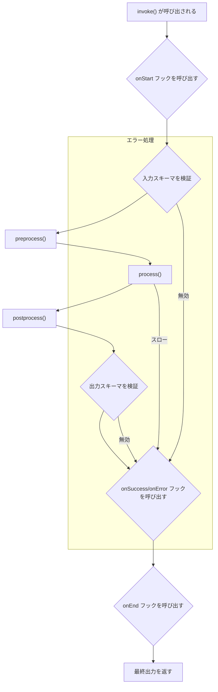

このドキュメントは、AIGNE フレームワークの基本的な構成要素である `Agent` クラスに関する包括的なガイドを提供します。広範なタスクを実行するために、Agent の作成、設定、使用方法を学びます。

## Agent クラス

`Agent` は、AIGNE システムのすべての Agent のベースクラスです。処理ロジックの定義、入出力スキーマの管理、および他のコンポーネントとの対話のための堅牢なフレームワークを提供します。`Agent` クラスを拡張することで、特殊な機能を持つカスタム Agent を作成できます。

### 主な責務

-   **データ処理**: Agent は構造化された入力を受け取り、操作を実行し、構造化された出力を生成します。
-   **データ検証**: Zod スキーマを使用して、入出力データが期待される形式に準拠していることを確認します。
-   **コミュニケーション**: Agent はメッセージパッシングコンテキストを通じて互いに、またシステムと対話します。
-   **状態管理**: 過去の対話のメモリを維持し、将来の振る舞いに活かすことができます。
-   **拡張性**: Agent は他の Agent を「スキル」として使用し、タスクを委任して複雑なワークフローを構築できます。

### クラス図

次の図は、`Agent` クラスのアーキテクチャと、システム内の他のコアコンポーネントとの関係を示しています。

```d2
direction: down

Agent: {
  shape: class
  "-inputSchema: ZodSchema"
  "-outputSchema: ZodSchema"
  "-skills: Agent[]"
  "-memory: Memory"
  "+run(input, context): any"
}

ZodSchema: {
  shape: class
  "+parse(data): any"
}

Context: {
  shape: class
  "..."
}

Memory: {
  shape: class
  "..."
}

Agent -> Agent: "スキルとして使用" {
  style.stroke-dash: 4
}

Agent -> ZodSchema: "で検証"

Agent -> Context: "を介して通信"

Agent -> Memory: "で状態を管理"
```

## Agent の作成

Agent を作成するには、主に 2 つの方法があります。`Agent` クラスを拡張する方法と、よりシンプルな関数ベースの Agent のために `FunctionAgent` を使用する方法です。

### `Agent` クラスの拡張

特定のロジックを持つ複雑な Agent の場合、ベースの `Agent` クラスを拡張し、抽象メソッド `process` を実装します。

**コアコンセプト:**

-   **`constructor(options)`**: 名前、説明、スキーマ、スキルなどの設定で Agent を初期化します。
-   **`process(input, options)`**: Agent のコアロジックです。ここで Agent が実際に *何をするか* を定義します。入力と呼び出しオプション (コンテキストを含む) を受け取り、結果を返す必要があります。

**例: シンプルな電卓 Agent**

```typescript
import { Agent, AgentOptions, AgentInvokeOptions, Message } from "@aigne/core";
import { z } from "zod";

// 入出力メッセージの形状を定義
interface CalculatorInput extends Message {
  operation: "add" | "subtract";
  a: number;
  b: number;
}

interface CalculatorOutput extends Message {
  result: number;
}

// カスタム Agent を作成
class CalculatorAgent extends Agent<CalculatorInput, CalculatorOutput> {
  constructor(options: AgentOptions<CalculatorInput, CalculatorOutput> = {}) {
    super({
      // Agent のメタデータを定義
      name: "Calculator",
      description: "Performs basic arithmetic operations.",
      
      // 検証用の Zod スキーマを定義
      inputSchema: z.object({
        operation: z.enum(["add", "subtract"]),
        a: z.number(),
        b: z.number(),
      }),
      outputSchema: z.object({
        result: z.number(),
      }),
      
      ...options,
    });
  }

  // コア処理ロジックを実装
  async process(input: CalculatorInput, options: AgentInvokeOptions): Promise<CalculatorOutput> {
    let result: number;
    
    if (input.operation === "add") {
      result = input.a + input.b;
    } else {
      result = input.a - input.b;
    }
    
    return { result };
  }
}
```

### `FunctionAgent` の使用

よりシンプルでステートレスなタスクの場合、`FunctionAgent` はクラスを定義する定型文なしで、単一の関数から Agent を作成する便利な方法を提供します。

**例: JavaScript コード評価 Agent**

この Agent は JavaScript コードの文字列を受け取り、安全なサンドボックスで評価し、結果を返します。

```javascript
import { FunctionAgent } from "@aigne/core";
import vm from "node:vm";

// Agent のロジックを含む関数
async function evaluateJs({ code }) {
  const sandbox = {};
  const context = vm.createContext(sandbox);
  const result = vm.runInContext(code, context, { displayErrors: true });
  return { result };
}

// メタデータとスキーマを個別に定義
evaluateJs.description = "This agent evaluates JavaScript code.";
evaluateJs.input_schema = {
  type: "object",
  properties: {
    code: { type: "string", description: "JavaScript code to evaluate" },
  },
  required: ["code"],
};
evaluateJs.output_schema = {
  type: "object",
  properties: {
    result: { type: "any", description: "Result of the evaluated code" },
  },
  required: ["result"],
};

// 関数から Agent を作成
const sandboxAgent = new FunctionAgent({
  name: "Sandbox",
  description: evaluateJs.description,
  inputSchema: evaluateJs.input_schema,
  outputSchema: evaluateJs.output_schema,
  process: evaluateJs,
});
```

## Agent の呼び出し

Agent を実行するには、`invoke` メソッドを使用します。このメソッドは、入力メッセージとオプションのオプションオブジェクトを受け取ります。Agent の実行は `Context` オブジェクトによって管理され、メッセージパッシング、イベント発行、リソース追跡を処理します。

### 通常応答とストリーミング応答

`invoke` メソッドは 2 つのモードで動作します。

1.  **通常 (デフォルト)**: メソッドは `Promise` を返します。これは、Agent の処理が完了したときに、最終的で完全な出力オブジェクトで解決されます。
2.  **ストリーミング**: オプションで `streaming: true` を設定すると、メソッドは `ReadableStream` を返します。Agent によって生成されるチャンクをこのストリームから読み取ることができ、リアルタイムの更新が可能になります。

**例: 電卓 Agent の呼び出し**

```typescript
const calculator = new CalculatorAgent();

// 通常の呼び出し
async function runCalculation() {
  const output = await calculator.invoke({
    operation: "add",
    a: 10,
    b: 5,
  });
  
  console.log("Result:", output.result); // 出力: Result: 15
}

runCalculation();
```

**例: ストリーミング Agent**

```typescript
import { Agent, textDelta } from "@aigne/core";

class StreamingEchoAgent extends Agent<{text: string}, {response: string}> {
  // ... コンストラクタ ...
  
  async *process(input) {
    const words = input.text.split(" ");
    for (const word of words) {
      // 各単語に対してデルタチャンクを生成
      yield textDelta({ response: word + " " });
      await new Promise(resolve => setTimeout(resolve, 100)); // 処理をシミュレート
    }
  }
}

const echoAgent = new StreamingEchoAgent();

// ストリーミング呼び出し
async function runStreaming() {
  const stream = await echoAgent.invoke(
    { text: "This is a streaming test" },
    { streaming: true }
  );
  
  const reader = stream.getReader();
  while (true) {
    const { done, value } = await reader.read();
    if (done) break;
    
    // 各チャンクが到着するたびに処理
    if (value.delta?.text?.response) {
      process.stdout.write(value.delta.text.response);
    }
  }
}
// 出力は単語ごとに表示されます: "This is a streaming test "
runStreaming();
```

## Agent のライフサイクルとフック

Agent の実行は定義されたライフサイクルに従い、`hooks` を使用して主要な瞬間に介入できます。フックを使用すると、Agent のコア実装を変更することなく、ロギング、モニタリング、またはカスタムロジックを追加できます。

### 呼び出しフロー図

この図は、Agent の呼び出し中のイベントのシーケンスを示しています。



### 主要なフック

-   `onStart`: 処理が開始される前に呼び出されます。入力を変更できます。
-   `onSuccess`: Agent が正常に出力を生成した後に呼び出されます。
-   `onError`: 処理中にエラーがスローされた場合に呼び出されます。
-   `onEnd`: 成功か失敗かに関わらず、呼び出しの最後に必ず呼び出されます。
-   `onSkillStart` / `onSkillEnd`: スキルが呼び出される前後に呼び出されます。

**例: ロギングフックの追加**

```typescript
const calculator = new CalculatorAgent({
  hooks: [{
    onStart: async ({ agent, input }) => {
      console.log(`[${agent.name}] 入力で開始:`, input);
    },
    onSuccess: async ({ agent, output }) => {
      console.log(`[${agent.name}] 出力で成功:`, output);
    },
    onError: async ({ agent, error }) => {
      console.error(`[${agent.name}] エラーで失敗:`, error);
    },
  }]
});

await calculator.invoke({ operation: "subtract", a: 10, b: 20 });
// ログ:
// [Calculator] 入力で開始: { operation: 'subtract', a: 10, b: 20 }
// [Calculator] 出力で成功: { result: -10 }
```

## コアプロパティとメソッド

これは、`Agent` クラスの最も重要なプロパティとメソッドのリファレンスです。

| メンバー                | タイプ                                    | 説明                                                                                                                              |
| --------------------- | --------------------------------------- | ---------------------------------------------------------------------------------------------------------------------------------------- |
| `name`                | `string`                                | Agent の識別子。デフォルトはクラス名です。                                                                                              |
| `description`         | `string`                                | Agent の目的を人間が読める形式で記述したもの。                                                                                             |
| `inputSchema`         | `ZodType`                               | 入力メッセージを検証するための Zod スキーマ。                                                                                             |
| `outputSchema`        | `ZodType`                               | 出力メッセージを検証するための Zod スキーマ。                                                                                             |
| `skills`              | `Agent[]`                               | この Agent がタスクを委任するために呼び出すことができる他の Agent のリスト。                                                                    |
| `memory`              | `MemoryAgent`                           | 過去の対話から情報を保存および取得するためのオプションのメモリ Agent。                                                                    |
| `hooks`               | `AgentHooks[]`                          | Agent のライフサイクルイベントをインターセプトするためのフックオブジェクトの配列。                                                                  |
| `retryOnError`        | `boolean \| object`                     | 失敗時に Agent の `process` メソッドを自動的に再試行するための設定。                                                                        |
| `guideRails`          | `GuideRailAgent[]`                      | Agent の入出力を検査および検証してポリシーやルールを強制することができる特別な Agent のリスト。                                               |
| `invoke()`            | `function`                              | **(公開メソッド)** 与えられた入力で Agent を実行します。最終結果またはストリームを返します。                                                        |
| `process()`           | `function`                              | **(抽象メソッド)** サブクラスによって実装されるコアロジック。                                                                                    |
| `invokeSkill()`       | `function`                              | **(保護されたメソッド)** スキルとして追加された別の Agent を呼び出すためのヘルパーメソッド。                                                      |
| `addSkill()`          | `function`                              | この Agent のスキルリストに 1 つ以上の Agent を追加します。                                                                              |
| `shutdown()`          | `function`                              | トピックの購読解除など、リソースをクリーンアップします。                                                                                        |