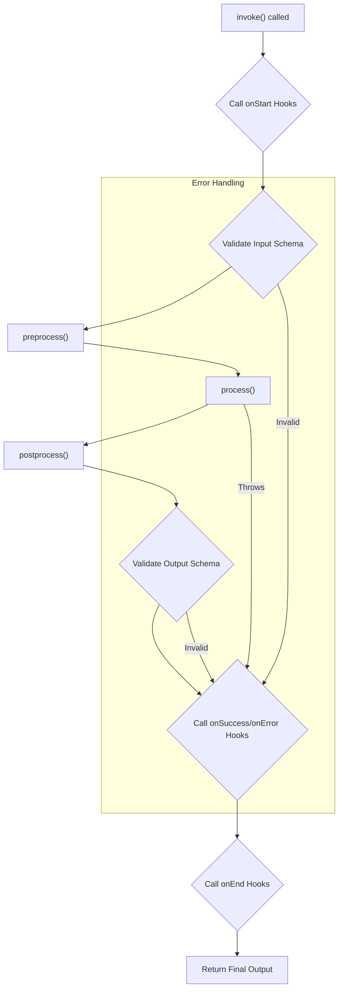

This document provides a comprehensive guide to the `Agent` class, the fundamental building block in the AIGNE framework. You will learn how to create, configure, and use agents to perform a wide range of tasks.

## The Agent Class

The `Agent` is the base class for all agents in the AIGNE system. It provides a robust framework for defining processing logic, managing input/output schemas, and interacting with other components. By extending the `Agent` class, you can create custom agents with specialized capabilities.

### Key Responsibilities

-   **Process Data**: Agents take structured input, perform operations, and produce structured output.
-   **Data Validation**: They use Zod schemas to ensure that input and output data conform to expected formats.
-   **Communication**: Agents interact with each other and the system through a message-passing context.
-   **State Management**: They can maintain a memory of past interactions to inform future behavior.
-   **Extensibility**: Agents can use other agents as "skills" to delegate tasks and build complex workflows.

### Class Diagram

The following diagram illustrates the architecture of the `Agent` class and its relationship with other core components in the system.

```d2
direction: down

Agent: {
  shape: class
  "-inputSchema: ZodSchema"
  "-outputSchema: ZodSchema"
  "-skills: Agent[]"
  "-memory: Memory"
  "+run(input, context): any"
}

ZodSchema: {
  shape: class
  "+parse(data): any"
}

Context: {
  shape: class
  "..."
}

Memory: {
  shape: class
  "..."
}

Agent -> Agent: "uses as skill" {
  style.stroke-dash: 4
}

Agent -> ZodSchema: "validates with"

Agent -> Context: "communicates via"

Agent -> Memory: "manages state with"
```

## Creating an Agent

There are two primary ways to create an agent: extending the `Agent` class or using the `FunctionAgent` for simpler, function-based agents.

### Extending the `Agent` Class

For complex agents with specific logic, you can extend the base `Agent` class and implement the abstract `process` method.

**Core Concepts:**

-   **`constructor(options)`**: Initializes the agent with configuration like its name, description, schemas, and skills.
-   **`process(input, options)`**: The core logic of the agent. This is where you define what the agent actually *does*. It receives input and invocation options (including the context) and must return a result.

**Example: A Simple Calculator Agent**

```typescript
import { Agent, AgentOptions, AgentInvokeOptions, Message } from "@aigne/core";
import { z } from "zod";

// Define input and output message shapes
interface CalculatorInput extends Message {
  operation: "add" | "subtract";
  a: number;
  b: number;
}

interface CalculatorOutput extends Message {
  result: number;
}

// Create the custom agent
class CalculatorAgent extends Agent<CalculatorInput, CalculatorOutput> {
  constructor(options: AgentOptions<CalculatorInput, CalculatorOutput> = {}) {
    super({
      // Define agent metadata
      name: "Calculator",
      description: "Performs basic arithmetic operations.",
      
      // Define Zod schemas for validation
      inputSchema: z.object({
        operation: z.enum(["add", "subtract"]),
        a: z.number(),
        b: z.number(),
      }),
      outputSchema: z.object({
        result: z.number(),
      }),
      
      ...options,
    });
  }

  // Implement the core processing logic
  async process(input: CalculatorInput, options: AgentInvokeOptions): Promise<CalculatorOutput> {
    let result: number;
    
    if (input.operation === "add") {
      result = input.a + input.b;
    } else {
      result = input.a - input.b;
    }
    
    return { result };
  }
}
```

### Using `FunctionAgent`

For simpler, stateless tasks, `FunctionAgent` provides a convenient way to create an agent from a single function without the boilerplate of defining a class.

**Example: A JavaScript Code Evaluator**

This agent takes a string of JavaScript code, evaluates it in a safe sandbox, and returns the result.

```javascript
import { FunctionAgent } from "@aigne/core";
import vm from "node:vm";

// The function that contains the agent's logic
async function evaluateJs({ code }) {
  const sandbox = {};
  const context = vm.createContext(sandbox);
  const result = vm.runInContext(code, context, { displayErrors: true });
  return { result };
}

// Define metadata and schemas separately
evaluateJs.description = "This agent evaluates JavaScript code.";
evaluateJs.input_schema = {
  type: "object",
  properties: {
    code: { type: "string", description: "JavaScript code to evaluate" },
  },
  required: ["code"],
};
evaluateJs.output_schema = {
  type: "object",
  properties: {
    result: { type: "any", description: "Result of the evaluated code" },
  },
  required: ["result"],
};

// Create the agent from the function
const sandboxAgent = new FunctionAgent({
  name: "Sandbox",
  description: evaluateJs.description,
  inputSchema: evaluateJs.input_schema,
  outputSchema: evaluateJs.output_schema,
  process: evaluateJs,
});
```

## Invoking an Agent

To execute an agent, you use the `invoke` method. It takes the input message and an optional options object. The agent's execution is managed by a `Context` object, which handles message passing, event emission, and resource tracking.

### Regular vs. Streaming Responses

The `invoke` method can operate in two modes:

1.  **Regular (Default)**: The method returns a `Promise` that resolves with the final, complete output object once the agent has finished processing.
2.  **Streaming**: By setting `streaming: true` in the options, the method returns a `ReadableStream`. You can read chunks from this stream as they are generated by the agent, allowing for real-time updates.

**Example: Invoking the Calculator Agent**

```typescript
const calculator = new CalculatorAgent();

// Regular invocation
async function runCalculation() {
  const output = await calculator.invoke({
    operation: "add",
    a: 10,
    b: 5,
  });
  
  console.log("Result:", output.result); // Output: Result: 15
}

runCalculation();
```

**Example: A Streaming Agent**

```typescript
import { Agent, textDelta } from "@aigne/core";

class StreamingEchoAgent extends Agent<{text: string}, {response: string}> {
  // ... constructor ...
  
  async *process(input) {
    const words = input.text.split(" ");
    for (const word of words) {
      // Yield a delta chunk for each word
      yield textDelta({ response: word + " " });
      await new Promise(resolve => setTimeout(resolve, 100)); // Simulate work
    }
  }
}

const echoAgent = new StreamingEchoAgent();

// Streaming invocation
async function runStreaming() {
  const stream = await echoAgent.invoke(
    { text: "This is a streaming test" },
    { streaming: true }
  );
  
  const reader = stream.getReader();
  while (true) {
    const { done, value } = await reader.read();
    if (done) break;
    
    // Process each chunk as it arrives
    if (value.delta?.text?.response) {
      process.stdout.write(value.delta.text.response);
    }
  }
}
// Output will appear word-by-word: "This is a streaming test "
runStreaming();
```

## Agent Lifecycle and Hooks

Agent execution follows a defined lifecycle, and you can tap into key moments using `hooks`. Hooks allow you to add logging, monitoring, or custom logic without modifying the agent's core implementation.

### Invocation Flow Diagram

This diagram shows the sequence of events during an agent's invocation.



### Key Hooks

-   `onStart`: Called before any processing begins. Can modify the input.
-   `onSuccess`: Called after the agent successfully produces an output.
-   `onError`: Called if an error is thrown during processing.
-   `onEnd`: Always called at the end of the invocation, regardless of success or failure.
-   `onSkillStart` / `onSkillEnd`: Called before and after a skill is invoked.

**Example: Adding a Logging Hook**

```typescript
const calculator = new CalculatorAgent({
  hooks: [{
    onStart: async ({ agent, input }) => {
      console.log(`[${agent.name}] Starting with input:`, input);
    },
    onSuccess: async ({ agent, output }) => {
      console.log(`[${agent.name}] Succeeded with output:`, output);
    },
    onError: async ({ agent, error }) => {
      console.error(`[${agent.name}] Failed with error:`, error);
    },
  }]
});

await calculator.invoke({ operation: "subtract", a: 10, b: 20 });
// Logs:
// [Calculator] Starting with input: { operation: 'subtract', a: 10, b: 20 }
// [Calculator] Succeeded with output: { result: -10 }
```

## Core Properties and Methods

This is a reference for the most important properties and methods of the `Agent` class.

| Member                | Type                                    | Description                                                                                                                              |
| --------------------- | --------------------------------------- | ---------------------------------------------------------------------------------------------------------------------------------------- |
| `name`                | `string`                                | The identifier for the agent. Defaults to the class name.                                                                                |
| `description`         | `string`                                | A human-readable description of the agent's purpose.                                                                                     |
| `inputSchema`         | `ZodType`                               | A Zod schema to validate the input message.                                                                                              |
| `outputSchema`        | `ZodType`                               | A Zod schema to validate the output message.                                                                                             |
| `skills`              | `Agent[]`                               | A list of other agents that this agent can invoke to delegate tasks.                                                                     |
| `memory`              | `MemoryAgent`                           | An optional memory agent to store and retrieve information from past interactions.                                                       |
| `hooks`               | `AgentHooks[]`                          | An array of hook objects to intercept the agent's lifecycle events.                                                                      |
| `retryOnError`        | `boolean \| object`                     | Configuration for automatically retrying the agent's `process` method on failure.                                                        |
| `guideRails`          | `GuideRailAgent[]`                      | A list of special agents that can inspect and validate the agent's input and output to enforce policies or rules.                        |
| `invoke()`            | `function`                              | **(Public Method)** Executes the agent with a given input. Returns a final result or a stream.                                         |
| `process()`           | `function`                              | **(Abstract Method)** The core logic to be implemented by subclasses.                                                                    |
| `invokeSkill()`       | `function`                              | **(Protected Method)** A helper method for invoking another agent that has been added as a skill.                                        |
| `addSkill()`          | `function`                              | Adds one or more agents to this agent's list of skills.                                                                                  |
| `shutdown()`          | `function`                              | Cleans up resources, such as unsubscribing from topics.                                                                                  |