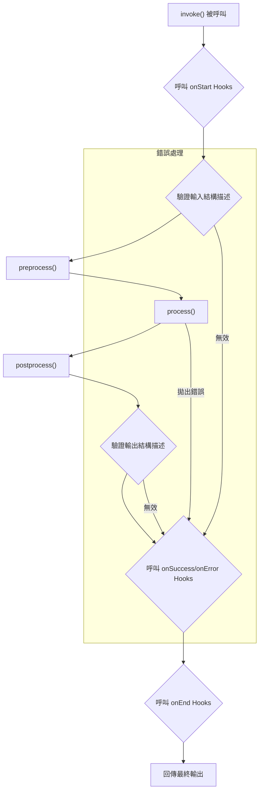

本文件為 `Agent` 類別提供了一份全面的指南，該類別是 AIGNE 框架中的基本建構模組。您將學習如何建立、設定和使用 Agent 來執行各種任務。

## Agent 類別

`Agent` 是 AIGNE 系統中所有 Agent 的基礎類別。它提供了一個穩健的框架，用於定義處理邏輯、管理輸入/輸出結構描述以及與其他元件互動。透過擴充 `Agent` 類別，您可以建立具有專門功能的自訂 Agent。

### 主要職責

-   **處理資料**：Agent 接收結構化輸入，執行操作，並產生結構化輸出。
-   **資料驗證**：它們使用 Zod 結構描述來確保輸入和輸出資料符合預期格式。
-   **通訊**：Agent 透過一個訊息傳遞的 context 彼此互動及與系統互動。
-   **狀態管理**：它們可以維護過去互動的記憶，為未來的行為提供資訊。
-   **擴充性**：Agent 可以使用其他 Agent 作為「skill」來委派任務並建立複雜的工作流程。

### 類別圖

下圖說明了 `Agent` 類別的架構及其與系統中其他核心元件的關係。

```d2
direction: down

Agent: {
  shape: class
  "-inputSchema: ZodSchema"
  "-outputSchema: ZodSchema"
  "-skills: Agent[]"
  "-memory: Memory"
  "+run(input, context): any"
}

ZodSchema: {
  shape: class
  "+parse(data): any"
}

Context: {
  shape: class
  "..."
}

Memory: {
  shape: class
  "..."
}

Agent -> Agent: "作為 skill 使用" {
  style.stroke-dash: 4
}

Agent -> ZodSchema: "使用...進行驗證"

Agent -> Context: "透過...進行通訊"

Agent -> Memory: "使用...管理狀態"
```

## 建立 Agent

建立 Agent 主要有兩種方式：擴充 `Agent` 類別，或對較簡單的、基於函式的 Agent 使用 `FunctionAgent`。

### 擴充 `Agent` 類別

對於具有特定邏輯的複雜 Agent，您可以擴充基礎的 `Agent` 類別並實作抽象的 `process` 方法。

**核心概念：**

-   **`constructor(options)`**：使用其名稱、描述、結構描述和 skill 等設定來初始化 Agent。
-   **`process(input, options)`**：Agent 的核心邏輯。您在此處定義 Agent 實際上*做*什麼。它接收輸入和調用選項（包括 context），並且必須回傳一個結果。

**範例：一個簡單的計算機 Agent**

```typescript
import { Agent, AgentOptions, AgentInvokeOptions, Message } from "@aigne/core";
import { z } from "zod";

// 定義輸入和輸出訊息的形狀
interface CalculatorInput extends Message {
  operation: "add" | "subtract";
  a: number;
  b: number;
}

interface CalculatorOutput extends Message {
  result: number;
}

// 建立自訂 Agent
class CalculatorAgent extends Agent<CalculatorInput, CalculatorOutput> {
  constructor(options: AgentOptions<CalculatorInput, CalculatorOutput> = {}) {
    super({
      // 定義 Agent 元資料
      name: "Calculator",
      description: "Performs basic arithmetic operations.",
      
      // 定義用於驗證的 Zod 結構描述
      inputSchema: z.object({
        operation: z.enum(["add", "subtract"]),
        a: z.number(),
        b: z.number(),
      }),
      outputSchema: z.object({
        result: z.number(),
      }),
      
      ...options,
    });
  }

  // 實作核心處理邏輯
  async process(input: CalculatorInput, options: AgentInvokeOptions): Promise<CalculatorOutput> {
    let result: number;
    
    if (input.operation === "add") {
      result = input.a + input.b;
    } else {
      result = input.a - input.b;
    }
    
    return { result };
  }
}
```

### 使用 `FunctionAgent`

對於較簡單、無狀態的任務，`FunctionAgent` 提供了一種便捷的方式，可以從單一函式建立一個 Agent，而無需定義類別的樣板程式碼。

**範例：一個 JavaScript 程式碼評估器**

此 Agent 接收一個 JavaScript 程式碼字串，在一個安全的沙箱中評估它，並回傳結果。

```javascript
import { FunctionAgent } from "@aigne/core";
import vm from "node:vm";

// 包含 Agent 邏輯的函式
async function evaluateJs({ code }) {
  const sandbox = {};
  const context = vm.createContext(sandbox);
  const result = vm.runInContext(code, context, { displayErrors: true });
  return { result };
}

// 分別定義元資料和結構描述
evaluateJs.description = "This agent evaluates JavaScript code.";
evaluateJs.input_schema = {
  type: "object",
  properties: {
    code: { type: "string", description: "JavaScript code to evaluate" },
  },
  required: ["code"],
};
evaluateJs.output_schema = {
  type: "object",
  properties: {
    result: { type: "any", description: "Result of the evaluated code" },
  },
  required: ["result"],
};

// 從函式建立 Agent
const sandboxAgent = new FunctionAgent({
  name: "Sandbox",
  description: evaluateJs.description,
  inputSchema: evaluateJs.input_schema,
  outputSchema: evaluateJs.output_schema,
  process: evaluateJs,
});
```

## 調用 Agent

要執行一個 Agent，您可以使用 `invoke` 方法。它接收輸入訊息和一個可選的選項物件。Agent 的執行由一個 `Context` 物件管理，該物件處理訊息傳遞、事件發布和資源追蹤。

### 一般與串流回應

`invoke` 方法可以在兩種模式下運作：

1.  **一般（預設）**：一旦 Agent 完成處理，此方法會回傳一個 `Promise`，該 Promise 會解析為最終、完整的輸出物件。
2.  **串流**：透過在選項中設定 `streaming: true`，此方法會回傳一個 `ReadableStream`。您可以在 Agent 產生資料區塊時從此串流中讀取，從而實現即時更新。

**範例：調用計算機 Agent**

```typescript
const calculator = new CalculatorAgent();

// 一般調用
async function runCalculation() {
  const output = await calculator.invoke({
    operation: "add",
    a: 10,
    b: 5,
  });
  
  console.log("Result:", output.result); // 輸出：Result: 15
}

runCalculation();
```

**範例：一個串流 Agent**

```typescript
import { Agent, textDelta } from "@aigne/core";

class StreamingEchoAgent extends Agent<{text: string}, {response: string}> {
  // ... 建構函式 ...
  
  async *process(input) {
    const words = input.text.split(" ");
    for (const word of words) {
      // 為每個單字產生一個 delta 區塊
      yield textDelta({ response: word + " " });
      await new Promise(resolve => setTimeout(resolve, 100)); // 模擬工作
    }
  }
}

const echoAgent = new StreamingEchoAgent();

// 串流調用
async function runStreaming() {
  const stream = await echoAgent.invoke(
    { text: "This is a streaming test" },
    { streaming: true }
  );
  
  const reader = stream.getReader();
  while (true) {
    const { done, value } = await reader.read();
    if (done) break;
    
    // 在每個區塊到達時進行處理
    if (value.delta?.text?.response) {
      process.stdout.write(value.delta.text.response);
    }
  }
}
// 輸出將逐字顯示：「This is a streaming test 」
runStreaming();
```

## Agent 生命週期與 Hook

Agent 的執行遵循一個定義好的生命週期，您可以使用 `hook` 來介入關鍵時刻。Hook 允許您新增日誌、監控或自訂邏輯，而無需修改 Agent 的核心實作。

### 調用流程圖

此圖顯示了 Agent 調用期間的事件序列。



### 主要 Hook

-   `onStart`：在任何處理開始前呼叫。可以修改輸入。
-   `onSuccess`：在 Agent 成功產生輸出後呼叫。
-   `onError`：如果在處理過程中拋出錯誤則呼叫。
-   `onEnd`：總是在調用結束時呼叫，無論成功或失敗。
-   `onSkillStart` / `onSkillEnd`：在 skill 被調用前後呼叫。

**範例：新增一個日誌 Hook**

```typescript
const calculator = new CalculatorAgent({
  hooks: [{
    onStart: async ({ agent, input }) => {
      console.log(`[${agent.name}] Starting with input:`, input);
    },
    onSuccess: async ({ agent, output }) => {
      console.log(`[${agent.name}] Succeeded with output:`, output);
    },
    onError: async ({ agent, error }) => {
      console.error(`[${agent.name}] Failed with error:`, error);
    },
  }]
});

await calculator.invoke({ operation: "subtract", a: 10, b: 20 });
// 紀錄：
// [Calculator] Starting with input: { operation: 'subtract', a: 10, b: 20 }
// [Calculator] Succeeded with output: { result: -10 }
```

## 核心屬性與方法

這是 `Agent` 類別最重要屬性和方法的參考。

| 成員                  | 類型                                    | 描述                                                                                                                                     |
| --------------------- | --------------------------------------- | ---------------------------------------------------------------------------------------------------------------------------------------- |
| `name`                | `string`                                | Agent 的識別碼。預設為類別名稱。                                                                                                         |
| `description`         | `string`                                | Agent 用途的人類可讀描述。                                                                                                               |
| `inputSchema`         | `ZodType`                               | 用於驗證輸入訊息的 Zod 結構描述。                                                                                                        |
| `outputSchema`        | `ZodType`                               | 用於驗證輸出訊息的 Zod 結構描述。                                                                                                        |
| `skills`              | `Agent[]`                               | 此 Agent 可調用以委派任務的其他 Agent 列表。                                                                                             |
| `memory`              | `MemoryAgent`                           | 一個可選的 memory agent，用於儲存和擷取過去互動的資訊。                                                                                  |
| `hooks`               | `AgentHooks[]`                          | 用於攔截 Agent 生命週期事件的 hook 物件陣列。                                                                                            |
| `retryOnError`        | `boolean \| object`                     | 在失敗時自動重試 Agent 的 `process` 方法的設定。                                                                                         |
| `guideRails`          | `GuideRailAgent[]`                      | 可檢查和驗證 Agent 的輸入和輸出以強制執行政策或規則的特殊 Agent 列表。                                                                   |
| `invoke()`            | `function`                              | **(公開方法)** 使用給定的輸入執行 Agent。回傳最終結果或串流。                                                                            |
| `process()`           | `function`                              | **(抽象方法)** 待由子類別實作的核心邏輯。                                                                                                |
| `invokeSkill()`       | `function`                              | **(受保護方法)** 用於調用已新增為 skill 的另一個 Agent 的輔助方法。                                                                        |
| `addSkill()`          | `function`                              | 將一個或多個 Agent 新增到此 Agent 的 skill 列表中。                                                                                      |
| `shutdown()`          | `function`                              | 清理資源，例如取消訂閱主題。                                                                                                             |