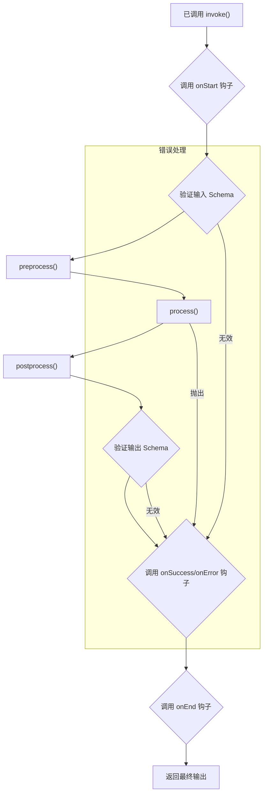

本文档全面介绍了 `Agent` 类，它是 AIGNE 框架中的基本构建块。您将学习如何创建、配置和使用 Agent 来执行各种任务。

## Agent 类

`Agent` 是 AIGNE 系统中所有 Agent 的基类。它提供了一个强大的框架，用于定义处理逻辑、管理输入/输出 schema 以及与其他组件进行交互。通过扩展 `Agent` 类，您可以创建具有专门功能的自定义 Agent。

### 主要职责

-   **处理数据**：Agent 接收结构化输入，执行操作，并生成结构化输出。
-   **数据验证**：它们使用 Zod schema 来确保输入和输出数据符合预期格式。
-   **通信**：Agent 通过消息传递上下文相互之间以及与系统进行交互。
-   **状态管理**：它们可以维护过去交互的记忆，为未来的行为提供信息。
-   **可扩展性**：Agent 可以使用其他 Agent 作为“技能”来委托任务并构建复杂的工作流。

### 类图

下图说明了 `Agent` 类的架构及其与系统中其他核心组件的关系。

```d2
direction: down

Agent: {
  shape: class
  "-inputSchema: ZodSchema"
  "-outputSchema: ZodSchema"
  "-skills: Agent[]"
  "-memory: Memory"
  "+run(input, context): any"
}

ZodSchema: {
  shape: class
  "+parse(data): any"
}

Context: {
  shape: class
  "..."
}

Memory: {
  shape: class
  "..."
}

Agent -> Agent: "用作技能" {
  style.stroke-dash: 4
}

Agent -> ZodSchema: "使用...进行验证"

Agent -> Context: "通过...进行通信"

Agent -> Memory: "使用...管理状态"
```

## 创建 Agent

创建 Agent 主要有两种方式：扩展 `Agent` 类或使用 `FunctionAgent` 来创建更简单的、基于函数的 Agent。

### 扩展 `Agent` 类

对于具有特定逻辑的复杂 Agent，您可以扩展基类 `Agent` 并实现抽象的 `process` 方法。

**核心概念：**

-   **`constructor(options)`**：使用名称、描述、schema 和技能等配置来初始化 Agent。
-   **`process(input, options)`**：Agent 的核心逻辑。您在此处定义 Agent 实际*做什么*。它接收输入和调用选项（包括上下文），并且必须返回一个结果。

**示例：一个简单的计算器 Agent**

```typescript
import { Agent, AgentOptions, AgentInvokeOptions, Message } from "@aigne/core";
import { z } from "zod";

// 定义输入和输出消息的结构
interface CalculatorInput extends Message {
  operation: "add" | "subtract";
  a: number;
  b: number;
}

interface CalculatorOutput extends Message {
  result: number;
}

// 创建自定义 Agent
class CalculatorAgent extends Agent<CalculatorInput, CalculatorOutput> {
  constructor(options: AgentOptions<CalculatorInput, CalculatorOutput> = {}) {
    super({
      // 定义 Agent 元数据
      name: "Calculator",
      description: "Performs basic arithmetic operations.",
      
      // 定义用于验证的 Zod schema
      inputSchema: z.object({
        operation: z.enum(["add", "subtract"]),
        a: z.number(),
        b: z.number(),
      }),
      outputSchema: z.object({
        result: z.number(),
      }),
      
      ...options,
    });
  }

  // 实现核心处理逻辑
  async process(input: CalculatorInput, options: AgentInvokeOptions): Promise<CalculatorOutput> {
    let result: number;
    
    if (input.operation === "add") {
      result = input.a + input.b;
    } else {
      result = input.a - input.b;
    }
    
    return { result };
  }
}
```

### 使用 `FunctionAgent`

对于更简单的无状态任务，`FunctionAgent` 提供了一种便捷的方式，可以从单个函数创建一个 Agent，而无需定义类的样板代码。

**示例：一个 JavaScript 代码评估器**

该 Agent 接收一个 JavaScript 代码字符串，在一个安全的沙箱中对其进行评估，并返回结果。

```javascript
import { FunctionAgent } from "@aigne/core";
import vm from "node:vm";

// 包含 Agent 逻辑的函数
async function evaluateJs({ code }) {
  const sandbox = {};
  const context = vm.createContext(sandbox);
  const result = vm.runInContext(code, context, { displayErrors: true });
  return { result };
}

// 单独定义元数据和 schema
evaluateJs.description = "This agent evaluates JavaScript code.";
evaluateJs.input_schema = {
  type: "object",
  properties: {
    code: { type: "string", description: "JavaScript code to evaluate" },
  },
  required: ["code"],
};
evaluateJs.output_schema = {
  type: "object",
  properties: {
    result: { type: "any", description: "Result of the evaluated code" },
  },
  required: ["result"],
};

// 从函数创建 Agent
const sandboxAgent = new FunctionAgent({
  name: "Sandbox",
  description: evaluateJs.description,
  inputSchema: evaluateJs.input_schema,
  outputSchema: evaluateJs.output_schema,
  process: evaluateJs,
});
```

## 调用 Agent

要执行一个 Agent，您需要使用 `invoke` 方法。它接收输入消息和一个可选的选项对象。Agent 的执行由一个 `Context` 对象管理，该对象处理消息传递、事件触发和资源跟踪。

### 常规响应与流式响应

`invoke` 方法可以在两种模式下运行：

1.  **常规（默认）**：该方法返回一个 `Promise`，一旦 Agent 完成处理，该 `Promise` 就会解析为最终的、完整的输出对象。
2.  **流式**：通过在选项中设置 `streaming: true`，该方法会返回一个 `ReadableStream`。您可以从该流中读取由 Agent 生成的数据块，从而实现实时更新。

**示例：调用计算器 Agent**

```typescript
const calculator = new CalculatorAgent();

// 常规调用
async function runCalculation() {
  const output = await calculator.invoke({
    operation: "add",
    a: 10,
    b: 5,
  });
  
  console.log("Result:", output.result); // 输出：Result: 15
}

runCalculation();
```

**示例：一个流式 Agent**

```typescript
import { Agent, textDelta } from "@aigne/core";

class StreamingEchoAgent extends Agent<{text: string}, {response: string}> {
  // ... 构造函数 ...
  
  async *process(input) {
    const words = input.text.split(" ");
    for (const word of words) {
      // 为每个单词生成一个增量块
      yield textDelta({ response: word + " " });
      await new Promise(resolve => setTimeout(resolve, 100)); // 模拟工作
    }
  }
}

const echoAgent = new StreamingEchoAgent();

// 流式调用
async function runStreaming() {
  const stream = await echoAgent.invoke(
    { text: "This is a streaming test" },
    { streaming: true }
  );
  
  const reader = stream.getReader();
  while (true) {
    const { done, value } = await reader.read();
    if (done) break;
    
    // 在每个数据块到达时进行处理
    if (value.delta?.text?.response) {
      process.stdout.write(value.delta.text.response);
    }
  }
}
// 输出将逐词显示：“This is a streaming test ”
runStreaming();
```

## Agent 生命周期和钩子

Agent 的执行遵循一个定义的生命周期，您可以使用`钩子`（hooks）来介入关键时刻。钩子允许您添加日志记录、监控或自定义逻辑，而无需修改 Agent 的核心实现。

### 调用流程图

此图显示了 Agent 调用期间的事件序列。



### 关键钩子

-   `onStart`：在任何处理开始之前调用。可以修改输入。
-   `onSuccess`：在 Agent 成功生成输出后调用。
-   `onError`：如果在处理过程中抛出错误则调用。
-   `onEnd`：总是在调用结束时调用，无论成功与否。
-   `onSkillStart` / `onSkillEnd`：在调用技能之前和之后调用。

**示例：添加日志记录钩子**

```typescript
const calculator = new CalculatorAgent({
  hooks: [{
    onStart: async ({ agent, input }) => {
      console.log(`[${agent.name}] 开始处理，输入为：`, input);
    },
    onSuccess: async ({ agent, output }) => {
      console.log(`[${agent.name}] 处理成功，输出为：`, output);
    },
    onError: async ({ agent, error }) => {
      console.error(`[${agent.name}] 处理失败，错误为：`, error);
    },
  }]
});

await calculator.invoke({ operation: "subtract", a: 10, b: 20 });
// 日志输出：
// [Calculator] Starting with input: { operation: 'subtract', a: 10, b: 20 }
// [Calculator] Succeeded with output: { result: -10 }
```

## 核心属性和方法

这是 `Agent` 类最重要属性和方法的参考。

| 成员 | 类型 | 描述 |
| --------------------- | --------------------------------------- | ---------------------------------------------------------------------------------------------------------------------------------------- |
| `name` | `string` | Agent 的标识符。默认为类名。 |
| `description` | `string` | 对 Agent 用途的可读描述。 |
| `inputSchema` | `ZodType` | 用于验证输入消息的 Zod schema。 |
| `outputSchema` | `ZodType` | 用于验证输出消息的 Zod schema。 |
| `skills` | `Agent[]` | 此 Agent 可调用以委托任务的其他 Agent 的列表。 |
| `memory` | `MemoryAgent` | 一个可选的记忆 Agent，用于存储和检索过去交互的信息。 |
| `hooks` | `AgentHooks[]` | 用于拦截 Agent 生命周期事件的钩子对象数组。 |
| `retryOnError` | `boolean \| object` | 用于在失败时自动重试 Agent 的 `process` 方法的配置。 |
| `guideRails` | `GuideRailAgent[]` | 一组特殊的 Agent，可以检查和验证 Agent 的输入和输出，以强制执行策略或规则。 |
| `invoke()` | `function` | **(公共方法)** 使用给定输入执行 Agent。返回最终结果或流。 |
| `process()` | `function` | **(抽象方法)** 需要由子类实现的核心逻辑。 |
| `invokeSkill()` | `function` | **(受保护方法)** 用于调用已添加为技能的另一个 Agent 的辅助方法。 |
| `addSkill()` | `function` | 将一个或多个 Agent 添加到此 Agent 的技能列表中。 |
| `shutdown()` | `function` | 清理资源，例如取消订阅主题。 |