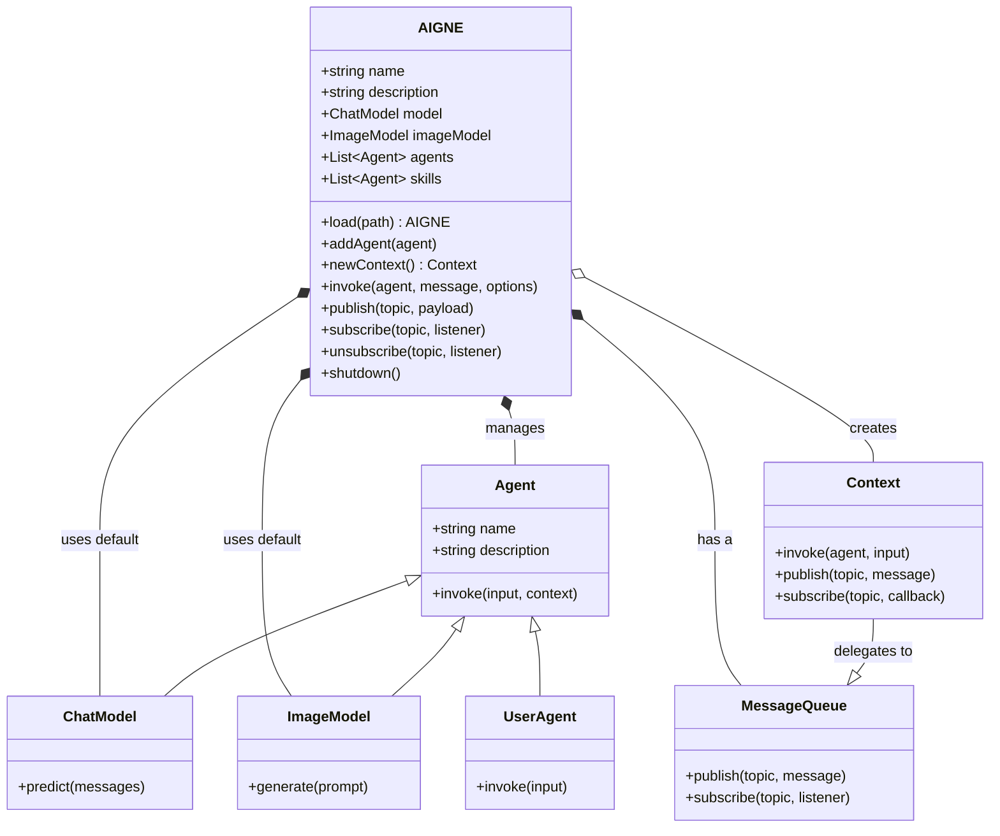

I'll start by exploring the file system to find the test files that are referenced in the source code, as they contain valuable examples. I'll also look for the `architecture.md` file, which will provide a high-level overview of the system's structure.# AIGNE Class

The `AIGNE` class is the central orchestrator for creating complex AI applications by managing and coordinating multiple agents. It handles agent interactions, message passing, and the overall execution flow.

## Class Diagram

The following diagram illustrates the architecture of the AIGNE class and its relationship with other core components like `Agent`, `ChatModel`, and `Context`.



## Constructor

Creates a new `AIGNE` instance.

```typescript
constructor(options?: AIGNEOptions)
```

### Parameters

<x-field-group>
  <x-field data-name="options" data-type="AIGNEOptions" data-required="false" data-desc="Configuration options for the AIGNE instance.">
    <x-field data-name="rootDir" data-type="string" data-required="false" data-desc="The root directory to resolve relative paths for agents and skills."></x-field>
    <x-field data-name="name" data-type="string" data-required="false" data-desc="The name of the AIGNE instance."></x-field>
    <x-field data-name="description" data-type="string" data-required="false" data-desc="A description of the AIGNE instance."></x-field>
    <x-field data-name="model" data-type="ChatModel" data-required="false" data-desc="The default global chat model for agents that do not specify one."></x-field>
    <x-field data-name="imageModel" data-type="ImageModel" data-required="false" data-desc="The default image model for image processing tasks."></x-field>
    <x-field data-name="skills" data-type="Agent[]" data-required="false" data-desc="An array of skill agents to be available to the instance."></x-field>
    <x-field data-name="agents" data-type="Agent[]" data-required="false" data-desc="An array of agents to add to the instance upon creation."></x-field>
    <x-field data-name="limits" data-type="ContextLimits" data-required="false" data-desc="Execution limits, such as timeout or max tokens."></x-field>
    <x-field data-name="observer" data-type="AIGNEObserver" data-required="false" data-desc="An observer for monitoring and logging."></x-field>
  </x-field>
</x-field-group>

### Example

```javascript
import { AIGNE, FunctionAgent } from '@aigne/core';
import { OpenAI } from '@aigne/models/openai';

// Define a simple agent
const greetingAgent = new FunctionAgent({
  name: 'greeter',
  description: 'Generates a greeting',
  process: async ({ input }) => `Hello, ${input.name}!`,
});

// Initialize the AIGNE instance
const aigne = new AIGNE({
  name: 'MyAIGNEApp',
  description: 'A simple demonstration of AIGNE.',
  model: new OpenAI({ apiKey: process.env.OPENAI_API_KEY }),
  agents: [greetingAgent],
});

console.log('AIGNE instance created:', aigne.name);
```

## Static Methods

### load

Loads an `AIGNE` instance from a directory containing an `aigne.yaml` file and agent definitions. This provides a convenient way to initialize an AIGNE system from configuration files.

```typescript
static async load(path: string, options?: Omit<AIGNEOptions, keyof LoadOptions> & LoadOptions): Promise<AIGNE>
```

#### Parameters

<x-field-group>
    <x-field data-name="path" data-type="string" data-required="true" data-desc="Path to the directory containing the aigne.yaml file."></x-field>
    <x-field data-name="options" data-type="LoadOptions" data-required="false" data-desc="Options to override the loaded configuration."></x-field>
</x-field-group>

#### Returns

<x-field data-name="Promise<AIGNE>" data-type="Promise" data-desc="A promise that resolves to a fully initialized AIGNE instance."></x-field>

## Properties

### agents

A collection of primary agents managed by the `AIGNE` instance. Provides indexed access by agent name.

**Type:** `Agent[]`

### description

An optional description of the `AIGNE` instance's purpose.

**Type:** `string`

### imageModel

The default image model used for image processing tasks.

**Type:** `ImageModel`

### limits

Usage limits applied to the `AIGNE` instance's execution context.

**Type:** `ContextLimits`

### model

The global default model for all agents that don't specify their own.

**Type:** `ChatModel`

### name

An optional name identifier for the `AIGNE` instance.

**Type:** `string`

### observer

The observer instance for monitoring and logging.

**Type:** `AIGNEObserver`

### rootDir

The optional root directory for the `AIGNE` instance, used to resolve relative paths.

**Type:** `string`

### skills

A collection of skill agents available to this `AIGNE` instance.

**Type:** `Agent[]`

## Methods

### addAgent

Adds one or more agents to the `AIGNE` instance. Each added agent is attached to the instance, allowing it to access shared resources.

```typescript
addAgent(...agents: Agent[]): void
```

#### Parameters

<x-field data-name="...agents" data-type="Agent[]" data-required="true" data-desc="One or more agent instances to add."></x-field>

### invoke

Invokes an agent with a message and returns its response. This method has multiple overloads to support different invocation patterns, including simple responses, streaming, and creating user agents.

#### Overloads

1.  **Create User Agent:** Returns a `UserAgent` for consistent interactions with a specific agent.
    ```typescript
    invoke<I extends Message, O extends Message>(agent: Agent<I, O>): UserAgent<I, O>
    ```
2.  **Standard Invocation:** Invokes an agent and returns its complete response.
    ```typescript
    invoke<I extends Message, O extends Message>(agent: Agent<I, O>, message: I & Message, options?: InvokeOptions<U>): Promise<O>
    ```
3.  **Streaming Invocation:** Invokes an agent and returns a stream of the response, allowing for incremental processing.
    ```typescript
    invoke<I extends Message, O extends Message>(agent: Agent<I, O>, message: I & Message, options: InvokeOptions<U> & { streaming: true }): Promise<AgentResponseStream<O>>
    ```

#### Example: Standard Invocation

```javascript
import { AIGNE, FunctionAgent } from '@aigne/core';

async function run() {
  const weatherAgent = new FunctionAgent({
    name: 'weather',
    description: 'Gets the weather for a city',
    process: async ({ input }) => `The weather in ${input.city} is sunny.`,
  });

  const aigne = new AIGNE({ agents: [weatherAgent] });

  const response = await aigne.invoke(weatherAgent, { city: 'San Francisco' });
  console.log(response); // Output: The weather in San Francisco is sunny.
}

run();
```

#### Example: Streaming Invocation

```javascript
import { AIGNE, AIAgent } from '@aigne/core';
import { OpenAI } from '@aigne/models/openai';

async function runStreaming() {
  const storyAgent = new AIAgent({
    name: 'storyteller',
    model: new OpenAI({ model: 'gpt-4', apiKey: process.env.OPENAI_API_KEY }),
    instructions: 'Tell a short story about a brave knight.',
  });

  const aigne = new AIGNE({ agents: [storyAgent] });

  const stream = await aigne.invoke(storyAgent, {}, { streaming: true });

  for await (const chunk of stream) {
    process.stdout.write(chunk.output);
  }
}

runStreaming();
```

### newContext

Creates a new execution context, which isolates state for different conversations or flows.

```typescript
newContext(options?: Partial<Pick<Context, "userContext" | "memories">>): AIGNEContext
```

#### Parameters

<x-field data-name="options" data-type="object" data-required="false" data-desc="Optional initial state for the context.">
    <x-field data-name="userContext" data-type="object" data-required="false" data-desc="Custom user context data."></x-field>
    <x-field data-name="memories" data-type="Memory[]" data-required="false" data-desc="A list of initial memories."></x-field>
</x-field-group>

#### Returns

<x-field data-name="AIGNEContext" data-type="AIGNEContext" data-desc="A new AIGNEContext instance."></x-field>

### publish

Publishes a message to a topic on the message queue, broadcasting it to all subscribers.

```typescript
publish(topic: string | string[], payload: Omit<MessagePayload, "context"> | Message, options?: InvokeOptions<U>): void
```

#### Parameters

<x-field-group>
    <x-field data-name="topic" data-type="string | string[]" data-required="true" data-desc="The topic(s) to publish the message to."></x-field>
    <x-field data-name="payload" data-type="Message | object" data-required="true" data-desc="The message payload."></x-field>
    <x-field data-name="options" data-type="InvokeOptions" data-required="false" data-desc="Optional configuration for the publish operation."></x-field>
</x-field-group>

### subscribe

Subscribes to a topic to receive messages. It can either return a promise that resolves with the next message or register a listener for continuous message handling.

#### Overloads

1.  **Promise-based:**
    ```typescript
    subscribe(topic: string | string[]): Promise<MessagePayload>
    ```
2.  **Listener-based:**
    ```typescript
    subscribe(topic: string | string[], listener: MessageQueueListener): Unsubscribe
    ```

#### Example: Pub/Sub

```javascript
import { AIGNE } from '@aigne/core';

async function runPubSub() {
  const aigne = new AIGNE();
  const topic = 'user.created';

  // Subscribe with a listener
  const unsubscribe = aigne.subscribe(topic, (message) => {
    console.log('Listener received:', message.output);
  });

  // Publish a message
  aigne.publish(topic, { output: { userId: '123', status: 'active' } });

  // Unsubscribe after a short delay
  setTimeout(() => {
    unsubscribe();
    console.log('Unsubscribed from topic.');
  }, 1000);
}

runPubSub();
```

### unsubscribe

Unsubscribes a listener from a specific topic, stopping it from receiving further messages.

```typescript
unsubscribe(topic: string | string[], listener: MessageQueueListener): void
```

#### Parameters

<x-field-group>
    <x-field data-name="topic" data-type="string | string[]" data-required="true" data-desc="The topic to unsubscribe from."></x-field>
    <x-field data-name="listener" data-type="MessageQueueListener" data-required="true" data-desc="The listener function that was previously subscribed."></x-field>
</x-field-group>

### shutdown

Gracefully shuts down the `AIGNE` instance, including all its agents and skills, to ensure proper cleanup of resources.

```typescript
async shutdown(): Promise<void>
```

#### Example

```javascript
import { AIGNE } from '@aigne/core';

const aigne = new AIGNE();
// ... add agents and operate

// Shutdown the instance before exiting
aigne.shutdown().then(() => {
  console.log('AIGNE has been shut down.');
});
```