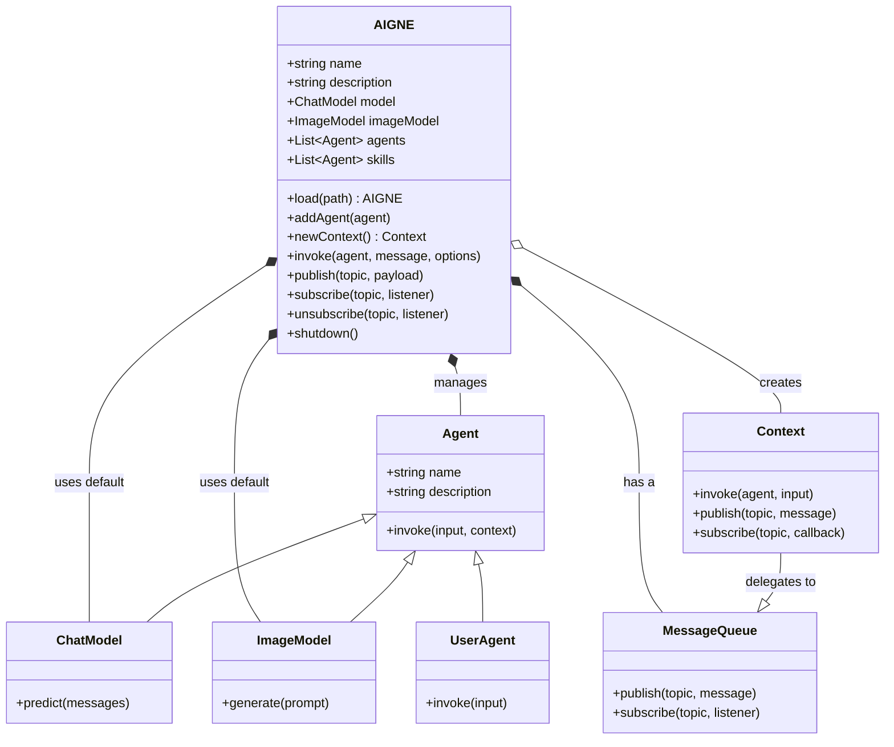

我将首先浏览文件系统，以查找源代码中引用的测试文件，因为它们包含有价值的示例。我还会寻找 `architecture.md` 文件，它将提供系统结构的高级概述。# AIGNE 类

`AIGNE` 类是通过管理和协调多个 Agent 来创建复杂 AI 应用程序的核心协调器。它负责处理 Agent 交互、消息传递和整体执行流程。

## 类图

下图说明了 AIGNE 类的架构及其与 `Agent`、`ChatModel` 和 `Context` 等其他核心组件的关系。



## 构造函数

创建一个新的 `AIGNE` 实例。

```typescript
constructor(options?: AIGNEOptions)
```

### 参数

<x-field-group>
  <x-field data-name="options" data-type="AIGNEOptions" data-required="false" data-desc="AIGNE 实例的配置选项。">
    <x-field data-name="rootDir" data-type="string" data-required="false" data-desc="用于解析 Agent 和技能的相对路径的根目录。"></x-field>
    <x-field data-name="name" data-type="string" data-required="false" data-desc="AIGNE 实例的名称。"></x-field>
    <x-field data-name="description" data-type="string" data-required="false" data-desc="AIGNE 实例的描述。"></x-field>
    <x-field data-name="model" data-type="ChatModel" data-required="false" data-desc="未指定聊天模型的 Agent 的默认全局聊天模型。"></x-field>
    <x-field data-name="imageModel" data-type="ImageModel" data-required="false" data-desc="用于图像处理任务的默认图像模型。"></x-field>
    <x-field data-name="skills" data-type="Agent[]" data-required="false" data-desc="可供该实例使用的技能 Agent 数组。"></x-field>
    <x-field data-name="agents" data-type="Agent[]" data-required="false" data-desc="创建实例时要添加的 Agent 数组。"></x-field>
    <x-field data-name="limits" data-type="ContextLimits" data-required="false" data-desc="执行限制，如超时或最大令牌数。"></x-field>
    <x-field data-name="observer" data-type="AIGNEObserver" data-required="false" data-desc="用于监控和日志记录的观察者。"></x-field>
  </x-field>
</x-field-group>

### 示例

```javascript
import { AIGNE, FunctionAgent } from '@aigne/core';
import { OpenAI } from '@aigne/models/openai';

// 定义一个简单的 Agent
const greetingAgent = new FunctionAgent({
  name: 'greeter',
  description: 'Generates a greeting',
  process: async ({ input }) => `Hello, ${input.name}!`,
});

// 初始化 AIGNE 实例
const aigne = new AIGNE({
  name: 'MyAIGNEApp',
  description: 'A simple demonstration of AIGNE.',
  model: new OpenAI({ apiKey: process.env.OPENAI_API_KEY }),
  agents: [greetingAgent],
});

console.log('AIGNE instance created:', aigne.name);
```

## 静态方法

### load

从包含 `aigne.yaml` 文件和 Agent 定义的目录中加载 `AIGNE` 实例。这为从配置文件初始化 AIGNE 系统提供了一种便捷的方式。

```typescript
static async load(path: string, options?: Omit<AIGNEOptions, keyof LoadOptions> & LoadOptions): Promise<AIGNE>
```

#### 参数

<x-field-group>
    <x-field data-name="path" data-type="string" data-required="true" data-desc="包含 aigne.yaml 文件的目录路径。"></x-field>
    <x-field data-name="options" data-type="LoadOptions" data-required="false" data-desc="用于覆盖已加载配置的选项。"></x-field>
</x-field-group>

#### 返回值

<x-field data-name="Promise<AIGNE>" data-type="Promise" data-desc="一个解析为完全初始化的 AIGNE 实例的 promise。"></x-field>

## 属性

### agents

由 `AIGNE` 实例管理的主要 Agent 集合。提供按 Agent 名称的索引访问。

**类型：** `Agent[]`

### description

`AIGNE` 实例用途的可选描述。

**类型：** `string`

### imageModel

用于图像处理任务的默认图像模型。

**类型：** `ImageModel`

### limits

应用于 `AIGNE` 实例执行上下文的使用限制。

**类型：** `ContextLimits`

### model

所有未指定自有模型的 Agent 的全局默认模型。

**类型：** `ChatModel`

### name

`AIGNE` 实例的可选名称标识符。

**类型：** `string`

### observer

用于监控和日志记录的观察者实例。

**类型：** `AIGNEObserver`

### rootDir

`AIGNE` 实例的可选根目录，用于解析相对路径。

**类型：** `string`

### skills

此 `AIGNE` 实例可用的技能 Agent 集合。

**类型：** `Agent[]`

## 方法

### addAgent

向 `AIGNE` 实例添加一个或多个 Agent。每个添加的 Agent 都会附加到该实例上，从而允许它访问共享资源。

```typescript
addAgent(...agents: Agent[]): void
```

#### 参数

<x-field data-name="...agents" data-type="Agent[]" data-required="true" data-desc="要添加的一个或多个 Agent 实例。"></x-field>

### invoke

使用消息调用 Agent 并返回其响应。此方法有多个重载以支持不同的调用模式，包括简单响应、流式处理和创建用户 Agent。

#### 重载

1.  **创建用户 Agent：** 返回一个 `UserAgent`，用于与特定 Agent 进行一致的交互。
    ```typescript
    invoke<I extends Message, O extends Message>(agent: Agent<I, O>): UserAgent<I, O>
    ```
2.  **标准调用：** 调用一个 Agent 并返回其完整响应。
    ```typescript
    invoke<I extends Message, O extends Message>(agent: Agent<I, O>, message: I & Message, options?: InvokeOptions<U>): Promise<O>
    ```
3.  **流式调用：** 调用一个 Agent 并返回响应流，从而允许增量处理。
    ```typescript
    invoke<I extends Message, O extends Message>(agent: Agent<I, O>, message: I & Message, options: InvokeOptions<U> & { streaming: true }): Promise<AgentResponseStream<O>>
    ```

#### 示例：标准调用

```javascript
import { AIGNE, FunctionAgent } from '@aigne/core';

async function run() {
  const weatherAgent = new FunctionAgent({
    name: 'weather',
    description: 'Gets the weather for a city',
    process: async ({ input }) => `The weather in ${input.city} is sunny.`,
  });

  const aigne = new AIGNE({ agents: [weatherAgent] });

  const response = await aigne.invoke(weatherAgent, { city: 'San Francisco' });
  console.log(response); // 输出：The weather in San Francisco is sunny.
}

run();
```

#### 示例：流式调用

```javascript
import { AIGNE, AIAgent } from '@aigne/core';
import { OpenAI } from '@aigne/models/openai';

async function runStreaming() {
  const storyAgent = new AIAgent({
    name: 'storyteller',
    model: new OpenAI({ model: 'gpt-4', apiKey: process.env.OPENAI_API_KEY }),
    instructions: 'Tell a short story about a brave knight.',
  });

  const aigne = new AIGNE({ agents: [storyAgent] });

  const stream = await aigne.invoke(storyAgent, {}, { streaming: true });

  for await (const chunk of stream) {
    process.stdout.write(chunk.output);
  }
}

runStreaming();
```

### newContext

创建一个新的执行上下文，为不同的对话或流程隔离状态。

```typescript
newContext(options?: Partial<Pick<Context, "userContext" | "memories">>): AIGNEContext
```

#### 参数

<x-field data-name="options" data-type="object" data-required="false" data-desc="上下文的可选初始状态。">
    <x-field data-name="userContext" data-type="object" data-required="false" data-desc="自定义用户上下文数据。"></x-field>
    <x-field data-name="memories" data-type="Memory[]" data-required="false" data-desc="初始记忆列表。"></x-field>
</x-field-group>

#### 返回值

<x-field data-name="AIGNEContext" data-type="AIGNEContext" data-desc="一个新的 AIGNEContext 实例。"></x-field>

### publish

将消息发布到消息队列上的一个主题，将其广播给所有订阅者。

```typescript
publish(topic: string | string[], payload: Omit<MessagePayload, "context"> | Message, options?: InvokeOptions<U>): void
```

#### 参数

<x-field-group>
    <x-field data-name="topic" data-type="string | string[]" data-required="true" data-desc="要将消息发布到的主题。"></x-field>
    <x-field data-name="payload" data-type="Message | object" data-required="true" data-desc="消息负载。"></x-field>
    <x-field data-name="options" data-type="InvokeOptions" data-required="false" data-desc="发布操作的可选配置。"></x-field>
</x-field-group>

### subscribe

订阅一个主题以接收消息。它可以返回一个在下一条消息到达时解析的 promise，也可以注册一个监听器以进行连续的消息处理。

#### 重载

1.  **基于 Promise：**
    ```typescript
    subscribe(topic: string | string[]): Promise<MessagePayload>
    ```
2.  **基于监听器：**
    ```typescript
    subscribe(topic: string | string[], listener: MessageQueueListener): Unsubscribe
    ```

#### 示例：发布/订阅

```javascript
import { AIGNE } from '@aigne/core';

async function runPubSub() {
  const aigne = new AIGNE();
  const topic = 'user.created';

  // 使用监听器订阅
  const unsubscribe = aigne.subscribe(topic, (message) => {
    console.log('Listener received:', message.output);
  });

  // 发布一条消息
  aigne.publish(topic, { output: { userId: '123', status: 'active' } });

  // 短暂延迟后取消订阅
  setTimeout(() => {
    unsubscribe();
    console.log('Unsubscribed from topic.');
  }, 1000);
}

runPubSub();
```

### unsubscribe

从特定主题取消订阅监听器，使其不再接收后续消息。

```typescript
unsubscribe(topic: string | string[], listener: MessageQueueListener): void
```

#### 参数

<x-field-group>
    <x-field data-name="topic" data-type="string | string[]" data-required="true" data-desc="要取消订阅的主题。"></x-field>
    <x-field data-name="listener" data-type="MessageQueueListener" data-required="true" data-desc="先前订阅的监听器函数。"></x-field>
</x-field-group>

### shutdown

平稳地关闭 `AIGNE` 实例，包括其所有的 Agent 和技能，以确保资源的正确清理。

```typescript
async shutdown(): Promise<void>
```

#### 示例

```javascript
import { AIGNE } from '@aigne/core';

const aigne = new AIGNE();
// ... 添加 Agent 并进行操作

// 在退出前关闭实例
aigne.shutdown().then(() => {
  console.log('AIGNE has been shut down.');
});
```