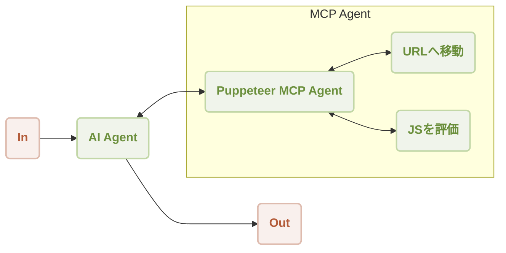

# MCP Puppeteer

AIGNE ワークフロー内で直接 Puppeteer の能力を活用し、ウェブスクレイピングとコンテンツ抽出を自動化します。この例では、Puppeteer MCP (Model Context Protocol) サーバーを統合して、ウェブサイトをナビゲートし、データを抽出できる Agent を作成する方法を示します。抽出されたデータは、AI モデルによって処理されます。

このガイドでは、Puppeteer スキルを備えた AI Agent を使用してウェブサイトからコンテンツを抽出するデモンストレーションのセットアップと実行方法を順を追って説明します。さまざまなモードでサンプルを実行する方法、多様な AI モデルに接続する方法、そしてその背後にあるコードを理解する方法を学びます。

## 概要

このワークフローには、Puppeteer サーバーに接続された `MCPAgent` を使用する `AIAgent` が関わります。AI Agent は「https://www.arcblock.io のコンテンツを要約して」といったタスクを受け取り、その後、`navigate` や `evaluate` といった Puppeteer Agent のスキルをインテリジェントに活用して、必要なウェブスクレイピング操作を実行します。

### ワークフロー図

以下の図は、ユーザーのリクエストを達成するために AI Agent と Puppeteer MCP Agent の間の相互作用を示しています。



### 操作のシーケンス

ウェブサイトの要約タスクがどのように実行されるかのステップバイステップのシーケンスは次のとおりです。

```d2
shape: sequence_diagram

User: {
  shape: c4-person
}

AI: {
  label: "AI Agent"
}

P: {
  label: "Puppeteer MCP Agent"
}

N: {
  label: "URLへ移動"
}

E: {
  label: "JSを評価"
}

User -> AI: "https://www.arcblock.ioのコンテンツを要約"
AI -> P: "https://www.arcblock.ioからコンテンツを抽出"
P -> N: "https://www.arcblock.ioへ移動"
N -> P: "移動完了"
P -> E: "document.body.innerTextを評価"
E -> P: "コンテンツ抽出済み"
P -> AI: "コンテキストとして抽出されたコンテンツ"
AI -> User: "コンテンツは以下の通りです：..."
```

## 前提条件

進める前に、開発環境が以下の要件を満たしていることを確認してください。

*   **Node.js:** バージョン 20.0 以降。
*   **OpenAI API キー:** デフォルトのモデル設定に必要です。[OpenAI Platform](https://platform.openai.com/api-keys) から取得できます。

## クイックスタート

リポジトリをクローンすることなく、`npx` を使用してこのサンプルを直接実行できます。

### サンプルの実行

ターミナルで以下のコマンドのいずれかを実行してください。

デフォルトのワンショットモードで実行する場合：
```sh icon=lucide:terminal
npx -y @aigne/example-mcp-puppeteer
```

インタラクティブなチャットモードで実行する場合：
```sh icon=lucide:terminal
npx -y @aigne/example-mcp-puppeteer --chat
```

スクリプトに直接入力をパイプすることもできます：
```sh icon=lucide:terminal
echo "extract content from https://www.arcblock.io" | npx -y @aigne/example-mcp-puppeteer
```

### AI モデルへの接続

サンプルを初めて実行すると、AI モデルへの接続を促されます。いくつかのオプションがあります：

1.  **AIGNE Hub (公式):** 最も簡単に始める方法です。ブラウザが公式の AIGNE Hub を開き、そこでサインインできます。新規ユーザーは無料のトークン残高を受け取れます。
2.  **AIGNE Hub (セルフホスト):** 独自の AIGNE Hub インスタンスをお持ちの場合は、その URL を提供することで接続できます。
3.  **サードパーティのモデルプロバイダー:** 適切な環境変数を設定することで、OpenAI のようなプロバイダーへの直接接続を設定できます。

たとえば、OpenAI を使用するには、`OPENAI_API_KEY` 変数を設定します：
```sh icon=lucide:terminal
export OPENAI_API_KEY="your-openai-api-key"
```

設定後、サンプルのコマンドを再度実行してください。DeepSeek や Google Gemini のような他のプロバイダーの設定に関する詳細は、ソースリポジトリの `.env.local.example` ファイルを参照してください。

## ソースからのインストール

ソースコードからサンプルを実行したい場合は、以下の手順に従ってください。

### 1. リポジトリのクローン

```sh icon=lucide:terminal
git clone https://github.com/AIGNE-io/aigne-framework
```

### 2. 依存関係のインストール

サンプルディレクトリに移動し、`pnpm` を使用して必要なパッケージをインストールします。

```sh icon=lucide:terminal
cd aigne-framework/examples/mcp-puppeteer
pnpm install
```

### 3. サンプルの実行

スタートスクリプトを実行してアプリケーションを起動します。

```sh icon=lucide:terminal
pnpm start
```

コマンドライン引数を渡すには、引数の前に `--` を追加します：
```sh icon=lucide:terminal
# インタラクティブなチャットモードで実行
pnpm start -- --chat

# デバッグ用にログレベルを設定
pnpm start -- --log-level DEBUG
```

## コマンドラインオプション

スクリプトは、その動作をカスタマイズするためにいくつかのコマンドライン引数を受け入れます。

| パラメータ                | 説明                                                                                             | デフォルト         |
| ------------------------- | -------------------------------------------------------------------------------------------------------- | ---------------- |
| `--chat`                  | インタラクティブなチャットモードで実行します。省略した場合、ワンショットモードで実行されます。             | 無効               |
| `--model <provider[:model]>` | 使用するAIモデルを指定します。例：`openai` または `openai:gpt-4o-mini`。                               | `openai`         |
| `--temperature <value>`   | モデル生成の temperature を設定します。                                                                  | プロバイダーのデフォルト |
| `--top-p <value>`         | top-p サンプリング値を設定します。                                                                       | プロバイダーのデフォルト |
| `--presence-penalty <value>` | presence penalty の値を設定します。                                                                        | プロバイダーのデフォルト |
| `--frequency-penalty <value>` | frequency penalty の値を設定します。                                                                       | プロバイダーのデフォルト |
| `--log-level <level>`     | ログレベルを設定します。オプション：`ERROR`、`WARN`、`INFO`、`DEBUG`、`TRACE`。                       | `INFO`           |
| `--input, -i <input>`     | 引数として直接入力を提供します。                                                                         | なし               |

## コードの実装

中心的なロジックは、AI モデルと Puppeteer サーバーを実行するように設定された `MCPAgent` を持つ `AIGNE` インスタンスのセットアップです。その後、`AIAgent` には、Puppeteer スキルを使用してウェブコンテンツを抽出する方法に関する指示が与えられます。

```typescript index.ts
import { AIAgent, AIGNE, MCPAgent } from "@aigne/core";
import { OpenAIChatModel } from "@aigne/core/models/openai-chat-model.js";

const { OPENAI_API_KEY } = process.env;

// 1. AIモデルを初期化する
const model = new OpenAIChatModel({
  apiKey: OPENAI_API_KEY,
});

// 2. Puppeteerサーバーを管理するためのMCPAgentを作成する
const puppeteerMCPAgent = await MCPAgent.from({
  command: "npx",
  args: ["-y", "@modelcontextprotocol/server-puppeteer"],
});

// 3. モデルとPuppeteerスキルでAIGNEフレームワークをインスタンス化する
const aigne = new AIGNE({
  model,
  skills: [puppeteerMCPAgent],
});

// 4. ウェブスクレイピングの指示を持つAI Agentを定義する
const agent = AIAgent.from({
  instructions: `\
## ウェブサイトからコンテンツを抽出する手順
1. URLに移動する
2. document.body.innerTextを評価してコンテンツを取得する
`,
});

// 5. プロンプトでAgentを呼び出す
const result = await aigne.invoke(
  agent,
  "extract content from https://www.arcblock.io",
);

console.log(result);

// 6. MCP Agentをシャットダウンし、リソースをクリーンアップする
await aigne.shutdown();
```

出力は、指定された URL から抽出されたコンテンツを含む JSON オブジェクトとなり、Agent の指示に従って要約または処理されます。

```json
{
  "$message": "ウェブサイト [ArcBlock](https://www.arcblock.io) から抽出されたコンテンツは以下の通りです：\n\n---\n\n**ソフトウェアアーキテクトとエコシステムの再定義**\n\n分散型アプリケーションを構築するためのトータルソリューション ..."
}
```

## まとめ

この例では、Model Context Protocol を使用して Puppeteer のような外部ツールを AIGNE フレームワークに統合する方法を具体的に示します。`AIAgent` にウェブスクレイピングスキルを装備することで、ウェブと対話して情報を自動的に収集および処理できる強力なアプリケーションを構築できます。

さらに探求するために、以下の関連ドキュメントを参照できます：

<x-cards data-columns="2">
  <x-card data-title="MCP Agent" data-href="/developer-guide/agents/mcp-agent" data-icon="lucide:box">
  Model Context Protocol (MCP) を介して外部システムに接続する方法について詳しく学びます。
  </x-card>
  <x-card data-title="AI Agent" data-href="/developer-guide/agents/ai-agent" data-icon="lucide:bot">
  言語モデルと対話するための主要な Agent についてさらに深く掘り下げます。
  </x-card>
</x-cards>