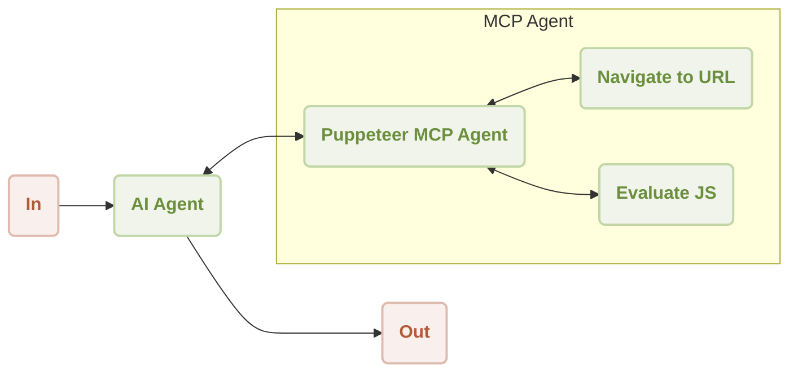

# MCP Puppeteer

Leverage the power of Puppeteer for automated web scraping and content extraction directly within your AIGNE workflows. This example demonstrates how to integrate the Puppeteer MCP (Model Context Protocol) Server to create agents capable of navigating websites and extracting data, which can then be processed by an AI model.

This guide will walk you through setting up and running a demonstration that extracts content from a website using an AI agent equipped with Puppeteer skills. You will learn how to run the example in different modes, connect to various AI models, and understand the underlying code.

## Overview

The workflow involves an `AIAgent` that uses a `MCPAgent` connected to a Puppeteer server. The AI agent receives a task, such as "summarize content from https://www.arcblock.io," and then intelligently utilizes the Puppeteer agent's skills—like `navigate` and `evaluate`—to perform the necessary web scraping operations.

### Workflow Diagram

The following diagram illustrates the interaction between the AI Agent and the Puppeteer MCP Agent to fulfill a user's request.



### Sequence of Operations

Here is a step-by-step sequence of how a website summarization task is executed:

```d2
shape: sequence_diagram

User: {
  shape: c4-person
}

AI: {
  label: "AI Agent"
}

P: {
  label: "Puppeteer MCP Agent"
}

N: {
  label: "Navigate to URL"
}

E: {
  label: "Evaluate JS"
}

User -> AI: "summarize content from https://www.arcblock.io"
AI -> P: "extract content from https://www.arcblock.io"
P -> N: "navigate to https://www.arcblock.io"
N -> P: "navigation completed"
P -> E: "evaluate document.body.innerText"
E -> P: "content extracted"
P -> AI: "extracted content as context"
AI -> User: "The content is as follows: ..."
```

## Prerequisites

Before proceeding, ensure your development environment meets the following requirements:

*   **Node.js:** Version 20.0 or higher.
*   **OpenAI API Key:** Required for the default model configuration. You can obtain one from the [OpenAI Platform](https://platform.openai.com/api-keys).

## Quick Start

You can run this example directly without cloning the repository using `npx`.

### Run the Example

Execute one of the following commands in your terminal.

To run in the default one-shot mode:
```sh icon=lucide:terminal
npx -y @aigne/example-mcp-puppeteer
```

To run in an interactive chat mode:
```sh icon=lucide:terminal
npx -y @aigne/example-mcp-puppeteer --chat
```

You can also pipe input directly to the script:
```sh icon=lucide:terminal
echo "extract content from https://www.arcblock.io" | npx -y @aigne/example-mcp-puppeteer
```

### Connect to an AI Model

The first time you run the example, you will be prompted to connect to an AI model. You have several options:

1.  **AIGNE Hub (Official):** The easiest way to get started. Your browser will open the official AIGNE Hub, where you can sign in. New users receive a complimentary token balance.
2.  **AIGNE Hub (Self-Hosted):** If you have your own instance of AIGNE Hub, you can connect by providing its URL.
3.  **Third-Party Model Provider:** You can configure a direct connection to a provider like OpenAI by setting the appropriate environment variables.

For example, to use OpenAI, set the `OPENAI_API_KEY` variable:
```sh icon=lucide:terminal
export OPENAI_API_KEY="your-openai-api-key"
```

After configuration, run the example command again. For more details on configuring other providers like DeepSeek or Google Gemini, refer to the `.env.local.example` file in the source repository.

## Installation from Source

If you prefer to run the example from the source code, follow these steps.

### 1. Clone the Repository

```sh icon=lucide:terminal
git clone https://github.com/AIGNE-io/aigne-framework
```

### 2. Install Dependencies

Navigate to the example directory and install the necessary packages using `pnpm`.

```sh icon=lucide:terminal
cd aigne-framework/examples/mcp-puppeteer
pnpm install
```

### 3. Run the Example

Execute the start script to run the application.

```sh icon=lucide:terminal
pnpm start
```

To pass command-line arguments, add `--` before the arguments:
```sh icon=lucide:terminal
# Run in interactive chat mode
pnpm start -- --chat

# Set the logging level for debugging
pnpm start -- --log-level DEBUG
```

## Command-Line Options

The script accepts several command-line arguments to customize its behavior.

| Parameter                 | Description                                                                                              | Default          |
| ------------------------- | -------------------------------------------------------------------------------------------------------- | ---------------- |
| `--chat`                  | Run in interactive chat mode. If omitted, runs in one-shot mode.                                         | Disabled         |
| `--model <provider[:model]>` | Specify the AI model to use. Examples: `openai` or `openai:gpt-4o-mini`.                               | `openai`         |
| `--temperature <value>`   | Set the temperature for model generation.                                                                | Provider default |
| `--top-p <value>`         | Set the top-p sampling value.                                                                            | Provider default |
| `--presence-penalty <value>` | Set the presence penalty value.                                                                          | Provider default |
| `--frequency-penalty <value>` | Set the frequency penalty value.                                                                         | Provider default |
| `--log-level <level>`     | Set the logging level. Options: `ERROR`, `WARN`, `INFO`, `DEBUG`, `TRACE`.                               | `INFO`           |
| `--input, -i <input>`     | Provide input directly as an argument.                                                                   | None             |

## Code Implementation

The core logic involves setting up an `AIGNE` instance with an AI model and a `MCPAgent` configured to run the Puppeteer server. An `AIAgent` is then given instructions on how to use the Puppeteer skills to extract web content.

```typescript index.ts
import { AIAgent, AIGNE, MCPAgent } from "@aigne/core";
import { OpenAIChatModel } from "@aigne/core/models/openai-chat-model.js";

const { OPENAI_API_KEY } = process.env;

// 1. Initialize the AI model
const model = new OpenAIChatModel({
  apiKey: OPENAI_API_KEY,
});

// 2. Create an MCPAgent to manage the Puppeteer server
const puppeteerMCPAgent = await MCPAgent.from({
  command: "npx",
  args: ["-y", "@modelcontextprotocol/server-puppeteer"],
});

// 3. Instantiate the AIGNE framework with the model and Puppeteer skill
const aigne = new AIGNE({
  model,
  skills: [puppeteerMCPAgent],
});

// 4. Define an AI agent with instructions for web scraping
const agent = AIAgent.from({
  instructions: `\
## Steps to extract content from a website
1. navigate to the url
2. evaluate document.body.innerText to get the content
`,
});

// 5. Invoke the agent with a prompt
const result = await aigne.invoke(
  agent,
  "extract content from https://www.arcblock.io",
);

console.log(result);

// 6. Shut down the MCP agent and clean up resources
await aigne.shutdown();
```

The output will be a JSON object containing the extracted content from the specified URL, summarized or processed as per the agent's instructions.

```json
{
  "$message": "The content extracted from the website [ArcBlock](https://www.arcblock.io) is as follows:\n\n---\n\n**Redefining Software Architect and Ecosystems**\n\nA total solution for building decentralized applications ..."
}
```

## Summary

This example provides a practical demonstration of how to integrate external tools like Puppeteer into the AIGNE Framework using the Model Context Protocol. By equipping an `AIAgent` with web scraping skills, you can build powerful applications capable of interacting with the web to gather and process information automatically.

For further exploration, you can refer to the following related documents:

<x-cards data-columns="2">
  <x-card data-title="MCP Agent" data-href="/developer-guide/agents/mcp-agent" data-icon="lucide:box">
  Learn more about how to connect to external systems via the Model Context Protocol (MCP).
  </x-card>
  <x-card data-title="AI Agent" data-href="/developer-guide/agents/ai-agent" data-icon="lucide:bot">
  Dive deeper into the primary agent for interacting with language models.
  </x-card>
</x-cards>