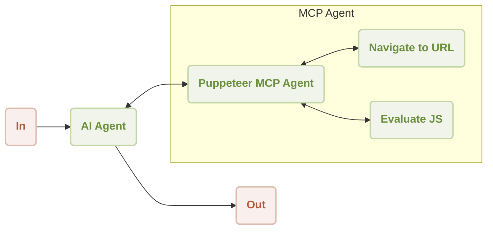

# MCP Puppeteer

在您的 AIGNE 工作流程中，直接利用 Puppeteer 的強大功能進行自動化網頁抓取和內容提取。本範例將示範如何整合 Puppeteer MCP (模型情境協議) 伺服器，以建立能夠瀏覽網站和提取資料的 Agent，這些資料隨後可由 AI 模型進行處理。

本指南將引導您設定並執行一個示範，該示範使用配備 Puppeteer 技能的 AI Agent 從網站提取內容。您將學習如何以不同模式執行範例、連接到各種 AI 模型，並理解其底層程式碼。

## 概述

此工作流程包含一個 `AIAgent`，它使用一個連接到 Puppeteer 伺服器的 `MCPAgent`。AI Agent 接收一個任務，例如「摘要 https://www.arcblock.io 的內容」，然後智慧地利用 Puppeteer Agent 的技能——如 `navigate` 和 `evaluate`——來執行必要的網頁抓取操作。

### 工作流程圖

下圖說明了 AI Agent 和 Puppeteer MCP Agent 之間為完成使用者請求而進行的互動。



### 操作順序

以下是執行網站摘要任務的逐步順序：

```d2
shape: sequence_diagram

User: {
  shape: c4-person
}

AI: {
  label: "AI Agent"
}

P: {
  label: "Puppeteer MCP Agent"
}

N: {
  label: "Navigate to URL"
}

E: {
  label: "Evaluate JS"
}

User -> AI: "摘要 https://www.arcblock.io 的內容"
AI -> P: "從 https://www.arcblock.io 提取內容"
P -> N: "瀏覽至 https://www.arcblock.io"
N -> P: "瀏覽完成"
P -> E: "執行 document.body.innerText"
E -> P: "內容已提取"
P -> AI: "已提取的內容作為情境"
AI -> User: "內容如下：..."
```

## 先決條件

在繼續之前，請確保您的開發環境符合以下要求：

*   **Node.js：** 20.0 或更高版本。
*   **OpenAI API 金鑰：** 預設模型設定所需。您可以從 [OpenAI Platform](https://platform.openai.com/api-keys) 取得。

## 快速入門

您可以使用 `npx` 直接執行此範例，無需克隆程式碼倉庫。

### 執行範例

在您的終端機中執行以下指令之一。

以預設的單次執行模式執行：
```sh icon=lucide:terminal
npx -y @aigne/example-mcp-puppeteer
```

以互動式聊天模式執行：
```sh icon=lucide:terminal
npx -y @aigne/example-mcp-puppeteer --chat
```

您也可以將輸入直接傳送給腳本：
```sh icon=lucide:terminal
echo "extract content from https://www.arcblock.io" | npx -y @aigne/example-mcp-puppeteer
```

### 連接到 AI 模型

首次執行範例時，系統將提示您連接到 AI 模型。您有幾個選項：

1.  **AIGNE Hub (官方)：** 最簡單的入門方式。您的瀏覽器將打開官方的 AIGNE Hub，您可以在那裡登入。新使用者會獲得免費的 token 餘額。
2.  **AIGNE Hub (自行託管)：** 如果您有自己的 AIGNE Hub 實例，可以透過提供其 URL 進行連接。
3.  **第三方模型提供商：** 您可以透過設定適當的環境變數，設定直接連接到像 OpenAI 這樣的提供商。

例如，要使用 OpenAI，請設定 `OPENAI_API_KEY` 變數：
```sh icon=lucide:terminal
export OPENAI_API_KEY="your-openai-api-key"
```

設定完成後，再次執行範例指令。有關設定其他提供商（如 DeepSeek 或 Google Gemini）的更多詳細資訊，請參閱原始碼倉庫中的 `.env.local.example` 檔案。

## 從原始碼安裝

如果您偏好從原始碼執行範例，請按照以下步驟操作。

### 1. 克隆程式碼倉庫

```sh icon=lucide:terminal
git clone https://github.com/AIGNE-io/aigne-framework
```

### 2. 安裝依賴項

導覽至範例目錄並使用 `pnpm` 安裝必要的套件。

```sh icon=lucide:terminal
cd aigne-framework/examples/mcp-puppeteer
pnpm install
```

### 3. 執行範例

執行啟動腳本來執行應用程式。

```sh icon=lucide:terminal
pnpm start
```

若要傳遞命令列參數，請在參數前加上 `--`：
```sh icon=lucide:terminal
# 以互動式聊天模式執行
pnpm start -- --chat

# 設定日誌級別以進行除錯
pnpm start -- --log-level DEBUG
```

## 命令列選項

此腳本接受多個命令列參數來自訂其行為。

| 參數 | 說明 | 預設值 |
| ------------------------- | -------------------------------------------------------------------------------------------------------- | ---------------- |
| `--chat` | 以互動式聊天模式執行。若省略，則以單次執行模式執行。 | 已停用 |
| `--model <provider[:model]>` | 指定要使用的 AI 模型。例如：`openai` 或 `openai:gpt-4o-mini`。 | `openai` |
| `--temperature <value>` | 設定模型生成的溫度。 | 提供商預設值 |
| `--top-p <value>` | 設定 top-p 取樣值。 | 提供商預設值 |
| `--presence-penalty <value>` | 設定存在懲罰值。 | 提供商預設值 |
| `--frequency-penalty <value>` | 設定頻率懲罰值。 | 提供商預設值 |
| `--log-level <level>` | 設定日誌級別。選項：`ERROR`、`WARN`、`INFO`、`DEBUG`、`TRACE`。 | `INFO` |
| `--input, -i <input>` | 直接以參數形式提供輸入。 | 無 |

## 程式碼實作

核心邏輯包括設定一個帶有 AI 模型和一個設定為執行 Puppeteer 伺服器的 `MCPAgent` 的 `AIGNE` 實例。然後，給予一個 `AIAgent` 指令，說明如何使用 Puppeteer 技能來提取網頁內容。

```typescript index.ts
import { AIAgent, AIGNE, MCPAgent } from "@aigne/core";
import { OpenAIChatModel } from "@aigne/core/models/openai-chat-model.js";

const { OPENAI_API_KEY } = process.env;

// 1. 初始化 AI 模型
const model = new OpenAIChatModel({
  apiKey: OPENAI_API_KEY,
});

// 2. 建立一個 MCPAgent 來管理 Puppeteer 伺服器
const puppeteerMCPAgent = await MCPAgent.from({
  command: "npx",
  args: ["-y", "@modelcontextprotocol/server-puppeteer"],
});

// 3. 使用模型和 Puppeteer 技能實例化 AIGNE 框架
const aigne = new AIGNE({
  model,
  skills: [puppeteerMCPAgent],
});

// 4. 定義一個帶有網頁抓取指令的 AI Agent
const agent = AIAgent.from({
  instructions: `\
## 從網站提取內容的步驟
1. 瀏覽至該 url
2. 執行 document.body.innerText 以取得內容
`,
});

// 5. 使用提示叫用 Agent
const result = await aigne.invoke(
  agent,
  "extract content from https://www.arcblock.io",
);

console.log(result);

// 6. 關閉 MCP Agent 並清理資源
await aigne.shutdown();
```

輸出將是一個 JSON 物件，其中包含從指定 URL 提取的內容，並根據 Agent 的指令進行摘要或處理。

```json
{
  "$message": "從網站 [ArcBlock](https://www.arcblock.io) 提取的內容如下：\n\n---\n\n**重新定義軟體架構與生態系**\n\n一個用於建構去中心化應用程式的完整解決方案..."
}
```

## 總結

本範例實際展示了如何使用模型情境協議將像 Puppeteer 這樣的外部工具整合到 AIGNE 框架中。透過為 `AIAgent` 配備網頁抓取技能，您可以建構強大的應用程式，能夠與網路互動以自動收集和處理資訊。

若要進一步探索，您可以參考以下相關文件：

<x-cards data-columns="2">
  <x-card data-title="MCP Agent" data-href="/developer-guide/agents/mcp-agent" data-icon="lucide:box">
  了解更多關於如何透過模型情境協議 (MCP) 連接到外部系統的資訊。
  </x-card>
  <x-card data-title="AI Agent" data-href="/developer-guide/agents/ai-agent" data-icon="lucide:bot">
  深入了解用於與語言模型互動的主要 Agent。
  </x-card>
</x-cards>