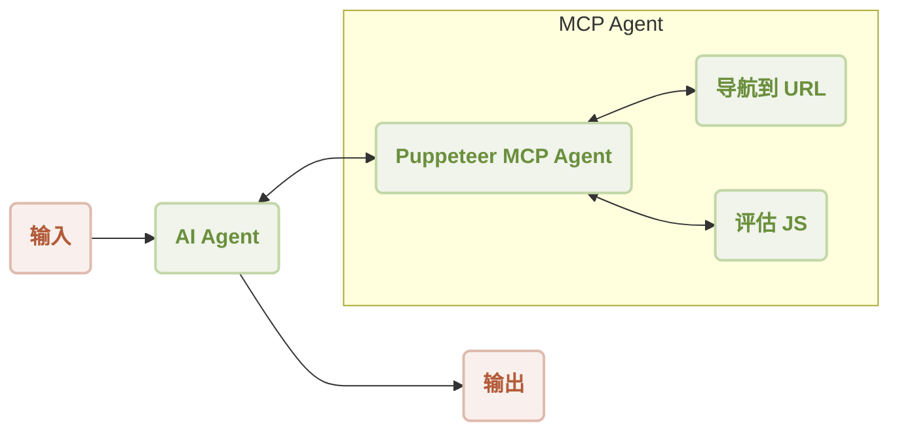

# MCP Puppeteer

利用 Puppeteer 的强大功能，直接在您的 AIGNE 工作流中自动执行网页抓取和内容提取。本示例演示了如何集成 Puppeteer MCP（模型上下文协议）服务器，以创建能够浏览网站和提取数据的 Agent，这些数据随后可由 AI 模型处理。

本指南将引导您设置并运行一个演示，该演示使用配备 Puppeteer 技能的 AI Agent 从网站提取内容。您将学习如何以不同模式运行该示例、连接到各种 AI 模型以及理解底层代码。

## 概述

该工作流涉及一个 `AIAgent`，它使用一个连接到 Puppeteer 服务器的 `MCPAgent`。AI Agent 接收一个任务，例如“从 https://www.arcblock.io 总结内容”，然后智能地利用 Puppeteer Agent 的技能（如 `navigate` 和 `evaluate`）来执行必要的网页抓取操作。

### 工作流图

下图说明了 AI Agent 和 Puppeteer MCP Agent 为完成用户请求而进行的交互。



### 操作序列

以下是执行网站内容摘要任务的逐步序列：

```d2
shape: sequence_diagram

User: {
  shape: c4-person
}

AI: {
  label: "AI Agent"
}

P: {
  label: "Puppeteer MCP Agent"
}

N: {
  label: "导航到 URL"
}

E: {
  label: "评估 JS"
}

User -> AI: "从 https://www.arcblock.io 总结内容"
AI -> P: "从 https://www.arcblock.io 提取内容"
P -> N: "导航到 https://www.arcblock.io"
N -> P: "导航完成"
P -> E: "评估 document.body.innerText"
E -> P: "内容已提取"
P -> AI: "将提取的内容作为上下文"
AI -> User: "内容如下：..."
```

## 前置要求

在继续之前，请确保您的开发环境满足以下要求：

*   **Node.js：** 20.0 或更高版本。
*   **OpenAI API 密钥：** 默认模型配置需要。您可以从 [OpenAI Platform](https://platform.openai.com/api-keys) 获取。

## 快速入门

您可以使用 `npx` 直接运行此示例，无需克隆代码仓库。

### 运行示例

在您的终端中执行以下命令之一。

以默认的单次模式运行：
```sh icon=lucide:terminal
npx -y @aigne/example-mcp-puppeteer
```

以交互式聊天模式运行：
```sh icon=lucide:terminal
npx -y @aigne/example-mcp-puppeteer --chat
```

您还可以将输入直接通过管道传递给脚本：
```sh icon=lucide:terminal
echo "extract content from https://www.arcblock.io" | npx -y @aigne/example-mcp-puppeteer
```

### 连接到 AI 模型

首次运行该示例时，系统将提示您连接到一个 AI 模型。您有以下几个选项：

1.  **AIGNE Hub（官方）：** 最简单的入门方式。您的浏览器将打开官方的 AIGNE Hub，您可以在那里登录。新用户会获得免费的 token 额度。
2.  **AIGNE Hub（自托管）：** 如果您有自己的 AIGNE Hub 实例，可以通过提供其 URL 进行连接。
3.  **第三方模型提供商：** 您可以通过设置适当的环境变量来配置与 OpenAI 等提供商的直接连接。

例如，要使用 OpenAI，请设置 `OPENAI_API_KEY` 变量：
```sh icon=lucide:terminal
export OPENAI_API_KEY="your-openai-api-key"
```

配置完成后，再次运行示例命令。有关配置其他提供商（如 DeepSeek 或 Google Gemini）的更多详细信息，请参阅源仓库中的 `.env.local.example` 文件。

## 从源代码安装

如果您更喜欢从源代码运行示例，请按照以下步骤操作。

### 1. 克隆代码仓库

```sh icon=lucide:terminal
git clone https://github.com/AIGNE-io/aigne-framework
```

### 2. 安装依赖项

导航到示例目录并使用 `pnpm` 安装必要的软件包。

```sh icon=lucide:terminal
cd aigne-framework/examples/mcp-puppeteer
pnpm install
```

### 3. 运行示例

执行启动脚本以运行应用程序。

```sh icon=lucide:terminal
pnpm start
```

要传递命令行参数，请在参数前添加 `--`：
```sh icon=lucide:terminal
# 以交互式聊天模式运行
pnpm start -- --chat

# 设置用于调试的日志级别
pnpm start -- --log-level DEBUG
```

## 命令行选项

该脚本接受多个命令行参数以自定义其行为。

| 参数 | 描述 | 默认值 |
| ------------------------- | -------------------------------------------------------------------------------------------------------- | ---------------- |
| `--chat` | 以交互式聊天模式运行。如果省略，则以单次模式运行。 | 已禁用 |
| `--model <provider[:model]>` | 指定要使用的 AI 模型。示例：`openai` 或 `openai:gpt-4o-mini`。 | `openai` |
| `--temperature <value>` | 设置模型生成的温度。 | 提供商默认值 |
| `--top-p <value>` | 设置 top-p 采样值。 | 提供商默认值 |
| `--presence-penalty <value>` | 设置存在惩罚值。 | 提供商默认值 |
| `--frequency-penalty <value>` | 设置频率惩罚值。 | 提供商默认值 |
| `--log-level <level>` | 设置日志级别。选项：`ERROR`、`WARN`、`INFO`、`DEBUG`、`TRACE`。 | `INFO` |
| `--input, -i <input>` | 直接作为参数提供输入。 | 无 |

## 代码实现

核心逻辑包括设置一个带有 AI 模型和配置为运行 Puppeteer 服务器的 `MCPAgent` 的 `AIGNE` 实例。然后，向一个 `AIAgent` 提供如何使用 Puppeteer 技能提取网页内容的指令。

```typescript index.ts
import { AIAgent, AIGNE, MCPAgent } from "@aigne/core";
import { OpenAIChatModel } from "@aigne/core/models/openai-chat-model.js";

const { OPENAI_API_KEY } = process.env;

// 1. 初始化 AI 模型
const model = new OpenAIChatModel({
  apiKey: OPENAI_API_KEY,
});

// 2. 创建一个 MCPAgent 来管理 Puppeteer 服务器
const puppeteerMCPAgent = await MCPAgent.from({
  command: "npx",
  args: ["-y", "@modelcontextprotocol/server-puppeteer"],
});

// 3. 使用模型和 Puppeteer 技能实例化 AIGNE 框架
const aigne = new AIGNE({
  model,
  skills: [puppeteerMCPAgent],
});

// 4. 定义一个带有网页抓取指令的 AI Agent
const agent = AIAgent.from({
  instructions: `\
## 从网站提取内容的步骤
1. 导航到 url
2. 评估 document.body.innerText 以获取内容
`,
});

// 5. 使用提示调用 Agent
const result = await aigne.invoke(
  agent,
  "extract content from https://www.arcblock.io",
);

console.log(result);

// 6. 关闭 MCP agent 并清理资源
await aigne.shutdown();
```

输出将是一个 JSON 对象，其中包含从指定 URL 提取的内容，并根据 Agent 的指令进行总结或处理。

```json
{
  "$message": "The content extracted from the website [ArcBlock](https://www.arcblock.io) is as follows:\n\n---\n\n**Redefining Software Architect and Ecosystems**\n\nA total solution for building decentralized applications ..."
}
```

## 总结

本示例提供了一个实践演示，展示了如何使用模型上下文协议将 Puppeteer 等外部工具集成到 AIGNE 框架中。通过为 `AIAgent` 配备网页抓取技能，您可以构建能够与网络交互以自动收集和处理信息的强大应用程序。

如需进一步探索，您可以参考以下相关文档：

<x-cards data-columns="2">
  <x-card data-title="MCP Agent" data-href="/developer-guide/agents/mcp-agent" data-icon="lucide:box">
  了解更多关于如何通过模型上下文协议（MCP）连接到外部系统的信息。
  </x-card>
  <x-card data-title="AI Agent" data-href="/developer-guide/agents/ai-agent" data-icon="lucide:bot">
  深入了解与语言模型交互的主要 Agent。
  </x-card>
</x-cards>