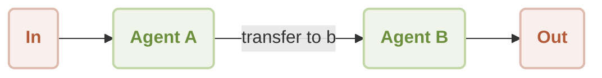

# ワークフローのハンドオフ

このドキュメントでは、ある Agent が別の Agent にシームレスに制御を引き継ぐワークフローを構築する方法について説明します。この手法により、タスクを専門の Agent に委任する洗練されたマルチ Agent システムを作成でき、より複雑な問題の解決が可能になります。このガイドを完了することで、異なる能力を持つ 2 つの Agent 間でハンドオフメカニズムを実装する方法を理解できます。

## 仕組み

ハンドオフワークフローには、最初のコンタクトおよびディスパッチャーとして機能するプライマリ Agent (Agent A) が関与します。ユーザーの入力に基づき、この Agent は会話をセカンダリの専門 Agent (Agent B) に転送する「スキル」をトリガーできます。その後、Agent B が対話を引き継ぎ、独自の指示セットに従います。このパターンは、モジュール式でスケーラブルな AI アプリケーションを構築するために不可欠です。

プロセスフローを以下に示します。



典型的なユーザーインタラクションシーケンスは次のとおりです。

```d2
shape: sequence_diagram

User: { 
  shape: c4-person 
}

A: {
  label: "Agent A"
}

B: {
  label: "Agent B"
}

User -> A: "transfer to agent b"
A -> B: "transfer to agent b"
B -> User: "What do you need, friend?"

loop: {
  User -> B: "It's a beautiful day"
  B -> User: "Sunshine warms the earth,\nGentle breeze whispers softly,\nNature sings with joy."
}
```

## 前提条件

続行する前に、システムに以下のソフトウェアがインストールされていることを確認してください。

*   Node.js (バージョン 20.0 以上)
*   OpenAI API キー。[OpenAI Platform](https://platform.openai.com/api-keys) から取得できます。

## クイックスタート

この例は、`npx` を使用してローカルにインストールすることなく、コマンドラインから直接実行できます。

### 例を実行する

このワークフローは、ワンショットモードまたは対話型のチャットセッションとして実行できます。

*   **ワンショットモード (デフォルト)**: 1 つの入力で実行され、出力を返します。

    ```sh icon=lucide:terminal
    npx -y @aigne/example-workflow-handoff
    ```

*   **対話型チャットモード**: 継続的な会話ができるセッションを開始します。

    ```sh icon=lucide:terminal
    npx -y @aigne/example-workflow-handoff --chat
    ```

*   **パイプライン入力**: スクリプトに直接入力をパイプすることもできます。

    ```sh icon=lucide:terminal
    echo "transfer to agent b" | npx -y @aigne/example-workflow-handoff
    ```

### AI モデルに接続する

初めてこの例を実行すると、AI モデルへの接続を求められます。主に 3 つの選択肢があります。

1.  **公式 AIGNE Hub 経由で接続**: 新規ユーザーに推奨されるオプションです。画面の指示に従ってブラウザを接続してください。新規ユーザーには無料のトークンが付与されます。
2.  **セルフホストの AIGNE Hub 経由で接続**: 独自の AIGNE Hub インスタンスをホストしている場合は、このオプションを選択し、その URL を提供してください。
3.  **サードパーティのモデルプロバイダー経由で接続**: OpenAI のようなプロバイダーに直接接続するには、対応する API キーを環境変数として設定します。

    ```sh icon=lucide:terminal
    export OPENAI_API_KEY="your-openai-api-key"
    ```

    環境変数を設定した後、再度 `npx` コマンドを実行してください。サポートされているプロバイダーとその必要な環境変数のリストについては、[モデル設定](./models-configuration.md)のドキュメントを参照してください。

## ローカルへのインストールと設定

ソースコードを確認または変更したい開発者は、以下の手順に従ってプロジェクトをローカルに設定してください。

1.  **リポジトリをクローンする**

    ```sh icon=lucide:terminal
    git clone https://github.com/AIGNE-io/aigne-framework
    ```

2.  **サンプルディレクトリに移動する**

    ```sh icon=lucide:terminal
    cd aigne-framework/examples/workflow-handoff
    ```

3.  **依存関係をインストールする**

    このリポジトリ内では、パッケージ管理に `pnpm` を使用することをお勧めします。

    ```sh icon=lucide:terminal
    pnpm install
    ```

4.  **例を実行する**

    ローカルスクリプトは、`npx` での実行と同じコマンドライン引数をサポートしています。

    ```sh icon=lucide:terminal
    # ワンショットモードで実行
    pnpm start
    
    # 対話型チャットモードで実行
    pnpm start -- --chat
    
    # パイプライン入力を使用
    echo "transfer to agent b" | pnpm start
    ```

## コードの実装

ハンドオフワークフローの中核となるロジックは、単一の TypeScript ファイルに含まれています。このファイルでは、2 つの Agent と、制御の移譲を容易にする関数が定義されています。

```typescript handoff-workflow.ts icon=logos:typescript
import { AIAgent, AIGNE } from "@aigne/core";
import { OpenAIChatModel } from "@aigne/core/models/openai-chat-model.js";

const { OPENAI_API_KEY } = process.env;

// 1. API キーでチャットモデルを初期化します。
const model = new OpenAIChatModel({
  apiKey: OPENAI_API_KEY,
});

// 2. ハンドオフ関数を定義します。この関数は、アクティブ化する Agent を返します。
function transfer_to_b() {
  return agentB;
}

// 3. Agent A (最初のコンタクトポイント) を定義します。
// これは、Agent B に制御を移すスキルを持つ役立つ Agent です。
const agentA = AIAgent.from({
  name: "AgentA",
  instructions: "You are a helpful agent.",
  outputKey: "A",
  skills: [transfer_to_b],
});

// 4. Agent B (専門 Agent) を定義します。
// その指示は、俳句でのみ応答することです。
const agentB = AIAgent.from({
  name: "AgentB",
  instructions: "Only speak in Haikus.",
  outputKey: "B",
});

// 5. モデルを使用して AIGNE ランタイムをインスタンス化します。
const aigne = new AIGNE({ model });

// 6. 初期 Agent (Agent A) を呼び出してセッションを開始します。
const userAgent = aigne.invoke(agentA);

// 7. 最初の呼び出しで Agent B へのハンドオフがトリガーされます。
const result1 = await userAgent.invoke("transfer to agent b");
console.log(result1);
// Output:
// {
//   B: "Transfer now complete,  \nAgent B is here to help.  \nWhat do you need, friend?",
// }

// 8. 2 回目の呼び出しは Agent B と直接対話します。
const result2 = await userAgent.invoke("It's a beautiful day");
console.log(result2);
// Output:
// {
//   B: "Sunshine warms the earth,  \nGentle breeze whispers softly,  \nNature sings with joy.  ",
// }
```

### 解説

1.  **モデルの初期化**: `OpenAIChatModel` のインスタンスが作成され、Agent の頭脳として機能します。
2.  **ハンドオフスキル**: `transfer_to_b` 関数は標準的な JavaScript 関数です。`agentA` の `skills` に追加されると、AIGNE フレームワークはこれを AI が使用を決定できるツールとして利用可能にします。呼び出されると、`agentB` オブジェクトを返し、フレームワークに制御をハンドオフするよう信号を送ります。
3.  **Agent A**: この Agent はディスパッチャーとして機能します。このワークフローにおける主な役割は、ユーザーの Agent 切り替えの意図を認識し、適切なスキルを呼び出すことです。
4.  **Agent B**: この Agent は、俳句でのみ話すという `instructions` によって定義された専門的なペルソナを持っています。独立して動作し、Agent A のことは認識していません。
5.  **AIGNE の呼び出し**: `aigne.invoke(agentA)` は、Agent A で始まるステートフルなセッションを作成します。その後の `userAgent.invoke()` の呼び出しは、セッションで現在アクティブな Agent に向けられます。ハンドオフ後、それ以降の入力はすべて Agent B に送られます。

## コマンドラインオプション

スクリプトの動作は、以下のコマンドラインパラメータを使用してカスタマイズできます。

| パラメータ | 説明 | デフォルト |
| ------------------------- | ---------------------------------------------------------------------------------------------------------------- | ---------------- |
| `--chat` | 対話型チャットモードで実行します。 | 無効 |
| `--model <provider[:model]>` | 使用する AI モデルを指定します。例: `openai` または `openai:gpt-4o-mini`。 | `openai` |
| `--temperature <value>` | モデル生成の temperature を設定します。 | プロバイダーのデフォルト |
| `--top-p <value>` | top-p サンプリング値を設定します。 | プロバイダーのデフォルト |
| `--presence-penalty <value>` | presence penalty の値を設定します。 | プロバイダーのデフォルト |
| `--frequency-penalty <value>` | frequency penalty の値を設定します。 | プロバイダーのデフォルト |
| `--log-level <level>` | ログレベル (`ERROR`、`WARN`、`INFO`、`DEBUG`、`TRACE`) を設定します。 | `INFO` |
| `--input`, `-i <input>` | コマンドライン経由で直接入力を提供します。 | なし |

#### 使用例

```sh icon=lucide:terminal
# 特定の OpenAI モデルを使用してチャットモードで実行
pnpm start -- --chat --model openai:gpt-4o-mini

# 詳細な出力のためにログレベルを DEBUG に設定
pnpm start -- --log-level DEBUG
```

## AIGNE Observe を使用したデバッグ

Agent の実行フローを調査するには、`aigne observe` コマンドを使用できます。これにより、Agent の動作を監視および分析するための UI を備えたローカルウェブサーバーが起動し、デバッグに非常に役立ちます。

1.  **監視サーバーを起動する**

    ```sh icon=lucide:terminal
    aigne observe
    ```

2.  **Agent を実行する**

    別のターミナルウィンドウでハンドオフの例を実行します。

3.  **トレースを表示する**

    `aigne observe` によって提供されるウェブインターフェースに移動します。最近の実行リストが表示されます。いずれかをクリックすると、Agent A による初期処理とそれに続く Agent B へのハンドオフを含む、ワークフロー全体の詳細なトレースが表示されます。

## まとめ

このガイドでは、モジュール式のマルチ Agent システムを構築するための基本的なテクニックであるワークフローハンドオフパターンについて詳しく説明しました。専門的な指示を持つ Agent にタスクを委任することで、より強力で保守性の高い AI アプリケーションを作成できます。

関連トピックに関する詳細については、以下のドキュメントを参照してください。

<x-cards data-columns="2">
  <x-card data-title="AI Agent" data-icon="lucide:bot" data-href="/developer-guide/agents/ai-agent">
    AI モデルと対話する Agent を作成するためのコアコンポーネントについて学びます。
  </x-card>
  <x-card data-title="Team Agent" data-icon="lucide:users" data-href="/developer-guide/agents/team-agent">
    複雑なタスクで協力するために複数の Agent を編成する方法を発見します。
  </x-card>
  <x-card data-title="Workflow Orchestration" data-icon="lucide:workflow" data-href="/examples/workflow-orchestration">
    処理パイプラインで複数の Agent を調整する別の例を探ります。
  </x-card>
  <x-card data-title="Workflow Router" data-icon="lucide:git-branch" data-href="/examples/workflow-router">
    リクエストを適切な Agent に転送するためのインテリジェントなルーティングを実装する方法を学びます。
  </x-card>
</x-cards>