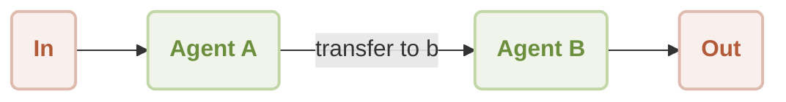

# Workflow Handoff

This document explains how to build a workflow where one agent seamlessly transfers control to another. This technique allows you to create sophisticated, multi-agent systems that delegate tasks to specialized agents, enabling the resolution of more complex problems. By completing this guide, you will understand how to implement a handoff mechanism between two agents with distinct capabilities.

## How It Works

The handoff workflow involves a primary agent (Agent A) that acts as an initial contact and dispatcher. Based on the user's input, this agent can trigger a "skill" that transfers the conversation to a secondary, specialized agent (Agent B). Agent B then takes over the interaction, following its own unique set of instructions. This pattern is essential for building modular and scalable AI applications.

The process flow is illustrated below:



A typical user interaction sequence is as follows:

```d2
shape: sequence_diagram

User: { 
  shape: c4-person 
}

A: {
  label: "Agent A"
}

B: {
  label: "Agent B"
}

User -> A: "transfer to agent b"
A -> B: "transfer to agent b"
B -> User: "What do you need, friend?"

loop: {
  User -> B: "It's a beautiful day"
  B -> User: "Sunshine warms the earth,\nGentle breeze whispers softly,\nNature sings with joy."
}
```

## Prerequisites

Ensure the following software is installed on your system before proceeding:

*   Node.js (version 20.0 or higher)
*   An OpenAI API key, which can be obtained from the [OpenAI Platform](https://platform.openai.com/api-keys).

## Quick Start

This example can be executed directly from the command line without any local installation using `npx`.

### Run the Example

The workflow can be run in a single-shot mode or as an interactive chat session.

*   **One-Shot Mode (Default)**: Executes with a single input and returns the output.

    ```sh icon=lucide:terminal
    npx -y @aigne/example-workflow-handoff
    ```

*   **Interactive Chat Mode**: Starts a session where you can have an ongoing conversation.

    ```sh icon=lucide:terminal
    npx -y @aigne/example-workflow-handoff --chat
    ```

*   **Pipeline Input**: You can also pipe input directly to the script.

    ```sh icon=lucide:terminal
    echo "transfer to agent b" | npx -y @aigne/example-workflow-handoff
    ```

### Connect to an AI Model

The first time you run the example, you will be prompted to connect to an AI model. You have three primary options:

1.  **Connect via the official AIGNE Hub**: This is the recommended option for new users. Follow the on-screen prompts to connect your browser. New users receive a complimentary token grant.
2.  **Connect via a self-hosted AIGNE Hub**: If you host your own AIGNE Hub instance, choose this option and provide its URL.
3.  **Connect via a third-party model provider**: To connect directly to a provider like OpenAI, set the corresponding API key as an environment variable.

    ```sh icon=lucide:terminal
    export OPENAI_API_KEY="your-openai-api-key"
    ```

    After configuring the environment variable, run the `npx` command again. For a list of supported providers and their required environment variables, refer to the [Model Configuration](./models-configuration.md) documentation.

## Local Installation and Setup

For developers who wish to examine or modify the source code, follow these steps to set up the project locally.

1.  **Clone the Repository**

    ```sh icon=lucide:terminal
    git clone https://github.com/AIGNE-io/aigne-framework
    ```

2.  **Navigate to the Example Directory**

    ```sh icon=lucide:terminal
    cd aigne-framework/examples/workflow-handoff
    ```

3.  **Install Dependencies**

    It is recommended to use `pnpm` for package management within this repository.

    ```sh icon=lucide:terminal
    pnpm install
    ```

4.  **Run the Example**

    The local script supports the same command-line arguments as the `npx` execution.

    ```sh icon=lucide:terminal
    # Run in one-shot mode
    pnpm start
    
    # Run in interactive chat mode
    pnpm start -- --chat
    
    # Use pipeline input
    echo "transfer to agent b" | pnpm start
    ```

## Code Implementation

The core logic for the handoff workflow is contained in a single TypeScript file. It defines two agents and the function that facilitates the transfer of control.

```typescript handoff-workflow.ts icon=logos:typescript
import { AIAgent, AIGNE } from "@aigne/core";
import { OpenAIChatModel } from "@aigne/core/models/openai-chat-model.js";

const { OPENAI_API_KEY } = process.env;

// 1. Initialize the chat model with an API key.
const model = new OpenAIChatModel({
  apiKey: OPENAI_API_KEY,
});

// 2. Define the handoff function. This function returns the agent to be activated.
function transfer_to_b() {
  return agentB;
}

// 3. Define Agent A, the initial point of contact.
// It is a helpful agent with the skill to transfer control to Agent B.
const agentA = AIAgent.from({
  name: "AgentA",
  instructions: "You are a helpful agent.",
  outputKey: "A",
  skills: [transfer_to_b],
});

// 4. Define Agent B, the specialized agent.
// Its instruction is to respond only in Haikus.
const agentB = AIAgent.from({
  name: "AgentB",
  instructions: "Only speak in Haikus.",
  outputKey: "B",
});

// 5. Instantiate the AIGNE runtime with the model.
const aigne = new AIGNE({ model });

// 6. Invoke the initial agent (Agent A) to start the session.
const userAgent = aigne.invoke(agentA);

// 7. First invocation triggers the handoff to Agent B.
const result1 = await userAgent.invoke("transfer to agent b");
console.log(result1);
// Output:
// {
//   B: "Transfer now complete,  \nAgent B is here to help.  \nWhat do you need, friend?",
// }

// 8. Second invocation interacts directly with Agent B.
const result2 = await userAgent.invoke("It's a beautiful day");
console.log(result2);
// Output:
// {
//   B: "Sunshine warms the earth,  \nGentle breeze whispers softly,  \nNature sings with joy.  ",
// }
```

### Explanation

1.  **Model Initialization**: An instance of `OpenAIChatModel` is created to serve as the brain for the agents.
2.  **Handoff Skill**: The `transfer_to_b` function is a standard JavaScript function. When added to `agentA`'s `skills`, the AIGNE framework makes it available as a tool that the AI can decide to use. When called, it returns the `agentB` object, signaling the framework to hand off control.
3.  **Agent A**: This agent acts as a dispatcher. Its primary role in this workflow is to recognize the user's intent to switch agents and call the appropriate skill.
4.  **Agent B**: This agent has a specialized persona, defined by its `instructions` to speak only in haikus. It operates independently and is unaware of Agent A.
5.  **AIGNE Invocation**: `aigne.invoke(agentA)` creates a stateful session that begins with Agent A. Subsequent calls to `userAgent.invoke()` are directed to whichever agent is currently active in the session. After the handoff, all further inputs go to Agent B.

## Command-Line Options

The script's behavior can be customized using the following command-line parameters.

| Parameter                 | Description                                                                                                      | Default          |
| ------------------------- | ---------------------------------------------------------------------------------------------------------------- | ---------------- |
| `--chat`                  | Run in interactive chat mode.                                                                                    | Disabled         |
| `--model <provider[:model]>` | Specifies the AI model to use, e.g., `openai` or `openai:gpt-4o-mini`.                                           | `openai`         |
| `--temperature <value>`   | Sets the temperature for model generation.                                                                       | Provider default |
| `--top-p <value>`         | Sets the top-p sampling value.                                                                                   | Provider default |
| `--presence-penalty <value>` | Sets the presence penalty value.                                                                                 | Provider default |
| `--frequency-penalty <value>` | Sets the frequency penalty value.                                                                                | Provider default |
| `--log-level <level>`     | Sets the logging level (`ERROR`, `WARN`, `INFO`, `DEBUG`, `TRACE`).                                                | `INFO`           |
| `--input`, `-i <input>`   | Provides input directly via the command line.                                                                    | None             |

#### Usage Examples

```sh icon=lucide:terminal
# Run in chat mode with a specific OpenAI model
pnpm start -- --chat --model openai:gpt-4o-mini

# Set the logging level to DEBUG for detailed output
pnpm start -- --log-level DEBUG
```

## Debugging with AIGNE Observe

To inspect the agent's execution flow, you can use the `aigne observe` command. This launches a local web server with a UI for monitoring and analyzing agent behavior, which is invaluable for debugging.

1.  **Start the Observation Server**

    ```sh icon=lucide:terminal
    aigne observe
    ```

2.  **Run Your Agent**

    Execute the handoff example in a separate terminal window.

3.  **View Traces**

    Navigate to the web interface provided by `aigne observe`. You will see a list of recent executions. Clicking on one will reveal a detailed trace of the entire workflow, including the initial handling by Agent A and the subsequent handoff to Agent B.

## Summary

This guide has detailed the workflow handoff pattern, a fundamental technique for building modular, multi-agent systems. By delegating tasks to agents with specialized instructions, you can create more powerful and maintainable AI applications.

For further reading on related topics, please see the following documents:

<x-cards data-columns="2">
  <x-card data-title="AI Agent" data-icon="lucide:bot" data-href="/developer-guide/agents/ai-agent">
    Learn about the core component for creating agents that interact with AI models.
  </x-card>
  <x-card data-title="Team Agent" data-icon="lucide:users" data-href="/developer-guide/agents/team-agent">
    Discover how to orchestrate multiple agents to collaborate on complex tasks.
  </x-card>
  <x-card data-title="Workflow Orchestration" data-icon="lucide:workflow" data-href="/examples/workflow-orchestration">
    Explore another example of coordinating multiple agents in a processing pipeline.
  </x-card>
  <x-card data-title="Workflow Router" data-icon="lucide:git-branch" data-href="/examples/workflow-router">
    Learn how to implement intelligent routing to direct requests to the appropriate agent.
  </x-card>
</x-cards>