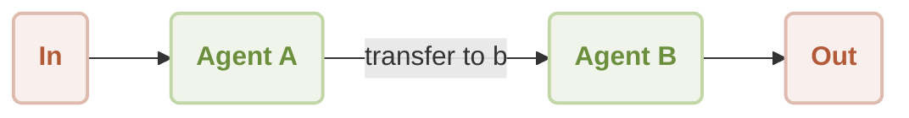

# 工作流程交接

本文件說明如何建立一個工作流程，讓一個 Agent 將控制權無縫轉移給另一個 Agent。此技術可讓您建立精細的多 Agent 系統，將任務委派給專門的 Agent，從而解決更複雜的問題。完成本指南後，您將了解如何在兩個具有不同功能的 Agent 之間實作交接機制。

## 運作方式

交接工作流程涉及一個主要 Agent (Agent A)，其作為初始接觸點和調度員。根據使用者的輸入，此 Agent 可以觸發一個「技能」，將對話轉移給一個次要的專門 Agent (Agent B)。接著，Agent B 會接管互動，遵循其自己獨特的指令集。此模式對於建構模組化且可擴展的 AI 應用程式至關重要。

流程圖如下所示：



典型的使用者互動順序如下：

```d2
shape: sequence_diagram

User: { 
  shape: c4-person 
}

A: {
  label: "Agent A"
}

B: {
  label: "Agent B"
}

User -> A: "transfer to agent b"
A -> B: "transfer to agent b"
B -> User: "What do you need, friend?"

loop: {
  User -> B: "It's a beautiful day"
  B -> User: "Sunshine warms the earth,\nGentle breeze whispers softly,\nNature sings with joy."
}
```

## 先決條件

在繼續之前，請確保您的系統上已安裝以下軟體：

*   Node.js (版本 20.0 或更高)
*   一個 OpenAI API 金鑰，可從 [OpenAI Platform](https://platform.openai.com/api-keys) 取得。

## 快速入門

此範例可直接從命令列執行，無需任何本機安裝，使用 `npx` 即可。

### 執行範例

此工作流程可以單次模式或互動式聊天會話執行。

*   **單次模式 (預設)**：以單一輸入執行並傳回輸出。

    ```sh icon=lucide:terminal
    npx -y @aigne/example-workflow-handoff
    ```

*   **互動式聊天模式**：啟動一個會話，您可以在其中進行持續的對話。

    ```sh icon=lucide:terminal
    npx -y @aigne/example-workflow-handoff --chat
    ```

*   **管道輸入**：您也可以將輸入直接透過管道傳送給指令碼。

    ```sh icon=lucide:terminal
    echo "transfer to agent b" | npx -y @aigne/example-workflow-handoff
    ```

### 連線至 AI 模型

首次執行範例時，系統會提示您連線至 AI 模型。您有三個主要選項：

1.  **透過官方 AIGNE Hub 連線**：這是推薦給新使用者的選項。請按照螢幕上的提示來連線您的瀏覽器。新使用者可獲得免費的 token 額度。
2.  **透過自行託管的 AIGNE Hub 連線**：如果您託管自己的 AIGNE Hub 執行個體，請選擇此選項並提供其 URL。
3.  **透過第三方模型供應商連線**：要直接連線到像 OpenAI 這樣的供應商，請將相應的 API 金鑰設定為環境變數。

    ```sh icon=lucide:terminal
    export OPENAI_API_KEY="your-openai-api-key"
    ```

    設定環境變數後，再次執行 `npx` 指令。有關支援的供應商及其所需環境變數的列表，請參閱[模型設定](./models-configuration.md)文件。

## 本機安裝與設定

對於希望檢查或修改原始程式碼的開發者，請按照以下步驟在本機設定專案。

1.  **複製儲存庫**

    ```sh icon=lucide:terminal
    git clone https://github.com/AIGNE-io/aigne-framework
    ```

2.  **導覽至範例目錄**

    ```sh icon=lucide:terminal
    cd aigne-framework/examples/workflow-handoff
    ```

3.  **安裝依賴項**

    建議在此儲存庫內使用 `pnpm` 進行套件管理。

    ```sh icon=lucide:terminal
    pnpm install
    ```

4.  **執行範例**

    本機指令碼支援與 `npx` 執行相同的命令列參數。

    ```sh icon=lucide:terminal
    # 以單次模式執行
    pnpm start
    
    # 以互動式聊天模式執行
    pnpm start -- --chat
    
    # 使用管道輸入
    echo "transfer to agent b" | pnpm start
    ```

## 程式碼實作

交接工作流程的核心邏輯包含在單一的 TypeScript 檔案中。它定義了兩個 Agent 以及促進控制權轉移的函式。

```typescript handoff-workflow.ts icon=logos:typescript
import { AIAgent, AIGNE } from "@aigne/core";
import { OpenAIChatModel } from "@aigne/core/models/openai-chat-model.js";

const { OPENAI_API_KEY } = process.env;

// 1. 使用 API 金鑰初始化聊天模型。
const model = new OpenAIChatModel({
  apiKey: OPENAI_API_KEY,
});

// 2. 定義交接函式。此函式會傳回要啟動的 Agent。
function transfer_to_b() {
  return agentB;
}

// 3. 定義 Agent A，即初始接觸點。
// 它是一個有用的 Agent，具備將控制權轉移給 Agent B 的技能。
const agentA = AIAgent.from({
  name: "AgentA",
  instructions: "You are a helpful agent.",
  outputKey: "A",
  skills: [transfer_to_b],
});

// 4. 定義 Agent B，即專門的 Agent。
// 其指令是只用俳句 (Haikus) 回應。
const agentB = AIAgent.from({
  name: "AgentB",
  instructions: "Only speak in Haikus.",
  outputKey: "B",
});

// 5. 使用模型實例化 AIGNE 執行階段。
const aigne = new AIGNE({ model });

// 6. 叫用初始 Agent (Agent A) 以啟動會話。
const userAgent = aigne.invoke(agentA);

// 7. 第一次叫用觸發向 Agent B 的交接。
const result1 = await userAgent.invoke("transfer to agent b");
console.log(result1);
// Output:
// {
//   B: "Transfer now complete,  \nAgent B is here to help.  \nWhat do you need, friend?",
// }

// 8. 第二次叫用直接與 Agent B 互動。
const result2 = await userAgent.invoke("It's a beautiful day");
console.log(result2);
// Output:
// {
//   B: "Sunshine warms the earth,  \nGentle breeze whispers softly,  \nNature sings with joy.  ",
// }
```

### 解釋

1.  **模型初始化**：建立一個 `OpenAIChatModel` 的實例，作為 Agent 的大腦。
2.  **交接技能**：`transfer_to_b` 函式是一個標準的 JavaScript 函式。當加入到 `agentA` 的 `skills` 中時，AIGNE 框架會使其成為一個 AI 可以決定使用的工具。當被呼叫時，它會傳回 `agentB` 物件，向框架發出交接控制權的訊號。
3.  **Agent A**：此 Agent 作為一個調度員。它在此工作流程中的主要角色是識別使用者切換 Agent 的意圖，並呼叫適當的技能。
4.  **Agent B**：此 Agent 有一個專門的人設，由其 `instructions` 定義為只用俳句說話。它獨立運作，並不知道 Agent A 的存在。
5.  **AIGNE 叫用**：`aigne.invoke(agentA)` 會建立一個從 Agent A 開始的具狀態會話。後續對 `userAgent.invoke()` 的呼叫會被導向至會話中目前處於活動狀態的 Agent。交接後，所有進一步的輸入都會傳送給 Agent B。

## 命令列選項

指令碼的行為可以使用以下命令列參數進行自訂。

| 參數 | 說明 | 預設值 |
| ------------------------- | ---------------------------------------------------------------------------------------------------------------- | ---------------- |
| `--chat` | 以互動式聊天模式執行。 | 已停用 |
| `--model <provider[:model]>` | 指定要使用的 AI 模型，例如 `openai` 或 `openai:gpt-4o-mini`。 | `openai` |
| `--temperature <value>` | 設定模型生成的溫度。 | 供應商預設值 |
| `--top-p <value>` | 設定 top-p 取樣值。 | 供應商預設值 |
| `--presence-penalty <value>` | 設定存在懲罰值。 | 供應商預設值 |
| `--frequency-penalty <value>` | 設定頻率懲罰值。 | 供應商預設值 |
| `--log-level <level>` | 設定記錄層級 (`ERROR`, `WARN`, `INFO`, `DEBUG`, `TRACE`)。 | `INFO` |
| `--input`, `-i <input>` | 直接透過命令列提供輸入。 | 無 |

#### 使用範例

```sh icon=lucide:terminal
# 以聊天模式執行，並使用特定的 OpenAI 模型
pnpm start -- --chat --model openai:gpt-4o-mini

# 將記錄層級設定為 DEBUG 以取得詳細輸出
pnpm start -- --log-level DEBUG
```

## 使用 AIGNE Observe 進行偵錯

要檢查 Agent 的執行流程，您可以使用 `aigne observe` 指令。這會啟動一個帶有 UI 的本機 Web 伺服器，用於監控和分析 Agent 的行為，這對於偵錯非常有價值。

1.  **啟動觀察伺服器**

    ```sh icon=lucide:terminal
    aigne observe
    ```

2.  **執行您的 Agent**

    在另一個終端機視窗中執行交接範例。

3.  **檢視追蹤**

    導覽至 `aigne observe` 提供的 Web 介面。您會看到最近執行的列表。點擊其中一個將顯示整個工作流程的詳細追蹤，包括由 Agent A 進行的初始處理以及隨後向 Agent B 的交接。

## 總結

本指南詳細介紹了工作流程交接模式，這是一種建構模組化、多 Agent 系統的基礎技術。透過將任務委派給具有專門指令的 Agent，您可以建立更強大且更易於維護的 AI 應用程式。

有關相關主題的進一步閱讀，請參閱以下文件：

<x-cards data-columns="2">
  <x-card data-title="AI Agent" data-icon="lucide:bot" data-href="/developer-guide/agents/ai-agent">
    了解用於建立與 AI 模型互動的 Agent 的核心元件。
  </x-card>
  <x-card data-title="Team Agent" data-icon="lucide:users" data-href="/developer-guide/agents/team-agent">
    探索如何協調多個 Agent 協作完成複雜任務。
  </x-card>
  <x-card data-title="工作流程協調" data-icon="lucide:workflow" data-href="/examples/workflow-orchestration">
    探索另一個在處理管道中協調多個 Agent 的範例。
  </x-card>
  <x-card data-title="工作流程路由器" data-icon="lucide:git-branch" data-href="/examples/workflow-router">
    了解如何實作智慧路由，將請求導向至適當的 Agent。
  </x-card>
</x-cards>