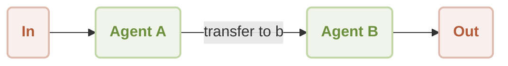

# 工作流交接

本文档解释了如何构建一个工作流，其中一个 Agent 将控制权无缝移交给另一个 Agent。通过这项技术，您可以创建复杂的多 Agent 系统，将任务委派给专门的 Agent，从而解决更复杂的问题。完成本指南后，您将了解如何在两个具有不同能力的 Agent 之间实现交接机制。

## 工作原理

交接工作流涉及一个作为初始联系和调度者的主 Agent（Agent A）。根据用户的输入，此 Agent 可以触发一个“技能”，将对话移交给一个专门的次级 Agent（Agent B）。然后，Agent B 接管交互，遵循其自己独特的指令集。这种模式对于构建模块化和可扩展的 AI 应用程序至关重要。

流程图如下所示：



典型的用户交互序列如下：

```d2
shape: sequence_diagram

User: { 
  shape: c4-person 
}

A: {
  label: "Agent A"
}

B: {
  label: "Agent B"
}

User -> A: "移交给 agent b"
A -> B: "移交给 agent b"
B -> User: "朋友，你需要什么？"

loop: {
  User -> B: "今天天气真好"
  B -> User: "阳光温暖大地，\n微风轻声低语，\n自然欢快歌唱。"
}
```

## 前置条件

在继续之前，请确保您的系统上已安装以下软件：

*   Node.js (版本 20.0 或更高)
*   一个 OpenAI API 密钥，可从 [OpenAI 平台](https://platform.openai.com/api-keys)获取。

## 快速入门

此示例可直接通过命令行使用 `npx` 执行，无需任何本地安装。

### 运行示例

该工作流可以以单次模式或交互式聊天会话模式运行。

*   **单次模式 (默认)**：使用单个输入执行并返回输出。

    ```sh icon=lucide:terminal
    npx -y @aigne/example-workflow-handoff
    ```

*   **交互式聊天模式**：启动一个会话，您可以在其中进行持续对话。

    ```sh icon=lucide:terminal
    npx -y @aigne/example-workflow-handoff --chat
    ```

*   **管道输入**：您也可以直接将输入通过管道传递给脚本。

    ```sh icon=lucide:terminal
    echo "transfer to agent b" | npx -y @aigne/example-workflow-handoff
    ```

### 连接到 AI 模型

首次运行示例时，系统会提示您连接到 AI 模型。您有三个主要选项：

1.  **通过官方 AIGNE Hub 连接**：这是推荐给新用户的选项。按照屏幕上的提示连接您的浏览器。新用户会获得免费的 token 赠款。
2.  **通过自托管的 AIGNE Hub 连接**：如果您托管自己的 AIGNE Hub 实例，请选择此选项并提供其 URL。
3.  **通过第三方模型提供商连接**：要直接连接到像 OpenAI 这样的提供商，请将相应的 API 密钥设置为环境变量。

    ```sh icon=lucide:terminal
    export OPENAI_API_KEY="your-openai-api-key"
    ```

    配置环境变量后，再次运行 `npx` 命令。有关支持的提供商及其所需环境变量的列表，请参阅[模型配置](./models-configuration.md)文档。

## 本地安装与设置

对于希望检查或修改源代码的开发者，请按照以下步骤在本地设置项目。

1.  **克隆仓库**

    ```sh icon=lucide:terminal
    git clone https://github.com/AIGNE-io/aigne-framework
    ```

2.  **导航至示例目录**

    ```sh icon=lucide:terminal
    cd aigne-framework/examples/workflow-handoff
    ```

3.  **安装依赖**

    建议在此仓库中使用 `pnpm` 进行包管理。

    ```sh icon=lucide:terminal
    pnpm install
    ```

4.  **运行示例**

    本地脚本支持与 `npx` 执行相同的命令行参数。

    ```sh icon=lucide:terminal
    # 以单次模式运行
    pnpm start
    
    # 以交互式聊天模式运行
    pnpm start -- --chat
    
    # 使用管道输入
    echo "transfer to agent b" | pnpm start
    ```

## 代码实现

交接工作流的核心逻辑包含在一个 TypeScript 文件中。它定义了两个 Agent 以及促进控制权移交的函数。

```typescript handoff-workflow.ts icon=logos:typescript
import { AIAgent, AIGNE } from "@aigne/core";
import { OpenAIChatModel } from "@aigne/core/models/openai-chat-model.js";

const { OPENAI_API_KEY } = process.env;

// 1. 使用 API 密钥初始化聊天模型。
const model = new OpenAIChatModel({
  apiKey: OPENAI_API_KEY,
});

// 2. 定义交接函数。此函数返回要激活的 Agent。
function transfer_to_b() {
  return agentB;
}

// 3. 定义 Agent A，即初始接触点。
// 它是一个有用的 Agent，具备将控制权移交给 Agent B 的技能。
const agentA = AIAgent.from({
  name: "AgentA",
  instructions: "You are a helpful agent.",
  outputKey: "A",
  skills: [transfer_to_b],
});

// 4. 定义 Agent B，即专门的 Agent。
// 它的指令是只用俳句（Haikus）回应。
const agentB = AIAgent.from({
  name: "AgentB",
  instructions: "Only speak in Haikus.",
  outputKey: "B",
});

// 5. 使用模型实例化 AIGNE 运行时。
const aigne = new AIGNE({ model });

// 6. 调用初始 Agent (Agent A) 以启动会话。
const userAgent = aigne.invoke(agentA);

// 7. 第一次调用触发向 Agent B 的交接。
const result1 = await userAgent.invoke("transfer to agent b");
console.log(result1);
// 输出:
// {
//   B: "Transfer now complete,  \nAgent B is here to help.  \nWhat do you need, friend?",
// }

// 8. 第二次调用直接与 Agent B 交互。
const result2 = await userAgent.invoke("It's a beautiful day");
console.log(result2);
// 输出:
// {
//   B: "Sunshine warms the earth,  \nGentle breeze whispers softly,  \nNature sings with joy.  ",
// }
```

### 说明

1.  **模型初始化**：创建一个 `OpenAIChatModel` 实例，作为 Agent 的大脑。
2.  **交接技能**：`transfer_to_b` 函数是一个标准的 JavaScript 函数。当添加到 `agentA` 的 `skills` 中时，AIGNE 框架会将其作为 AI 可以决定使用的工具。调用时，它返回 `agentB` 对象，示意框架交接控制权。
3.  **Agent A**：此 Agent 充当调度员。在此工作流中，其主要作用是识别用户切换 Agent 的意图并调用相应的技能。
4.  **Agent B**：此 Agent 具有专门的人设，由其 `instructions` 定义为只用俳句说话。它独立运作，并且不知道 Agent A 的存在。
5.  **AIGNE 调用**：`aigne.invoke(agentA)` 创建一个从 Agent A 开始的有状态会话。后续对 `userAgent.invoke()` 的调用会定向到会话中当前活动的 Agent。交接后，所有后续输入都将发送给 Agent B。

## 命令行选项

可以使用以下命令行参数自定义脚本的行为。

| 参数 | 描述 | 默认值 |
| ------------------------- | ---------------------------------------------------------------------------------------------------------------- | ---------------- |
| `--chat` | 以交互式聊天模式运行。 | 已禁用 |
| `--model <provider[:model]>` | 指定要使用的 AI 模型，例如 `openai` 或 `openai:gpt-4o-mini`。 | `openai` |
| `--temperature <value>` | 设置模型生成的温度。 | 提供商默认值 |
| `--top-p <value>` | 设置 top-p 抽样值。 | 提供商默认值 |
| `--presence-penalty <value>` | 设置存在惩罚值。 | 提供商默认值 |
| `--frequency-penalty <value>` | 设置频率惩罚值。 | 提供商默认值 |
| `--log-level <level>` | 设置日志级别（`ERROR`、`WARN`、`INFO`、`DEBUG`、`TRACE`）。 | `INFO` |
| `--input`, `-i <input>` | 通过命令行直接提供输入。 | 无 |

#### 用法示例

```sh icon=lucide:terminal
# 以聊天模式运行，并使用特定的 OpenAI 模型
pnpm start -- --chat --model openai:gpt-4o-mini

# 将日志级别设置为 DEBUG 以获取详细输出
pnpm start -- --log-level DEBUG
```

## 使用 AIGNE Observe 进行调试

要检查 Agent 的执行流程，您可以使用 `aigne observe` 命令。该命令会启动一个本地 Web 服务器，提供一个用于监控和分析 Agent 行为的用户界面，这对于调试非常有价值。

1.  **启动观察服务器**

    ```sh icon=lucide:terminal
    aigne observe
    ```

2.  **运行您的 Agent**

    在另一个终端窗口中执行交接示例。

3.  **查看追踪**

    导航到 `aigne observe` 提供的 Web 界面。您将看到最近的执行列表。点击其中一个将显示整个工作流的详细追踪，包括 Agent A 的初始处理以及随后的向 Agent B 的交接。

## 总结

本指南详细介绍了工作流交接模式，这是构建模块化、多 Agent 系统的基本技术。通过将任务委派给具有专门指令的 Agent，您可以创建功能更强大、更易于维护的 AI 应用程序。

有关相关主题的更多阅读，请参阅以下文档：

<x-cards data-columns="2">
  <x-card data-title="AI Agent" data-icon="lucide:bot" data-href="/developer-guide/agents/ai-agent">
    了解用于创建与 AI 模型交互的 Agent 的核心组件。
  </x-card>
  <x-card data-title="Team Agent" data-icon="lucide:users" data-href="/developer-guide/agents/team-agent">
    探索如何协调多个 Agent 协作完成复杂任务。
  </x-card>
  <x-card data-title="工作流编排" data-icon="lucide:workflow" data-href="/examples/workflow-orchestration">
    探索在处理流水线中协调多个 Agent 的另一个示例。
  </x-card>
  <x-card data-title="工作流路由器" data-icon="lucide:git-branch" data-href="/examples/workflow-router">
    了解如何实现智能路由，将请求定向到合适的 Agent。
  </x-card>
</x-cards>