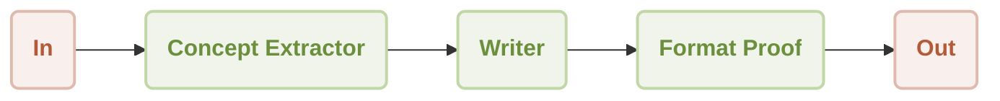
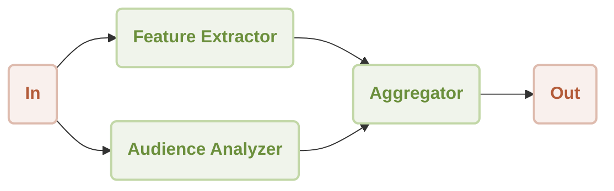
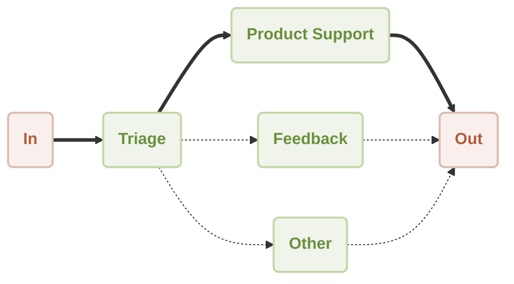
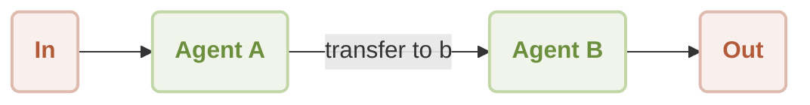
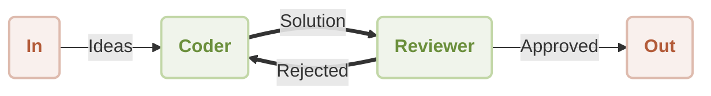

# Building with Workflows

In AIGNE, an "agent" is like a specialized worker trained for a specific task. While a single agent can be very effective, the real power of AIGNE is unlocked when you combine multiple agents into a team to tackle more complex problems. This process of assembling and coordinating agents is called building a workflow.

A workflow is a structured process that defines how a group of agents work together. You can think of it as creating a digital assembly line or a project team. By connecting agents, you can automate multi-step tasks, handle complex decision-making, and create sophisticated applications without needing to write complex code.

AIGNE offers several pre-defined workflow patterns to structure how your team of agents collaborates. Each pattern is designed for a different type of task.

### Sequential Workflow: The Assembly Line

In a sequential workflow, an agent work one after another in a specific order. The output from the first agent becomes the input for the second, and so on, until the final task is complete.

**Best for:** Multi-step processes where the order of operations is critical. For example, generating a report might involve one agent to gather data, a second to write a summary, and a third to format the final document.

```typescript Sequential Workflow Example icon=logos:typescript
import { AIAgent, AIGNE, ProcessMode, TeamAgent } from "@aigne/core";
import { OpenAIChatModel } from "@aigne/openai";

const model = new OpenAIChatModel({ apiKey: process.env.OPENAI_API_KEY });

const conceptExtractor = AIAgent.from({
  instructions: `You are a marketing analyst. Given a product description, identify its key features, target audience, and unique selling points.
  Product description: {{product}}`,
  outputKey: "concept",
});

const writer = AIAgent.from({
  instructions: `You are a marketing copywriter. Using the provided features, audience, and USPs, write a compelling marketing copy (around 150 words).
  Info about the product: {{concept}}`,
  outputKey: "draft",
});

const formatProof = AIAgent.from({
  instructions: `You are an editor. Correct grammar, improve clarity, and polish the draft copy.
  Draft copy: {{draft}}`,
  outputKey: "content",
});

const aigne = new AIGNE({ model });

const result = await aigne.invoke(
  TeamAgent.from({
    skills: [conceptExtractor, writer, formatProof],
    mode: ProcessMode.sequential,
  }),
  { product: "AIGNE is a No-code Generative AI Apps Engine" }
);

console.log(result.content);
```



### Parallel Workflow: The Brainstorming Team

In a parallel workflow (also called concurrency), multiple agents work on the same input simultaneously. Each agent performs its task independently, and their results are combined at the end.

**Best for:** Tasks that can be broken down into independent sub-tasks to save time. For instance, when analyzing a document, one agent could extract key features while another analyzes the writing style, and a third identifies the target audience—all at the same time.

```typescript Parallel Workflow Example icon=logos:typescript
import { AIAgent, AIGNE, ProcessMode, TeamAgent } from "@aigne/core";
import { OpenAIChatModel } from "@aigne/openai";

const model = new OpenAIChatModel({ apiKey: process.env.OPENAI_API_KEY });

const featureExtractor = AIAgent.from({
  instructions: `You are a product analyst. Extract and summarize the key features of the product.
  Product description: {{product}}`,
  outputKey: "features",
});

const audienceAnalyzer = AIAgent.from({
  instructions: `You are a market researcher. Identify the target audience for the product.
  Product description: {{product}}`,
  outputKey: "audience",
});

const aigne = new AIGNE({ model });

const result = await aigne.invoke(
  TeamAgent.from({
    skills: [featureExtractor, audienceAnalyzer],
    mode: ProcessMode.parallel,
  }),
  { product: "AIGNE is a No-code Generative AI Apps Engine" }
);

console.log(result);
```



### Router Workflow: The Smart Receptionist

A router workflow acts as a traffic controller. A primary agent first analyzes the incoming request and then intelligently routes it to the most appropriate specialized agent to handle it.

**Best for:** Systems that need to handle a variety of different requests. A common example is an intelligent customer service system that directs a user's query to product support, the feedback department, or a general-purpose assistant based on the content of the message.

```typescript Router Workflow Example icon=logos:typescript
import { AIAgent, AIAgentToolChoice, AIGNE } from "@aigne/core";
import { OpenAIChatModel } from "@aigne/openai";

const model = new OpenAIChatModel({ apiKey: process.env.OPENAI_API_KEY });

const productSupport = AIAgent.from({
  name: "product_support",
  description: "Agent to assist with any product-related questions.",
  instructions: `You handle product-related questions.`,
  outputKey: "product_support",
});

const feedback = AIAgent.from({
  name: "feedback",
  description: "Agent to assist with any feedback-related questions.",
  instructions: `You handle feedback-related questions.`,
  outputKey: "feedback",
});

const other = AIAgent.from({
  name: "other",
  description: "Agent to assist with any general questions.",
  instructions: `You handle general questions.`,
  outputKey: "other",
});

const triage = AIAgent.from({
  name: "triage",
  instructions: `You route questions to the appropriate agent.`,
  skills: [productSupport, feedback, other],
  toolChoice: AIAgentToolChoice.router, // Enable router mode
  inputKey: "message",
});

const aigne = new AIGNE({ model });

const result = await aigne.invoke(triage, { message: "How to use this product?" });
console.log(result); // { product_support: "..." }
```



### Handoff Workflow: The Specialist Referral

This pattern allows one agent to pass control over to another agent during a task. This is useful when a problem requires different types of expertise to solve.

**Best for:** Complex problem-solving where an initial agent might handle the general query but then "hands off" the task to a specialist once the nature of the problem is better understood, similar to how a general physician refers a patient to a specialist.

```typescript Handoff Workflow Example icon=logos:typescript
import { AIAgent, AIGNE } from "@aigne/core";
import { OpenAIChatModel } from "@aigne/openai";

const model = new OpenAIChatModel({ apiKey: process.env.OPENAI_API_KEY });

// This function defines the condition for handoff
function transferToB() {
  return agentB;
}

const agentA = AIAgent.from({
  name: "AgentA",
  instructions: "You are a helpful agent. If the user says 'transfer', hand off to Agent B.",
  skills: [transferToB], // The skill enables the handoff
});

const agentB = AIAgent.from({
  name: "AgentB",
  instructions: "Only speak in Haikus.",
});

const aigne = new AIGNE({ model });
const userAgent = aigne.invoke(agentA);

const result = await userAgent.invoke({ message: "transfer to agent b" });
console.log(result); // Output will be a haiku from Agent B
```



### Reflection Workflow: The Quality Control Loop

The reflection workflow creates a process of review and refinement. One agent (the "coder" or "writer") produces an output, and a second agent (the "reviewer") evaluates it. If the output isn't good enough, it's sent back to the first agent with feedback for improvement. This loop continues until the output is approved.

**Best for:** Tasks that require high-quality, polished results. This is ideal for creative processes like writing articles, generating code, or any scenario where iterative improvement is valuable.

```typescript Reflection Workflow Example icon=logos:typescript
import { AIAgent, AIGNE, TeamAgent } from "@aigne/core";
import { OpenAIChatModel } from "@aigne/openai";
import { z } from "zod";

const model = new OpenAIChatModel({ apiKey: process.env.OPENAI_API_KEY });

const coder = AIAgent.from({
  instructions: `You are a coder. Write code to solve the user's problem.
  Problem: {{question}}
  Previous feedback: {{feedback}}`,
  outputSchema: z.object({ code: z.string() }),
});

const reviewer = AIAgent.from({
  instructions: `You are a code reviewer. Review the code for correctness.
  The problem statement is: {{question}}
  The code is: {{code}}`,
  outputSchema: z.object({
    approval: z.boolean().describe("Approve or reject the code."),
    feedback: z.string().describe("Your feedback for improvement."),
  }),
});

const reflectionTeam = TeamAgent.from({
  skills: [coder],
  reflection: {
    reviewer: reviewer,
    isApproved: (output) => output.approval, // Condition to stop the loop
    maxIterations: 3,
  },
});

const aigne = new AIGNE({ model });
const result = await aigne.invoke(reflectionTeam, {
  question: "Write a function to find the sum of all even numbers in a list.",
});

console.log(result);
```


