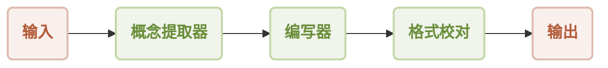
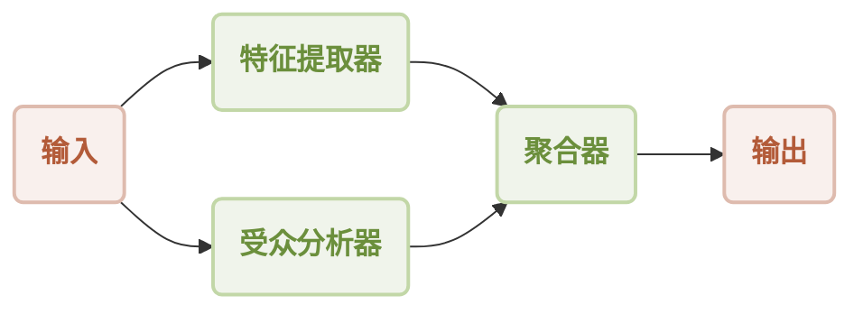
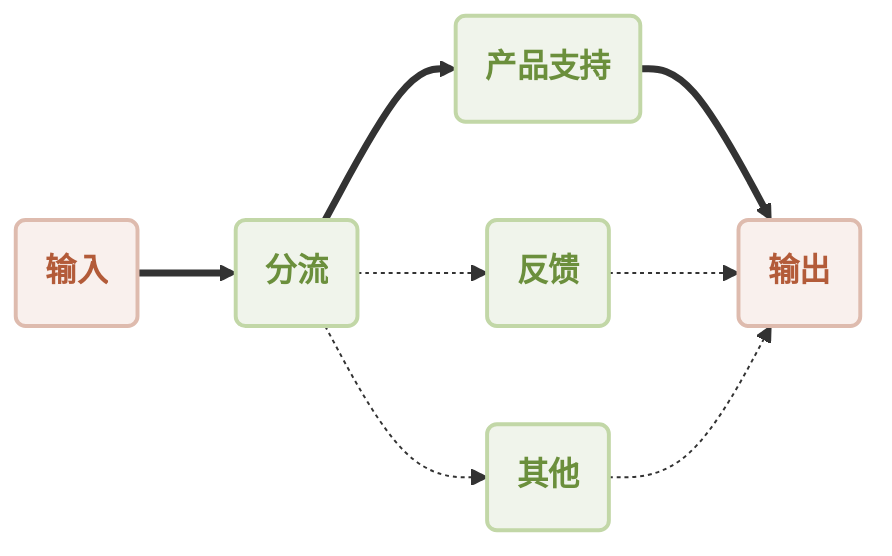
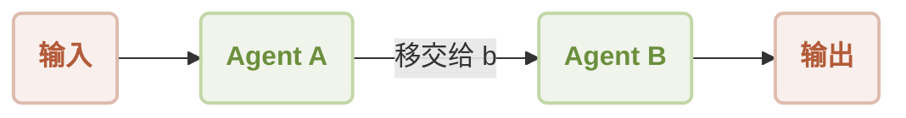
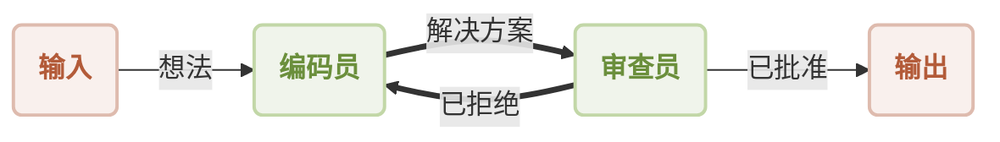

# 使用工作流进行构建

在 AIGNE 中，“agent”就像一个为特定任务而训练的专业工作者。虽然单个 agent 可以非常有效，但 AIGNE 的真正威力在于将多个 agent 组合成一个团队来解决更复杂的问题。这种组装和协调 agent 的过程被称为构建工作流。

工作流是一个结构化流程，定义了一组 agent 如何协同工作。你可以把它想象成创建一个数字装配线或一个项目团队。通过连接 agent，你可以自动化多步骤任务，处理复杂的决策，并创建复杂的应用程序，而无需编写复杂的代码。

AIGNE 提供了几种预定义的工作流模式来构建你的 agent 团队的协作方式。每种模式都为不同类型的任务而设计。

### 顺序工作流：装配线

在顺序工作流中，agent 按特定顺序一个接一个地工作。第一个 agent 的输出成为第二个 agent 的输入，以此类推，直到最终任务完成。

**最适用于：** 操作顺序至关重要的多步骤流程。例如，生成一份报告可能需要一个 agent 收集数据，第二个 agent 撰写摘要，第三个 agent 格式化最终文档。

```typescript 顺序工作流示例 icon=logos:typescript
import { AIAgent, AIGNE, ProcessMode, TeamAgent } from "@aigne/core";
import { OpenAIChatModel } from "@aigne/openai";

const model = new OpenAIChatModel({ apiKey: process.env.OPENAI_API_KEY });

const conceptExtractor = AIAgent.from({
  instructions: `You are a marketing analyst. Given a product description, identify its key features, target audience, and unique selling points.
  Product description: {{product}}`,
  outputKey: "concept",
});

const writer = AIAgent.from({
  instructions: `You are a marketing copywriter. Using the provided features, audience, and USPs, write a compelling marketing copy (around 150 words).
  Info about the product: {{concept}}`,
  outputKey: "draft",
});

const formatProof = AIAgent.from({
  instructions: `You are an editor. Correct grammar, improve clarity, and polish the draft copy.
  Draft copy: {{draft}}`,
  outputKey: "content",
});

const aigne = new AIGNE({ model });

const result = await aigne.invoke(
  TeamAgent.from({
    skills: [conceptExtractor, writer, formatProof],
    mode: ProcessMode.sequential,
  }),
  { product: "AIGNE is a No-code Generative AI Apps Engine" }
);

console.log(result.content);
```



### 并行工作流：头脑风暴团队

在并行工作流（也称为并发）中，多个 agent 同时处理相同的输入。每个 agent 独立执行其任务，最后将它们的结果合并。

**最适用于：** 可以分解为独立的子任务以节省时间的任务。例如，在分析文档时，一个 agent 可以提取关键特征，另一个 agent 分析写作风格，第三个 agent 识别目标受众——所有这些都可以同时进行。

```typescript 并行工作流示例 icon=logos:typescript
import { AIAgent, AIGNE, ProcessMode, TeamAgent } from "@aigne/core";
import { OpenAIChatModel } from "@aigne/openai";

const model = new OpenAIChatModel({ apiKey: process.env.OPENAI_API_KEY });

const featureExtractor = AIAgent.from({
  instructions: `You are a product analyst. Extract and summarize the key features of the product.
  Product description: {{product}}`,
  outputKey: "features",
});

const audienceAnalyzer = AIAgent.from({
  instructions: `You are a market researcher. Identify the target audience for the product.
  Product description: {{product}}`,
  outputKey: "audience",
});

const aigne = new AIGNE({ model });

const result = await aigne.invoke(
  TeamAgent.from({
    skills: [featureExtractor, audienceAnalyzer],
    mode: ProcessMode.parallel,
  }),
  { product: "AIGNE is a No-code Generative AI Apps Engine" }
);

console.log(result);
```



### 路由器工作流：智能接待员

路由器工作流充当交通控制器。一个主 agent 首先分析传入的请求，然后智能地将其路由到最合适的专业 agent 来处理。

**最适用于：** 需要处理各种不同请求的系统。一个常见的例子是智能客服系统，它根据消息内容将用户的查询引导至产品支持、反馈部门或通用助理。

```typescript 路由器工作流示例 icon=logos:typescript
import { AIAgent, AIAgentToolChoice, AIGNE } from "@aigne/core";
import { OpenAIChatModel } from "@aigne/openai";

const model = new OpenAIChatModel({ apiKey: process.env.OPENAI_API_KEY });

const productSupport = AIAgent.from({
  name: "product_support",
  description: "Agent to assist with any product-related questions.",
  instructions: `You handle product-related questions.`,
  outputKey: "product_support",
});

const feedback = AIAgent.from({
  name: "feedback",
  description: "Agent to assist with any feedback-related questions.",
  instructions: `You handle feedback-related questions.`,
  outputKey: "feedback",
});

const other = AIAgent.from({
  name: "other",
  description: "Agent to assist with any general questions.",
  instructions: `You handle general questions.`,
  outputKey: "other",
});

const triage = AIAgent.from({
  name: "triage",
  instructions: `You route questions to the appropriate agent.`,
  skills: [productSupport, feedback, other],
  toolChoice: AIAgentToolChoice.router, // 启用路由器模式
  inputKey: "message",
});

const aigne = new AIGNE({ model });

const result = await aigne.invoke(triage, { message: "How to use this product?" });
console.log(result); // { product_support: "..." }
```



### 移交工作流：专家转介

这种模式允许一个 agent 在任务执行期间将控制权移交给另一个 agent。当一个问题需要不同类型的专业知识来解决时，这非常有用。

**最适用于：** 复杂的问题解决场景，其中初始 agent 可能处理一般性查询，但在更清楚地了解问题性质后，将任务“移交”给专家，类似于全科医生将患者转介给专科医生。

```typescript 移交工作流示例 icon=logos:typescript
import { AIAgent, AIGNE } from "@aigne/core";
import { OpenAIChatModel } from "@aigne/openai";

const model = new OpenAIChatModel({ apiKey: process.env.OPENAI_API_KEY });

// 此函数定义了移交的条件
function transferToB() {
  return agentB;
}

const agentA = AIAgent.from({
  name: "AgentA",
  instructions: "You are a helpful agent. If the user says 'transfer', hand off to Agent B.",
  skills: [transferToB], // 该技能实现了移交功能
});

const agentB = AIAgent.from({
  name: "AgentB",
  instructions: "Only speak in Haikus.",
});

const aigne = new AIGNE({ model });
const userAgent = aigne.invoke(agentA);

const result = await userAgent.invoke({ message: "transfer to agent b" });
console.log(result); // 输出将是 Agent B 的一首俳句
```



### 反思工作流：质量控制循环

反思工作流创建了一个审查和优化的过程。一个 agent（“编码员”或“编写员”）生成一个输出，第二个 agent（“审查员”）对其进行评估。如果输出不够好，它会连同改进反馈一起被送回给第一个 agent。这个循环会一直持续到输出被批准为止。

**最适用于：** 需要高质量、精炼结果的任务。这对于创作过程（如撰写文章、生成代码）或任何迭代改进有价值的场景都是理想的选择。

```typescript 反思工作流示例 icon=logos:typescript
import { AIAgent, AIGNE, TeamAgent } from "@aigne/core";
import { OpenAIChatModel } from "@aigne/openai";
import { z } from "zod";

const model = new OpenAIChatModel({ apiKey: process.env.OPENAI_API_KEY });

const coder = AIAgent.from({
  instructions: `You are a coder. Write code to solve the user's problem.
  Problem: {{question}}
  Previous feedback: {{feedback}}`,
  outputSchema: z.object({ code: z.string() }),
});

const reviewer = AIAgent.from({
  instructions: `You are a code reviewer. Review the code for correctness.
  The problem statement is: {{question}}
  The code is: {{code}}`,
  outputSchema: z.object({
    approval: z.boolean().describe("Approve or reject the code."),
    feedback: z.string().describe("Your feedback for improvement."),
  }),
});

const reflectionTeam = TeamAgent.from({
  skills: [coder],
  reflection: {
    reviewer: reviewer,
    isApproved: (output) => output.approval, // 停止循环的条件
    maxIterations: 3,
  },
});

const aigne = new AIGNE({ model });
const result = await aigne.invoke(reflectionTeam, {
  question: "Write a function to find the sum of all even numbers in a list.",
});

console.log(result);
```

