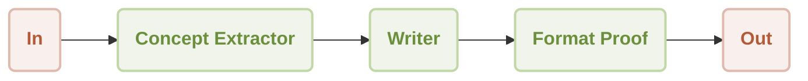
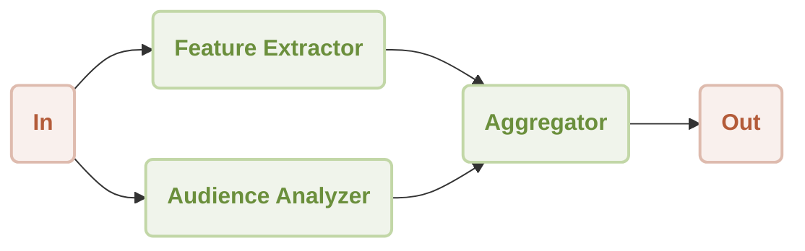
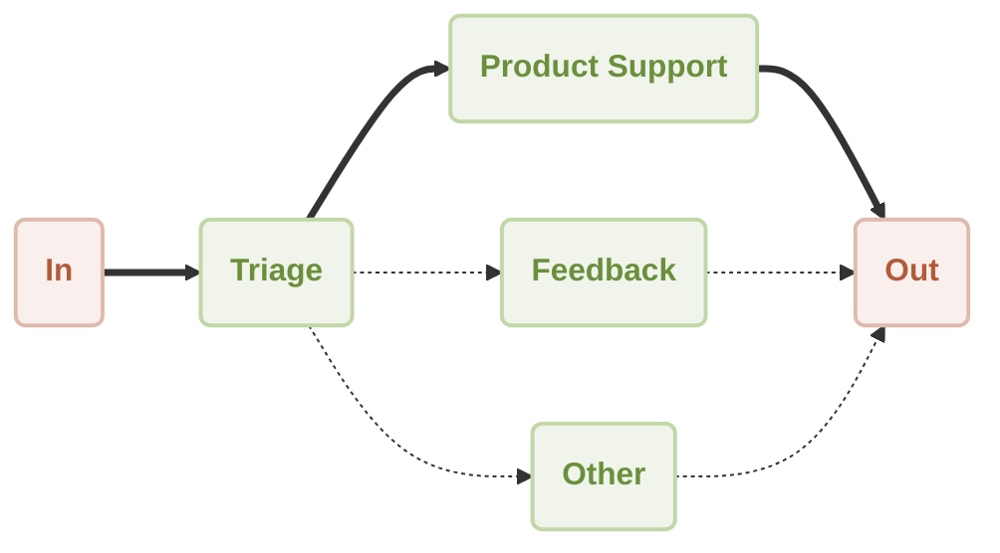
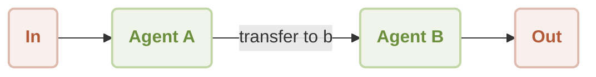
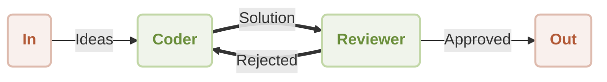

# Understanding Agents

In the AIGNE framework, the fundamental building block is the **Agent**. But what exactly is an agent?

Think of an agent in the real world, like a travel agent or a real estate agent. They are specialists you hire to perform a specific set of tasks for you. A travel agent finds the best flights and hotels, and a real estate agent helps you buy or sell a home. They have a clear purpose, specific skills, and they work on your behalf to achieve a goal.

AI Agents in AIGNE are very similar: they are specialized digital workers designed to perform specific tasks. Each agent has its own instructions and skills, allowing it to become an expert in a particular area. One agent might be an expert writer, another a data analyst, and a third a customer service specialist.

> **What's in a name?**
>
> The name AIGNE is pronounced like "agent" without the 't' (**[ ˈei dʒən ]**). In Old Irish, the word *aigne* means "spirit," which is a fitting metaphor for these digital workers that seem to think and act on their own.

## How Agents Collaborate: Building Workflows

The true power of AIGNE is realized when you combine multiple agents to work together. Just like a company hires different specialists to form a team, you can assemble a team of AI Agents to tackle complex problems. This structured collaboration is called a **Workflow**.

A workflow defines how agents interact, share information, and hand off tasks to one another. AIGNE supports several common patterns for these workflows.

### Sequential: The Assembly Line

In a sequential workflow, agents process a task one after another in a specific order. Each agent completes its step and passes the result to the next agent in the line, just like an assembly line.

This is useful for multi-step processes where the output of one step is the input for the next. For example, you could have one agent extract key concepts from a document, a second agent write an article based on those concepts, and a third agent proofread the final text.

### Concurrency: Parallel Processing

A concurrent workflow allows multiple agents to work on different parts of a task at the same time. Their individual results are then combined by another agent. This is highly efficient for tasks that can be broken down into independent sub-tasks.

For instance, when analyzing a new product idea, one agent could research the target audience while another analyzes its key features simultaneously. An aggregator agent then combines their findings into a single report.

### Router: The Specialist Dispatcher

A router workflow uses a "triage" agent to analyze an incoming request and direct it to the most appropriate specialist agent. This is like a receptionist directing a call to the correct department.

This pattern is ideal for creating intelligent assistants or customer support systems. The triage agent can determine if a request is about product support, user feedback, or something else, and route it to the agent best equipped to handle it.

### Handoff: Expert Collaboration

In a handoff workflow, control is passed from one specialized agent to another to solve a complex problem. This mimics how human experts collaborate, with one passing their findings to another for the next stage of work.

For example, a user might start a conversation with a general-purpose assistant (Agent A). When the conversation turns to a highly specialized topic, Agent A can "hand off" the user to an expert on that topic (Agent B) to continue the discussion seamlessly.

### Reflection: A System of Checks and Balances

A reflection workflow involves agents that review and critique each other's work to improve the final output. This creates a loop of feedback and refinement, ensuring higher quality results.

This is useful for tasks like code generation or content creation. A "Coder" agent might write a piece of software, which is then passed to a "Reviewer" agent. The Reviewer checks for errors or suggests improvements. If the work is rejected, it goes back to the Coder for revisions until it is finally approved.

## Summary

In essence, Agents are the individual "workers" and Workflows are the "teams" you build with them. By understanding these core concepts, you can begin to see how to construct powerful and intelligent systems to automate nearly any digital task.

To learn more about how to combine these agents into functioning applications, continue to the next section.

➡️ Next: [Building with Workflows](./user-guide-building-with-workflows.md)