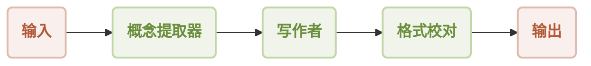
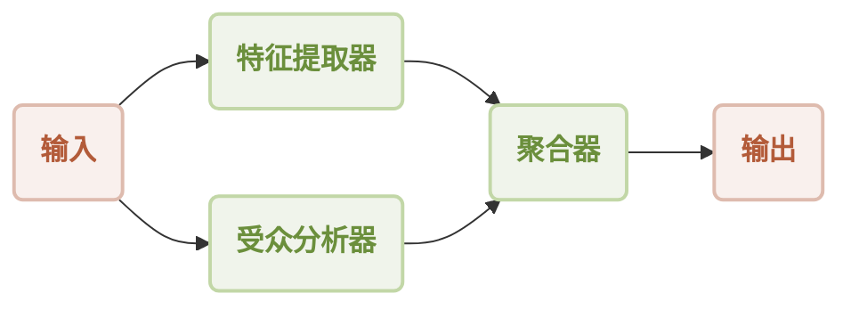
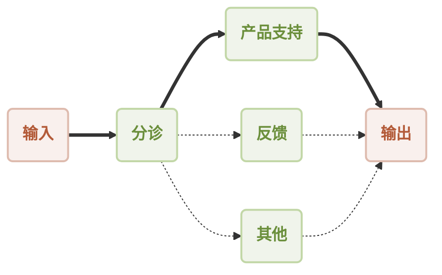
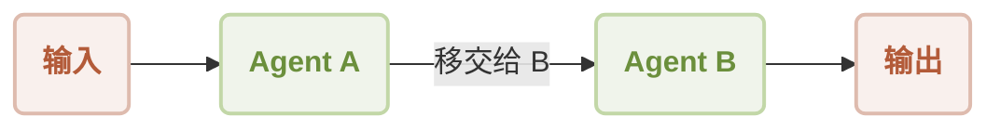
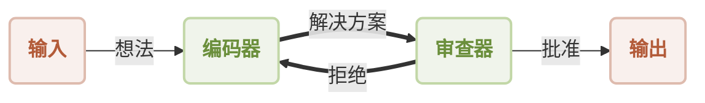

# 理解 Agent

在 AIGNE 框架中，最基本的构建块是 **Agent**。但 Agent 究竟是什么呢？

想象一下现实世界中的代理人，比如旅行代理人或房地产经纪人。他们是您雇佣来为您执行特定任务的专家。旅行代理人负责寻找最佳的航班和酒店，而房地产经纪人则帮助您买卖房屋。他们有明确的目标、特定的技能，并代表您工作以实现目标。

AIGNE 中的 AI Agent 非常相似：它们是专门设计用于执行特定任务的数字化工作者。每个 Agent 都有自己的指令和技能，使其能够成为特定领域的专家。一个 Agent 可能是写作专家，另一个是数据分析师，第三个是客户服务专员。

> **名字的由来？**
> 
> AIGNE 这个名字的发音类似于 "agent" 去掉 't' 的音（**[ ˈei dʒən ]**）。在古爱尔兰语中，*aigne* 这个词意为“精神”，这对于这些似乎能独立思考和行动的数字化工作者来说，是一个恰当的比喻。

## Agent 如何协作：构建工作流

当您将多个 Agent 组合在一起协同工作时，AIGNE 的真正威力才能得以体现。就像一家公司雇佣不同的专家组成团队一样，您也可以组建一个 AI Agent 团队来解决复杂的问题。这种结构化的协作被称为**工作流**。

工作流定义了 Agent 之间如何交互、共享信息以及相互交接任务。AIGNE 支持几种常见的工作流模式。

### 顺序型：流水线

在顺序型工作流中，Agent 按照特定顺序依次处理任务。每个 Agent 完成其步骤后，将结果传递给流水线中的下一个 Agent，就像一条装配流水线一样。

这对于多步骤流程非常有用，其中一个步骤的输出是下一步的输入。例如，您可以让一个 Agent 从文档中提取关键概念，第二个 Agent 基于这些概念撰写一篇文章，第三个 Agent 校对最终的文本。

### 并发型：并行处理

并发型工作流允许多个 Agent 同时处理一个任务的不同部分。然后，它们的各自结果由另一个 Agent 进行合并。对于可以分解为独立子任务的任务来说，这种方式非常高效。

例如，在分析一个新产品创意时，一个 Agent 可以研究目标受众，而另一个 Agent 则同时分析其关键特性。然后，一个聚合 Agent 将他们的发现合并成一份单一的报告。

### 路由器型：专家调度器

路由器型工作流使用一个“分诊” Agent 来分析传入的请求，并将其引导至最合适的专家 Agent。这就像前台将电话转接到正确的部门一样。

这种模式非常适合创建智能助手或客户支持系统。分诊 Agent 可以确定请求是关于产品支持、用户反馈还是其他问题，并将其路由给最适合处理该请求的 Agent。

### 交接型：专家协作

在交接型工作流中，控制权从一个专业 Agent 传递给另一个，以解决复杂问题。这模仿了人类专家协作的方式，即一位专家将其发现传递给另一位专家以进行下一阶段的工作。

例如，用户可能开始与一个通用助手（Agent A）进行对话。当对话转向一个高度专业化的话题时，Agent A 可以将用户“交接”给该话题的专家（Agent B），以无缝地继续讨论。

### 反思型：制衡系统

反思型工作流涉及 Agent 之间相互审查和批评彼此的工作，以改进最终的产出。这创建了一个反馈和优化的循环，确保了更高质量的结果。

这对于像代码生成或内容创作这样的任务非常有用。一个“编码器” Agent 可能会编写一段软件，然后将其传递给一个“审查器” Agent。审查器会检查错误或提出改进建议。如果工作被拒绝，它会返回给编码器进行修订，直到最终被批准。

## 总结

本质上，Agent 是独立的“工作者”，而工作流是您用它们构建的“团队”。通过理解这些核心概念，您就可以开始了解如何构建强大而智能的系统来自动化几乎任何数字化任务。

要了解更多关于如何将这些 Agent 组合成功能性应用程序的信息，请继续阅读下一节。

➡️ 下一步：[使用工作流进行构建](./user-guide-building-with-workflows.md)