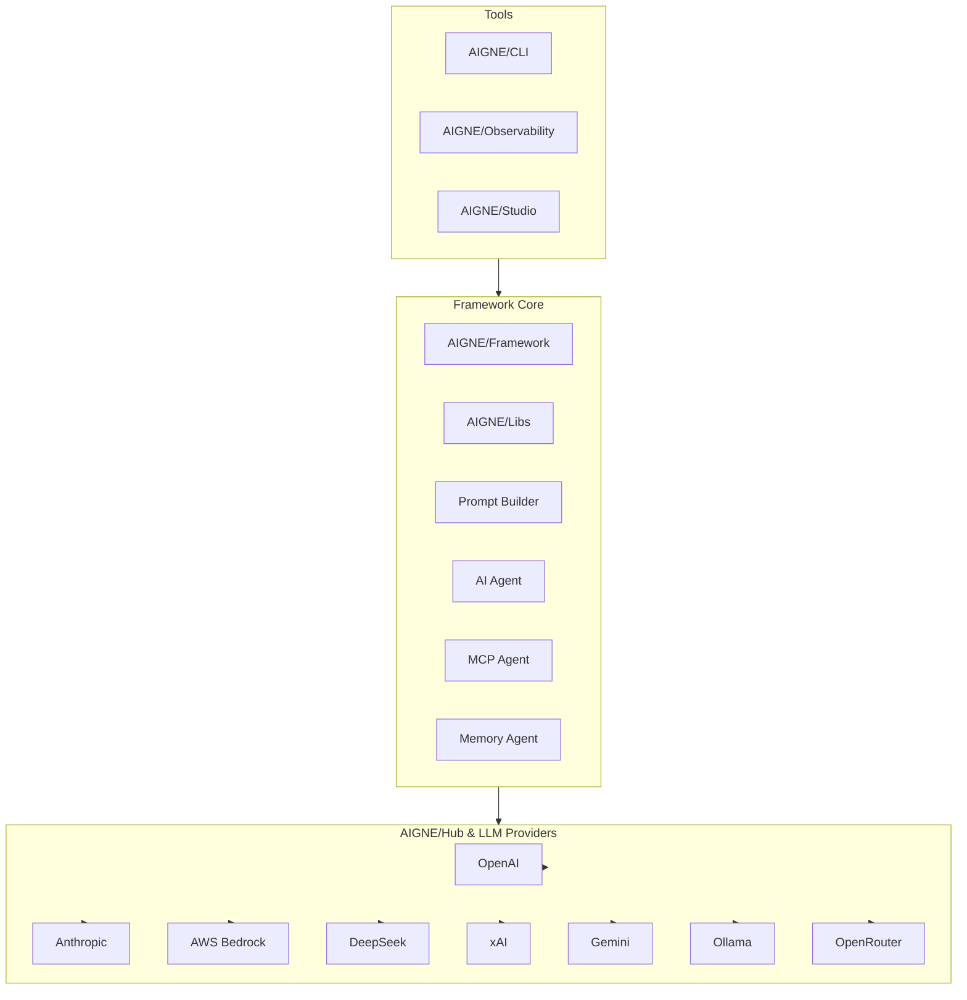

## Architecture

The AIGNE Framework is designed in a **three-layer architecture** that bridges tools, core framework capabilities, and integrations with multiple LLM providers.  
This layered design ensures both developer-friendly usability and enterprise-level scalability.

### 1. Tools

Developer and operator facing tools to build, monitor, and manage AI workflows:

- **AIGNE/CLI** — Command-line interface for project management and deployment
- **AIGNE/Observability** — End-to-end monitoring and tracing of workflows
- **AIGNE/Studio** — Visual environment for building and testing workflows

### 2. Framework Core

The heart of AIGNE that provides modular and agentic workflow capabilities:

- **AIGNE/Framework** — Functional core that powers workflow orchestration
- **AIGNE/Libs** — Shared libraries for rapid application development
- **Core Agents**
  - **Prompt Builder** — Standardized prompt construction and optimization
  - **AI Agent** — Configurable, composable task-oriented agents
  - **MCP Agent** — Integration via the Model Context Protocol
  - **Memory Agent** — Persistent and contextual memory management

### 3. Hub & LLM Providers

AIGNE Hub acts as a unified entry point to connect with different LLM backends and adapters:

- **OpenAI**
- **Anthropic**
- **AWS Bedrock**
- **DeepSeek**
- **xAI**
- **Gemini**
- **Ollama**
- **OpenRouter**

---

This three-layer architecture enables developers to:

- **Build** with modular tools,
- **Orchestrate** complex workflows via the core framework,
- **Integrate** seamlessly with multiple AI providers through a single hub.
