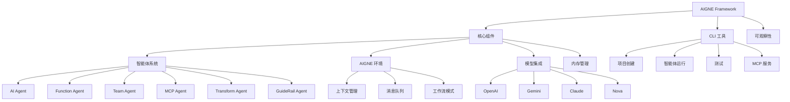
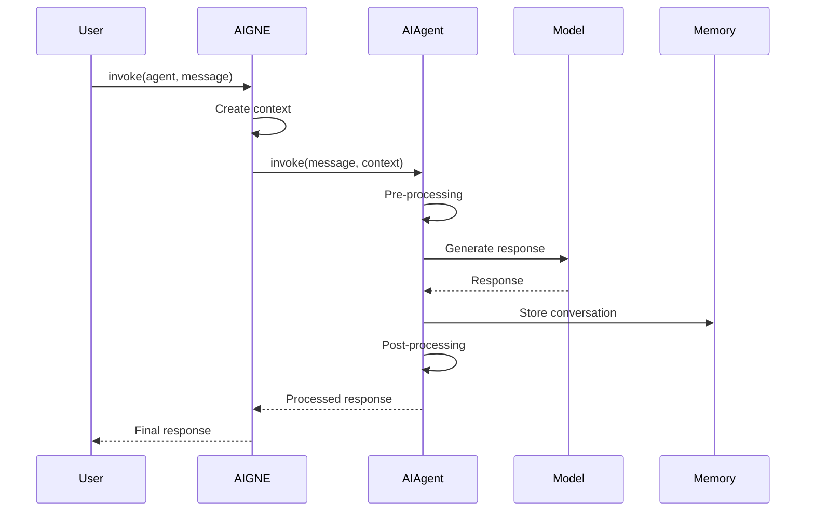

# AIGNE Framework 概述

AIGNE Framework 是一个用于构建 AI 驱动应用程序的综合工具包，为开发者提供了灵活且强大的基础，用于创建复杂的 AI 智能体系统。该框架简化了多个 AI 模型的集成、智能体编排和复杂工作流模式，使智能应用程序的快速开发成为可能。

## 介绍

AIGNE (AI 智能体) Framework 旨在抽象化处理多个 AI 模型和智能体系统的复杂性，使开发者能够专注于通过 AI 驱动的功能创造价值。该框架为使用各种 AI 模型（包括 OpenAI、Gemini、Claude 和 Nova）提供了统一的接口，同时处理不同类型智能体之间的编排、通信和执行流程。



## 关键特性

AIGNE Framework 提供了丰富的功能集，使开发者能够构建复杂的 AI 应用程序：

### 多 AI 模型支持

AIGNE 提供了对各种 AI 模型的内置支持，使集成和切换不同的 AI 提供商变得简单：

```typescript
import { AIAgent, AIGNE } from "@aigne/core";
import { OpenAIChatModel } from "@aigne/core/models/openai-chat-model.js";

// 创建 AI 模型实例
const model = new OpenAIChatModel({
  apiKey: process.env.OPENAI_API_KEY,
  model: process.env.DEFAULT_CHAT_MODEL || "gpt-4-turbo",
});

// 使用模型创建和配置 AIGNE
const aigne = new AIGNE({ model });
```

这个示例演示了如何使用 OpenAI 模型初始化 AIGNE。框架的架构允许通过实现 ChatModel 接口轻松扩展以支持其他模型。

### 强大的智能体系统

该框架提供了丰富的智能体类型层次结构，每种类型都为特定目的而设计：

| 智能体类型 | 描述 |
|------------|-------------|
| AIAgent | 使用各种语言模型的 AI 驱动智能体 |
| TeamAgent | 按顺序或并行编排多个智能体 |
| TransformAgent | 使用 JSONata 表达式转换数据 |
| MCPAgent | 与 Model Context Protocol 服务集成 |
| GuideRail Agent | 验证和控制消息流 |
| UserAgent | 管理用户交互和对话状态 |

以下是创建 AI 智能体的简单示例：

```typescript
// 创建 AI 智能体
const agent = AIAgent.from({
  name: "Assistant",
  instructions: "You are a helpful assistant.",
});

// 使用 AIGNE 调用智能体
const response = await aigne.invoke(agent, "Hello, can you help me write a short article?");
console.log(response);
```

### AIGNE 环境

AIGNE 环境为智能体通信和工作流执行提供了灵活的上下文：

```typescript
// 创建新的 AIGNE 实例
const aigne = new AIGNE({ 
  name: "My AI Application",
  description: "An application that demonstrates AIGNE capabilities",
  model: openAIModel,
  agents: [assistantAgent, routerAgent, specialistAgent],
  skills: [calculatorSkill, weatherSkill, calendarSkill]
});

// 创建新的上下文进行隔离执行
const context = aigne.newContext();

// 使用特定上下文调用智能体
const response = await context.invoke(assistantAgent, "What's the weather like today?");
```

AIGNE 环境管理执行上下文、智能体之间的消息传递和资源分配，以确保最佳性能。

### 工作流模式

AIGNE Framework 支持各种工作流模式以实现复杂的智能体交互：

```typescript
// 创建用于顺序执行的团队智能体
const sequentialTeam = TeamAgent.from({
  name: "SequentialTeam",
  agents: [preprocessAgent, mainProcessAgent, postprocessAgent],
  execution: "sequential" // 智能体依次执行
});

// 创建用于并发执行的团队智能体
const concurrentTeam = TeamAgent.from({
  name: "ConcurrentTeam",
  agents: [researchAgent, writingAgent, factCheckingAgent],
  execution: "concurrent" // 智能体并行执行
});

// 创建用于条件执行的路由智能体
const routerTeam = TeamAgent.from({
  name: "RouterTeam",
  agents: [
    routerAgent,
    {
      condition: "message.category === 'technical'",
      agent: technicalSupportAgent
    },
    {
      condition: "message.category === 'billing'",
      agent: billingAgent
    },
    {
      condition: "true", // 默认回退
      agent: generalSupportAgent
    }
  ],
  execution: "routing"
});
```

这些模式使开发者能够为复杂任务和工作流创建复杂的智能体交互。

### 命令行工具

AIGNE CLI 为 AIGNE 应用程序提供开发和管理工具：

```bash
# 创建新的 AIGNE 项目
aigne create my-project

# 运行智能体
aigne run --path ./my-agents

# 运行测试
aigne test --path ./my-agents

# 启动 MCP 服务器
aigne serve-mcp --port 3001

# 启动可观察性服务器
aigne observe
```

CLI 简化了开发过程，实现了 AIGNE 应用程序的快速原型开发和部署。

## 架构

AIGNE Framework 的架构围绕智能体、模型和执行环境的概念构建：



该架构实现了不同组件的灵活集成，同时为开发者维护一致的接口。

## 基本用法

以下是一个简单示例，展示如何使用 AIGNE Framework 创建基本的 AI 应用程序：

```typescript
import { AIAgent, AIGNE } from "@aigne/core";
import { OpenAIChatModel } from "@aigne/core/models/openai-chat-model.js";

// 初始化 AI 模型
const model = new OpenAIChatModel({
  apiKey: process.env.OPENAI_API_KEY,
  model: "gpt-4-turbo",
});

// 创建智能体
const agent = AIAgent.from({
  name: "Assistant",
  instructions: "You are a helpful assistant specialized in explaining complex topics simply.",
});

// 初始化 AIGNE
const aigne = new AIGNE({ model });

// 与智能体交互的函数
async function askQuestion(question) {
  const response = await aigne.invoke(agent, question);
  console.log(`Q: ${question}`);
  console.log(`A: ${response}`);
}

// 使用智能体
askQuestion("Explain quantum computing in simple terms.");
```

这个示例演示了 AIGNE Framework 的核心功能，展示了如何创建模型、定义智能体并用问题调用它。

## 流式支持

AIGNE Framework 还支持流式响应，实现实时交互：

```typescript
// 创建流式响应
const stream = await aigne.invoke(agent, "Write a short story about AI.", { streaming: true });

// 处理流
for await (const chunk of stream) {
  process.stdout.write(chunk);
}
```

流式处理使开发者能够构建响应更快的应用程序，在 AI 生成内容时向用户提供反馈。

## 总结

AIGNE Framework 为构建 AI 驱动的应用程序提供了强大的基础，其灵活的架构支持多种模型、多样化的智能体类型和复杂的工作流。通过抽象化 AI 集成和智能体编排的复杂性，该框架使开发者能够专注于通过智能功能创造价值。

要开始使用 AIGNE Framework，请查看[入门指南](./getting-started.md)，其中提供了详细的安装说明和基本示例。有关命令行工具的更多信息，请参阅 [AIGNE CLI](./cli.md) 文档。要探索框架背后的核心概念，请访问[核心概念](./core-concepts.md)部分。