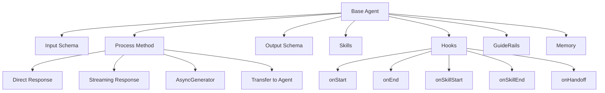
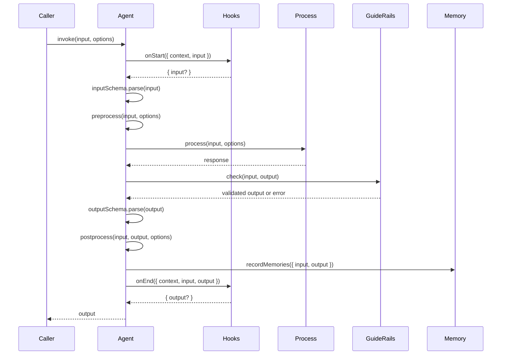

# Base Agent

The Base Agent serves as the foundation for all agents in the AIGNE Framework. It provides core functionality for message processing, lifecycle management, validation, and inter-agent communication. Understanding the Base Agent is essential for building custom agents and working effectively with the AIGNE ecosystem.

## Agent Architecture Overview

The Agent class is designed to be extensible and composable, enabling developers to create specialized agents while leveraging common infrastructure.



## Core Concepts

The Agent class is built around several key concepts:

1. **Message Processing**: Agents process input messages and produce output messages
2. **Schema Validation**: Input and output can be validated using Zod schemas
3. **Agent Skills**: Agents can utilize other agents as skills for complex tasks
4. **Lifecycle Hooks**: Customizable hooks for monitoring and extending agent behavior
5. **GuideRails**: Validation and control of message flow between agents
6. **Memory Management**: Optional integration with memory systems for state persistence

## Creating a Basic Agent

To create a custom agent, extend the base Agent class and implement the `process` method:

```typescript
import { Agent, AgentInvokeOptions } from "@aigne/core";

interface GreetingInput {
  name: string;
}

interface GreetingOutput {
  greeting: string;
}

class GreetingAgent extends Agent<GreetingInput, GreetingOutput> {
  async process(input: GreetingInput, options: AgentInvokeOptions) {
    return {
      greeting: `Hello, ${input.name}!`
    };
  }
}

// Create and use the agent
const greeter = new GreetingAgent();
const result = await greeter.invoke({ name: "World" });
console.log(result.greeting); // "Hello, World!"
```

This example demonstrates a simple agent that takes a name as input and returns a greeting as output. The agent implements the `process` method, which is the core of every agent implementation.

## Agent Configuration Options

When creating an agent, you can provide a variety of configuration options to customize its behavior:

```typescript
import { Agent, z } from "@aigne/core";

const myAgent = new MyAgent({
  name: "CustomNamedAgent",
  description: "This agent does something special",
  inputSchema: z.object({
    query: z.string(),
    options: z.object({
      limit: z.number().optional()
    }).optional()
  }),
  outputSchema: z.object({
    results: z.array(z.string()),
    count: z.number()
  }),
  includeInputInOutput: true,
  skills: [otherAgent1, otherAgent2, functionAgent],
  publishTopic: "results",
  subscribeTopic: ["queries", "commands"],
  memory: memoryAgent,
  maxRetrieveMemoryCount: 10,
  hooks: {
    onStart: async ({ context, input }) => {
      console.log(`Agent started with input: ${JSON.stringify(input)}`);
    },
    onEnd: async ({ context, input, output }) => {
      console.log(`Agent completed with output: ${JSON.stringify(output)}`);
    }
  },
  guideRails: [validationAgent, safetyAgent]
});
```

| Option | Type | Description |
|--------|------|-------------|
| `name` | string | Name of the agent, used for identification and logging |
| `description` | string | Human-readable description of the agent's purpose |
| `inputSchema` | ZodType | Schema for validating input messages |
| `outputSchema` | ZodType | Schema for validating output messages |
| `includeInputInOutput` | boolean | When true, input fields are merged into the output |
| `skills` | Agent[] | List of other agents this agent can use |
| `publishTopic` | string \| string[] \| function | Topics to publish output messages to |
| `subscribeTopic` | string \| string[] | Topics to subscribe to for input messages |
| `memory` | MemoryAgent \| MemoryAgent[] | Memory agents for state persistence |
| `maxRetrieveMemoryCount` | number | Maximum number of memory items to retrieve |
| `hooks` | AgentHooks | Lifecycle hooks for monitoring agent behavior |
| `guideRails` | GuideRailAgent[] | Agents for validating and controlling message flow |
| `disableEvents` | boolean | Whether to disable emitting events for agent actions |

## Agent Lifecycle

The agent lifecycle consists of several phases, each with opportunities for customization:



1. **Invoke**: The agent is invoked with input and options
2. **onStart Hook**: Optional pre-processing of input
3. **Input Validation**: Input is validated against the input schema
4. **Preprocess**: Additional pre-processing like usage checks
5. **Process**: Core processing logic is executed
6. **GuideRail Checks**: Output is verified by GuideRail agents
7. **Output Validation**: Output is validated against the output schema
8. **Postprocess**: Additional post-processing like topic publishing
9. **Memory Recording**: Interaction is recorded in memory (if enabled)
10. **onEnd Hook**: Optional post-processing of output
11. **Return**: Final output is returned to the caller

## Process Method Implementation

The `process` method is the heart of an agent. It must be implemented in all concrete agent classes and can return various types of results:

```typescript
abstract process(
  input: I,
  options: AgentInvokeOptions
): PromiseOrValue<AgentProcessResult<O>>;
```

The method can return:

1. **Direct Object Response**: A simple object matching the output schema
2. **Streaming Response**: A ReadableStream for incremental updates
3. **Async Generator**: For producing output in chunks
4. **Another Agent**: To transfer processing to another agent

### Direct Object Response

```typescript
class DirectResponseAgent extends Agent<{query: string}, {answer: string}> {
  async process(input: {query: string}, options: AgentInvokeOptions) {
    return {
      answer: `The answer to "${input.query}" is 42.`
    };
  }
}
```

This is the simplest form, returning a complete output object in one go.

### Streaming Response

```typescript
class StreamingAgent extends Agent<{query: string}, {answer: string}> {
  async process(input: {query: string}, options: AgentInvokeOptions) {
    // Create a stream with incremental text updates
    const encoder = new TextEncoder();
    const stream = new ReadableStream({
      start(controller) {
        const answer = `The answer to "${input.query}" is 42.`;
        const chunks = answer.split(' ');
        
        let index = 0;
        const interval = setInterval(() => {
          if (index < chunks.length) {
            controller.enqueue(textDelta({
              answer: chunks[index] + ' '
            }));
            index++;
          } else {
            clearInterval(interval);
            controller.close();
          }
        }, 200);
      }
    });
    
    return stream;
  }
}
```

Streaming responses allow for incremental updates, useful for chat interfaces or long-running operations.

### Async Generator

```typescript
class AsyncGeneratorAgent extends Agent<{query: string}, {answer: string}> {
  async *process(input: {query: string}, options: AgentInvokeOptions) {
    const answer = `The answer to "${input.query}" is 42.`;
    const chunks = answer.split(' ');
    
    for (const chunk of chunks) {
      yield textDelta({
        answer: chunk + ' '
      });
      await new Promise(resolve => setTimeout(resolve, 200));
    }
    
    return { answer };
  }
}
```

Async generators provide a more convenient way to produce streaming responses, especially when the data is generated asynchronously.

### Transfer to Another Agent

```typescript
class RouterAgent extends Agent<{query: string}, {answer: string}> {
  constructor() {
    super({
      skills: [
        new MathAgent(),
        new WeatherAgent(),
        new GeneralKnowledgeAgent()
      ]
    });
  }
  
  async process(input: {query: string}, options: AgentInvokeOptions) {
    // Determine which agent should handle this query
    if (input.query.includes('math')) {
      return this.skills[0]; // Return the MathAgent
    } else if (input.query.includes('weather')) {
      return this.skills[1]; // Return the WeatherAgent
    } else {
      return this.skills[2]; // Return the GeneralKnowledgeAgent
    }
  }
}
```

This pattern allows agents to delegate processing to other specialized agents, enabling complex routing and agent composition.

## Agent Skills

Agents can have skills, which are other agents they can use to perform specific tasks:

```typescript
class CalculatorAgent extends Agent<{operation: string, a: number, b: number}, {result: number}> {
  async process(input: {operation: string, a: number, b: number}, options: AgentInvokeOptions) {
    switch (input.operation) {
      case 'add':
        return { result: input.a + input.b };
      case 'subtract':
        return { result: input.a - input.b };
      default:
        throw new Error(`Unknown operation: ${input.operation}`);
    }
  }
}

class MathAgent extends Agent<{expression: string}, {result: number}> {
  constructor() {
    super({
      skills: [new CalculatorAgent()]
    });
  }
  
  async process(input: {expression: string}, options: AgentInvokeOptions) {
    // Parse the expression, e.g., "5 + 3"
    const [a, operation, b] = input.expression.split(' ');
    
    // Use the calculator skill
    const calculator = this.skills[0];
    const result = await this.invokeSkill(calculator, {
      operation: operation === '+' ? 'add' : 'subtract',
      a: Number(a),
      b: Number(b)
    }, options);
    
    return result;
  }
}
```

The `invokeSkill` method helps track skill usage and apply hooks consistently.

## Function Agents

For simple agents, you can use the `FunctionAgent` class instead of creating a custom class:

```typescript
import { FunctionAgent } from "@aigne/core";

const adderAgent = FunctionAgent.from(async (input: {a: number, b: number}) => {
  return { sum: input.a + input.b };
});

// Use it like any other agent
const result = await adderAgent.invoke({ a: 5, b: 3 });
console.log(result.sum); // 8
```

Function agents provide a convenient way to create agents from simple functions without the need to define a custom class.

## Agent Hooks

Hooks allow you to intercept and extend agent behavior at various points in the lifecycle:

```typescript
import { Agent, AgentInvokeOptions } from "@aigne/core";

class LoggingAgent extends Agent {
  constructor() {
    super({
      hooks: {
        onStart: async ({ context, input }) => {
          console.log(`Agent started at ${new Date().toISOString()}`);
          console.log(`Input: ${JSON.stringify(input)}`);
          
          // You can modify the input before processing
          return {
            input: {
              ...input,
              timestamp: Date.now()
            }
          };
        },
        
        onEnd: async ({ context, input, output, error }) => {
          if (error) {
            console.error(`Agent failed: ${error.message}`);
          } else {
            console.log(`Agent completed at ${new Date().toISOString()}`);
            console.log(`Output: ${JSON.stringify(output)}`);
            
            // You can modify the output before returning
            return {
              output: {
                ...output,
                processingTime: Date.now() - input.timestamp
              }
            };
          }
        },
        
        onSkillStart: async ({ context, skill, input }) => {
          console.log(`Skill ${skill.name} started with input: ${JSON.stringify(input)}`);
        },
        
        onSkillEnd: async ({ context, skill, input, output, error }) => {
          if (error) {
            console.error(`Skill ${skill.name} failed: ${error.message}`);
          } else {
            console.log(`Skill ${skill.name} completed with output: ${JSON.stringify(output)}`);
          }
        },
        
        onHandoff: async ({ context, source, target, input }) => {
          console.log(`Handoff from ${source.name} to ${target.name}`);
        }
      }
    });
  }
  
  async process(input: any, options: AgentInvokeOptions) {
    return { result: "Process completed" };
  }
}
```

| Hook | Description | Return Value |
|------|-------------|-------------|
| `onStart` | Called when agent processing begins | Optional modified input |
| `onEnd` | Called when agent processing completes or fails | Optional modified output |
| `onSkillStart` | Called before a skill is invoked | None |
| `onSkillEnd` | Called after a skill completes or fails | None |
| `onHandoff` | Called when processing is transferred to another agent | None |

## Memory Integration

Agents can integrate with memory systems to persist and retrieve state:

```typescript
import { Agent, MemoryAgent, AgentInvokeOptions } from "@aigne/core";

class ConversationalAgent extends Agent<{message: string}, {reply: string}> {
  constructor(memoryAgent: MemoryAgent) {
    super({
      memory: memoryAgent,
      maxRetrieveMemoryCount: 5
    });
  }
  
  async process(input: {message: string}, options: AgentInvokeOptions) {
    // Retrieve previous interactions from memory
    const memories = await this.retrieveMemories(
      { search: input.message, limit: 5 },
      options
    );
    
    // Use the memories to generate a contextual reply
    const previousMessages = memories.map(m => m.content).join("\n");
    
    const reply = `Based on our previous conversation:\n${previousMessages}\n\nMy reply to "${input.message}" is: Hello!`;
    
    return { reply };
  }
}
```

The `retrieveMemories` method fetches relevant memories based on a search query or other criteria. The `recordMemories` method is called automatically in the `postprocess` phase.

## GuideRail Agents

GuideRail agents validate, transform, or control the message flow between agents:

```typescript
import { Agent, GuideRailAgent, AgentInvokeOptions } from "@aigne/core";

// Create a GuideRail agent to enforce content safety
const safetyGuideRail = new GuideRailAgent({
  name: "ContentSafetyGuideRail",
  process: async (input: { input: any, output: any }, options: AgentInvokeOptions) => {
    const { output } = input;
    
    // Check if output contains unsafe content
    if (output.reply && typeof output.reply === 'string') {
      const unsafeWords = ["badword1", "badword2", "badword3"];
      const containsUnsafeContent = unsafeWords.some(word => 
        output.reply.toLowerCase().includes(word)
      );
      
      if (containsUnsafeContent) {
        return {
          abort: true,
          reason: "Output contains unsafe content",
          suggestion: "Please revise your output to remove inappropriate language"
        };
      }
    }
    
    // No issues found, allow the output to proceed
    return { pass: true };
  }
});

// Use the GuideRail with an agent
const chatAgent = new ChatAgent({
  guideRails: [safetyGuideRail]
});
```

GuideRail agents receive both the input and expected output, and can abort the process with an explanation if needed.

## Streaming Responses

For interactive applications, agents can return streaming responses using the `AgentResponseStream` type:

```typescript
import { Agent, AgentInvokeOptions, textDelta, jsonDelta } from "@aigne/core";

class StreamingChatAgent extends Agent<{prompt: string}, {response: string}> {
  async process(input: {prompt: string}, options: AgentInvokeOptions) {
    const words = ["Hello,", "I'm", "a", "streaming", "chat", "agent."];
    
    return new ReadableStream({
      start(controller) {
        let index = 0;
        
        const interval = setInterval(() => {
          if (index < words.length) {
            // Send incremental text updates
            controller.enqueue(textDelta({
              response: words[index] + " "
            }));
            
            // Optionally, send incremental JSON updates
            controller.enqueue(jsonDelta({
              progress: (index + 1) / words.length
            }));
            
            index++;
          } else {
            clearInterval(interval);
            controller.close();
          }
        }, 300);
      }
    });
  }
}

// To use streaming, set streaming: true in options
const stream = await streamingAgent.invoke({ prompt: "Hello" }, { streaming: true });

// Process the stream
for await (const chunk of stream) {
  if (chunk.delta?.text) {
    // Handle text updates
    console.log("Text update:", chunk.delta.text);
  }
  if (chunk.delta?.json) {
    // Handle JSON updates
    console.log("JSON update:", chunk.delta.json);
  }
}
```

The `textDelta` and `jsonDelta` helper functions make it easier to create properly formatted delta updates.

## Agent Events

Agents emit events during their lifecycle, which can be used for monitoring and debugging:

```typescript
import { Agent, AgentInvokeOptions, Context } from "@aigne/core";

// Create a context that will receive events
const context = new Context();

// Subscribe to agent events
context.on("agentStarted", (event) => {
  console.log(`Agent ${event.agent.name} started with input:`, event.input);
});

context.on("agentSucceed", (event) => {
  console.log(`Agent ${event.agent.name} succeeded with output:`, event.output);
});

context.on("agentFailed", (event) => {
  console.log(`Agent ${event.agent.name} failed with error:`, event.error);
});

// Create and invoke an agent with this context
const agent = new MyAgent();
await agent.invoke({ query: "test" }, { context });
```

You can disable event emission for specific agents by setting `disableEvents: true` in the options.

## Attaching Agents to Contexts

Agents can be attached to contexts to receive messages from specific topics:

```typescript
import { Agent, AgentInvokeOptions, Context } from "@aigne/core";

class SubscriberAgent extends Agent {
  constructor() {
    super({
      subscribeTopic: ["userRequests", "systemAlerts"]
    });
  }
  
  async process(input: any, options: AgentInvokeOptions) {
    console.log(`Received message:`, input);
    return { processed: true };
  }
}

// Create a context and attach the agent
const context = new Context();
const agent = new SubscriberAgent();

agent.attach(context);

// Publish a message to a topic the agent subscribes to
context.publish("userRequests", { type: "query", content: "What is the weather?" });
```

When an agent is attached to a context, it will automatically receive and process messages published to its subscribed topics.

## Summary

The Base Agent class provides the foundation for all agents in the AIGNE Framework. By understanding its architecture, lifecycle, and extension patterns, you can create custom agents that leverage the framework's powerful features for message processing, validation, skill composition, and more.

To build on this knowledge, explore more specialized agent types:
- [AI Agent](./agents-ai-agent.md) - For AI-powered natural language processing
- [Team Agent](./agents-team-agent.md) - For orchestrating multiple agents
- [Transform Agent](./agents-transform-agent.md) - For data transformation
- [MCP Agent](./agents-mcp-agent.md) - For Model Context Protocol integration
- [GuideRail Agent](./agents-guiderail-agent.md) - For validation and control
- [User Agent](./agents-user-agent.md) - For managing user interactions