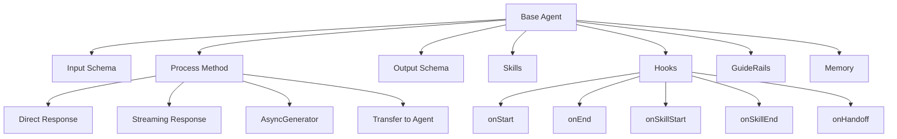
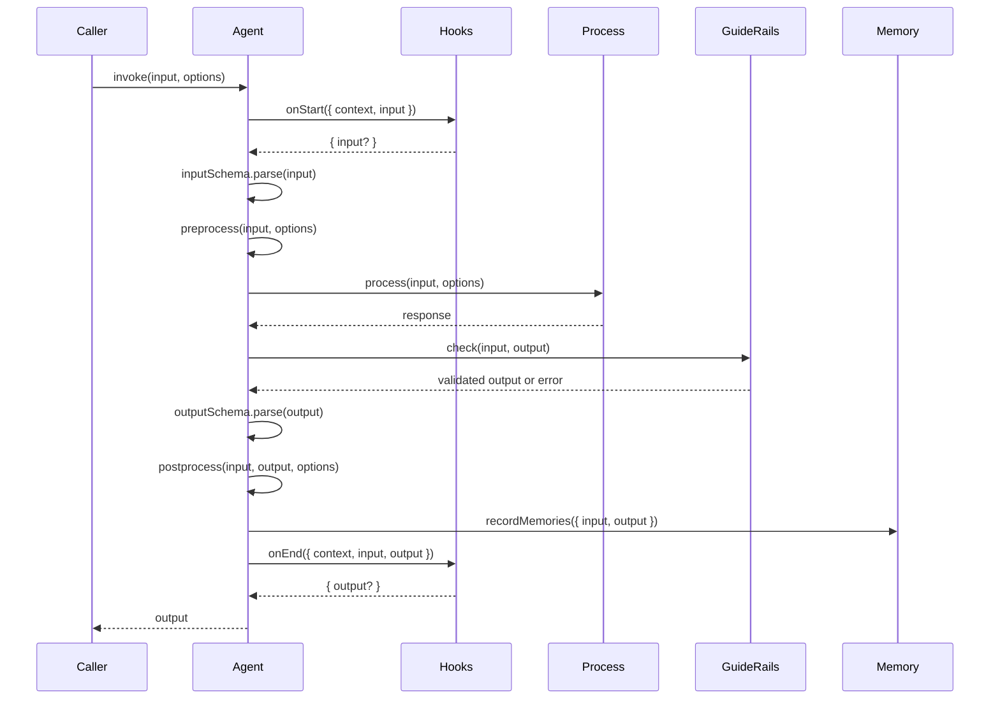

# Base Agent

Base Agent 是 AIGNE Framework 中所有智能体的基础。它提供了消息处理、生命周期管理、验证和智能体间通信的核心功能。理解 Base Agent 对于构建自定义智能体和在 AIGNE 生态系统中高效工作至关重要。

## 智能体架构概览

Agent 类被设计为可扩展和可组合的，使开发者能够创建专业化的智能体，同时利用通用基础设施。



## 核心概念

Agent 类围绕几个关键概念构建：

1. **消息处理**：智能体处理输入消息并产生输出消息
2. **Schema 验证**：输入和输出可以使用 Zod schemas 进行验证
3. **智能体技能**：智能体可以利用其他智能体作为技能来完成复杂任务
4. **生命周期钩子**：可自定义的钩子，用于监控和扩展智能体行为
5. **行为导轨 (Guide Rails)**：验证和控制智能体之间的消息流
6. **内存管理**：可选的内存系统集成，用于状态持久化

## 创建基本智能体

要创建自定义智能体，继承基础 Agent 类并实现 `process` 方法：

```typescript
import { Agent, AgentInvokeOptions } from "@aigne/core";

interface GreetingInput {
  name: string;
}

interface GreetingOutput {
  greeting: string;
}

class GreetingAgent extends Agent<GreetingInput, GreetingOutput> {
  async process(input: GreetingInput, options: AgentInvokeOptions) {
    return {
      greeting: `Hello, ${input.name}!`
    };
  }
}

// 创建并使用智能体
const greeter = new GreetingAgent();
const result = await greeter.invoke({ name: "World" });
console.log(result.greeting); // "Hello, World!"
```

这个例子展示了一个简单的智能体，它接收名称作为输入并返回问候语作为输出。智能体实现了 `process` 方法，这是每个智能体实现的核心。

## 智能体配置选项

创建智能体时，你可以提供各种配置选项来自定义其行为：

```typescript
import { Agent, z } from "@aigne/core";

const myAgent = new MyAgent({
  name: "CustomNamedAgent",
  description: "This agent does something special",
  inputSchema: z.object({
    query: z.string(),
    options: z.object({
      limit: z.number().optional()
    }).optional()
  }),
  outputSchema: z.object({
    results: z.array(z.string()),
    count: z.number()
  }),
  includeInputInOutput: true,
  skills: [otherAgent1, otherAgent2, functionAgent],
  publishTopic: "results",
  subscribeTopic: ["queries", "commands"],
  memory: memoryAgent,
  maxRetrieveMemoryCount: 10,
  hooks: {
    onStart: async ({ context, input }) => {
      console.log(`Agent started with input: ${JSON.stringify(input)}`);
    },
    onEnd: async ({ context, input, output }) => {
      console.log(`Agent completed with output: ${JSON.stringify(output)}`);
    }
  },
  guideRails: [validationAgent, safetyAgent]
});
```

| 选项 | 类型 | 描述 |
|--------|------|-------------|
| `name` | string | 智能体名称，用于识别和日志记录 |
| `description` | string | 人类可读的智能体目的描述 |
| `inputSchema` | ZodType | 用于验证输入消息的模式 |
| `outputSchema` | ZodType | 用于验证输出消息的模式 |
| `includeInputInOutput` | boolean | 为 true 时，输入字段会合并到输出中 |
| `skills` | Agent[] | 此智能体可以使用的其他智能体列表 |
| `publishTopic` | string \| string[] \| function | 发布输出消息的主题 |
| `subscribeTopic` | string \| string[] | 订阅输入消息的主题 |
| `memory` | MemoryAgent \| MemoryAgent[] | 用于状态持久化的内存智能体 |
| `maxRetrieveMemoryCount` | number | 检索的最大内存项数量 |
| `hooks` | AgentHooks | 用于监控智能体行为的生命周期钩子 |
| `guideRails` | GuideRailAgent[] | 用于验证和控制消息流的智能体 |
| `disableEvents` | boolean | 是否禁用智能体动作的事件发送 |

## 智能体生命周期

智能体生命周期包含几个阶段，每个阶段都有自定义的机会：



1. **调用**：使用输入和选项调用智能体
2. **onStart 钩子**：可选的输入预处理
3. **输入验证**：根据输入模式验证输入
4. **预处理**：额外的预处理，如使用检查
5. **处理**：执行核心处理逻辑
6. **GuideRail 检查**：通过 GuideRail 智能体验证输出
7. **输出验证**：根据输出模式验证输出
8. **后处理**：额外的后处理，如主题发布
9. **内存记录**：在内存中记录交互（如果启用）
10. **onEnd 钩子**：可选的输出后处理
11. **返回**：最终输出返回给调用者

## Process 方法实现

`process` 方法是智能体的核心。它必须在所有具体智能体类中实现，并且可以返回各种类型的结果：

```typescript
abstract process(
  input: I,
  options: AgentInvokeOptions
): PromiseOrValue<AgentProcessResult<O>>;
```

该方法可以返回：

1. **直接对象响应**：匹配输出模式的简单对象
2. **流式响应**：用于增量更新的 ReadableStream
3. **异步生成器**：用于分块产生输出
4. **另一个智能体**：将处理转移给另一个智能体

### 直接对象响应

```typescript
class DirectResponseAgent extends Agent<{query: string}, {answer: string}> {
  async process(input: {query: string}, options: AgentInvokeOptions) {
    return {
      answer: `The answer to "${input.query}" is 42.`
    };
  }
}
```

这是最简单的形式，一次性返回完整的输出对象。

### 流式响应

```typescript
class StreamingAgent extends Agent<{query: string}, {answer: string}> {
  async process(input: {query: string}, options: AgentInvokeOptions) {
    // 创建一个带有增量文本更新的流
    const encoder = new TextEncoder();
    const stream = new ReadableStream({
      start(controller) {
        const answer = `The answer to "${input.query}" is 42.`;
        const chunks = answer.split(' ');
        
        let index = 0;
        const interval = setInterval(() => {
          if (index < chunks.length) {
            controller.enqueue(textDelta({
              answer: chunks[index] + ' '
            }));
            index++;
          } else {
            clearInterval(interval);
            controller.close();
          }
        }, 200);
      }
    });
    
    return stream;
  }
}
```

流式响应允许增量更新，适用于聊天界面或长时间运行的操作。

### 异步生成器

```typescript
class AsyncGeneratorAgent extends Agent<{query: string}, {answer: string}> {
  async *process(input: {query: string}, options: AgentInvokeOptions) {
    const answer = `The answer to "${input.query}" is 42.`;
    const chunks = answer.split(' ');
    
    for (const chunk of chunks) {
      yield textDelta({
        answer: chunk + ' '
      });
      await new Promise(resolve => setTimeout(resolve, 200));
    }
    
    return { answer };
  }
}
```

异步生成器提供了一种更便捷的方式来产生流式响应，特别是当数据以异步方式生成时。

### 转移到另一个智能体

```typescript
class RouterAgent extends Agent<{query: string}, {answer: string}> {
  constructor() {
    super({
      skills: [
        new MathAgent(),
        new WeatherAgent(),
        new GeneralKnowledgeAgent()
      ]
    });
  }
  
  async process(input: {query: string}, options: AgentInvokeOptions) {
    // 确定哪个智能体应该处理这个查询
    if (input.query.includes('math')) {
      return this.skills[0]; // 返回 MathAgent
    } else if (input.query.includes('weather')) {
      return this.skills[1]; // 返回 WeatherAgent
    } else {
      return this.skills[2]; // 返回 GeneralKnowledgeAgent
    }
  }
}
```

这种模式允许智能体将处理委托给其他专业化的智能体，实现复杂的路由和智能体组合。

## 智能体技能

智能体可以拥有技能，这些技能是它们可以用来执行特定任务的其他智能体：

```typescript
class CalculatorAgent extends Agent<{operation: string, a: number, b: number}, {result: number}> {
  async process(input: {operation: string, a: number, b: number}, options: AgentInvokeOptions) {
    switch (input.operation) {
      case 'add':
        return { result: input.a + input.b };
      case 'subtract':
        return { result: input.a - input.b };
      default:
        throw new Error(`Unknown operation: ${input.operation}`);
    }
  }
}

class MathAgent extends Agent<{expression: string}, {result: number}> {
  constructor() {
    super({
      skills: [new CalculatorAgent()]
    });
  }
  
  async process(input: {expression: string}, options: AgentInvokeOptions) {
    // 解析表达式，例如 "5 + 3"
    const [a, operation, b] = input.expression.split(' ');
    
    // 使用计算器技能
    const calculator = this.skills[0];
    const result = await this.invokeSkill(calculator, {
      operation: operation === '+' ? 'add' : 'subtract',
      a: Number(a),
      b: Number(b)
    }, options);
    
    return result;
  }
}
```

`invokeSkill` 方法有助于跟踪技能使用情况并一致地应用钩子。

## 函数智能体

对于简单的智能体，你可以使用 `FunctionAgent` 类而不是创建自定义类：

```typescript
import { FunctionAgent } from "@aigne/core";

const adderAgent = FunctionAgent.from(async (input: {a: number, b: number}) => {
  return { sum: input.a + input.b };
});

// 像任何其他智能体一样使用它
const result = await adderAgent.invoke({ a: 5, b: 3 });
console.log(result.sum); // 8
```

函数智能体提供了一种方便的方式，无需定义自定义类即可从简单函数创建智能体。

## 智能体钩子

钩子允许你在生命周期的各个点拦截和扩展智能体行为：

```typescript
import { Agent, AgentInvokeOptions } from "@aigne/core";

class LoggingAgent extends Agent {
  constructor() {
    super({
      hooks: {
        onStart: async ({ context, input }) => {
          console.log(`Agent started at ${new Date().toISOString()}`);
          console.log(`Input: ${JSON.stringify(input)}`);
          
          // 你可以在处理前修改输入
          return {
            input: {
              ...input,
              timestamp: Date.now()
            }
          };
        },
        
        onEnd: async ({ context, input, output, error }) => {
          if (error) {
            console.error(`Agent failed: ${error.message}`);
          } else {
            console.log(`Agent completed at ${new Date().toISOString()}`);
            console.log(`Output: ${JSON.stringify(output)}`);
            
            // 你可以在返回前修改输出
            return {
              output: {
                ...output,
                processingTime: Date.now() - input.timestamp
              }
            };
          }
        },
        
        onSkillStart: async ({ context, skill, input }) => {
          console.log(`Skill ${skill.name} started with input: ${JSON.stringify(input)}`);
        },
        
        onSkillEnd: async ({ context, skill, input, output, error }) => {
          if (error) {
            console.error(`Skill ${skill.name} failed: ${error.message}`);
          } else {
            console.log(`Skill ${skill.name} completed with output: ${JSON.stringify(output)}`);
          }
        },
        
        onHandoff: async ({ context, source, target, input }) => {
          console.log(`Handoff from ${source.name} to ${target.name}`);
        }
      }
    });
  }
  
  async process(input: any, options: AgentInvokeOptions) {
    return { result: "Process completed" };
  }
}
```

| 钩子 | 描述 | 返回值 |
|------|-------------|-------------|
| `onStart` | 当智能体处理开始时调用 | 可选的修改后的输入 |
| `onEnd` | 当智能体处理完成或失败时调用 | 可选的修改后的输出 |
| `onSkillStart` | 在技能被调用前调用 | 无 |
| `onSkillEnd` | 在技能完成或失败后调用 | 无 |
| `onHandoff` | 当处理转移到另一个智能体时调用 | 无 |

## 内存集成

智能体可以与内存系统集成以持久化和检索状态：

```typescript
import { Agent, MemoryAgent, AgentInvokeOptions } from "@aigne/core";

class ConversationalAgent extends Agent<{message: string}, {reply: string}> {
  constructor(memoryAgent: MemoryAgent) {
    super({
      memory: memoryAgent,
      maxRetrieveMemoryCount: 5
    });
  }
  
  async process(input: {message: string}, options: AgentInvokeOptions) {
    // 从内存中检索之前的交互
    const memories = await this.retrieveMemories(
      { search: input.message, limit: 5 },
      options
    );
    
    // 使用记忆生成上下文相关的回复
    const previousMessages = memories.map(m => m.content).join("\n");
    
    const reply = `Based on our previous conversation:\n${previousMessages}\n\nMy reply to "${input.message}" is: Hello!`;
    
    return { reply };
  }
}
```

`retrieveMemories` 方法基于搜索查询或其他条件获取相关记忆。`recordMemories` 方法在 `postprocess` 阶段自动调用。

## GuideRail 智能体

GuideRail 智能体验证、转换或控制智能体之间的消息流：

```typescript
import { Agent, GuideRailAgent, AgentInvokeOptions } from "@aigne/core";

// 创建一个 GuideRail 智能体来强制内容安全
const safetyGuideRail = new GuideRailAgent({
  name: "ContentSafetyGuideRail",
  process: async (input: { input: any, output: any }, options: AgentInvokeOptions) => {
    const { output } = input;
    
    // 检查输出是否包含不安全内容
    if (output.reply && typeof output.reply === 'string') {
      const unsafeWords = ["badword1", "badword2", "badword3"];
      const containsUnsafeContent = unsafeWords.some(word => 
        output.reply.toLowerCase().includes(word)
      );
      
      if (containsUnsafeContent) {
        return {
          abort: true,
          reason: "Output contains unsafe content",
          suggestion: "Please revise your output to remove inappropriate language"
        };
      }
    }
    
    // 未发现问题，允许输出继续
    return { pass: true };
  }
});

// 将 GuideRail 与智能体一起使用
const chatAgent = new ChatAgent({
  guideRails: [safetyGuideRail]
});
```

GuideRail 智能体同时接收输入和预期输出，并在需要时可以中止过程并提供解释。

## 流式响应

对于交互式应用，智能体可以使用 `AgentResponseStream` 类型返回流式响应：

```typescript
import { Agent, AgentInvokeOptions, textDelta, jsonDelta } from "@aigne/core";

class StreamingChatAgent extends Agent<{prompt: string}, {response: string}> {
  async process(input: {prompt: string}, options: AgentInvokeOptions) {
    const words = ["Hello,", "I'm", "a", "streaming", "chat", "agent."];
    
    return new ReadableStream({
      start(controller) {
        let index = 0;
        
        const interval = setInterval(() => {
          if (index < words.length) {
            // 发送增量文本更新
            controller.enqueue(textDelta({
              response: words[index] + " "
            }));
            
            // 可选地，发送增量 JSON 更新
            controller.enqueue(jsonDelta({
              progress: (index + 1) / words.length
            }));
            
            index++;
          } else {
            clearInterval(interval);
            controller.close();
          }
        }, 300);
      }
    });
  }
}

// 要使用流式处理，在选项中设置 streaming: true
const stream = await streamingAgent.invoke({ prompt: "Hello" }, { streaming: true });

// 处理流
for await (const chunk of stream) {
  if (chunk.delta?.text) {
    // 处理文本更新
    console.log("Text update:", chunk.delta.text);
  }
  if (chunk.delta?.json) {
    // 处理 JSON 更新
    console.log("JSON update:", chunk.delta.json);
  }
}
```

`textDelta` 和 `jsonDelta` 辅助函数使创建格式正确的增量更新更容易。

## 智能体事件

智能体在其生命周期中发出事件，可用于监控和调试：

```typescript
import { Agent, AgentInvokeOptions, Context } from "@aigne/core";

// 创建一个将接收事件的上下文
const context = new Context();

// 订阅智能体事件
context.on("agentStarted", (event) => {
  console.log(`Agent ${event.agent.name} started with input:`, event.input);
});

context.on("agentSucceed", (event) => {
  console.log(`Agent ${event.agent.name} succeeded with output:`, event.output);
});

context.on("agentFailed", (event) => {
  console.log(`Agent ${event.agent.name} failed with error:`, event.error);
});

// 创建并使用带有此上下文的智能体
const agent = new MyAgent();
await agent.invoke({ query: "test" }, { context });
```

你可以通过在选项中设置 `disableEvents: true` 来禁用特定智能体的事件发送。

## 将智能体附加到上下文

智能体可以附加到上下文以接收来自特定主题的消息：

```typescript
import { Agent, AgentInvokeOptions, Context } from "@aigne/core";

class SubscriberAgent extends Agent {
  constructor() {
    super({
      subscribeTopic: ["userRequests", "systemAlerts"]
    });
  }
  
  async process(input: any, options: AgentInvokeOptions) {
    console.log(`Received message:`, input);
    return { processed: true };
  }
}

// 创建一个上下文并附加智能体
const context = new Context();
const agent = new SubscriberAgent();

agent.attach(context);

// 向智能体订阅的主题发布消息
context.publish("userRequests", { type: "query", content: "What is the weather?" });
```

当智能体附加到上下文时，它将自动接收并处理发布到其订阅主题的消息。

## 总结

Base Agent 类为 AIGNE Framework 中的所有智能体提供了基础。通过理解其架构、生命周期和扩展模式，你可以创建自定义智能体，利用框架强大的消息处理、验证、技能组合等功能。

在此基础上，探索更专业化的智能体类型：
- [AI Agent](./agents-ai-agent.md) - 用于 AI 驱动的自然语言处理
- [Team Agent](./agents-team-agent.md) - 用于协调多个智能体
- [Transform Agent](./agents-transform-agent.md) - 用于数据转换
- [MCP Agent](./agents-mcp-agent.md) - 用于 Model Context Protocol 集成
- [GuideRail Agent](./agents-guiderail-agent.md) - 用于验证和控制
- [User Agent](./agents-user-agent.md) - 用于管理用户交互