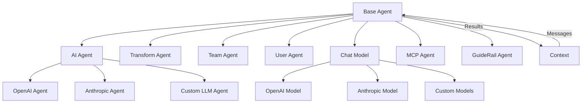
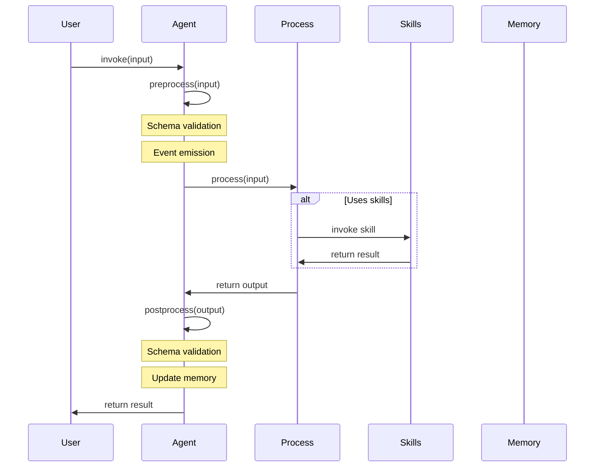

# Agents

Welcome to the comprehensive guide on AIGNE Framework's Agent system. Agents are the fundamental building blocks of AIGNE-powered applications, providing modular, composable units of functionality. In this guide, you'll learn about the different types of agents available, their configuration options, and implementation patterns.

Related documentation:
- [Core Concepts](./core-concepts.md) - Understand the fundamental concepts behind AIGNE
- [Memory Management](./memory.md) - Learn how agents use memory systems

## Agent Architecture Overview

The AIGNE Framework organizes functionality into Agent components that communicate through a message-passing architecture. Each agent type serves specific purposes, from basic processing to AI-powered conversations and team coordination.



## Base Agent

The foundation of the AIGNE agent system is the `Agent` class. All other agent types extend this base class, inheriting its core functionality for message processing, validation, and communication.

Key capabilities of the base Agent include:
- Input/output schema validation using Zod
- Event emission for monitoring agent activity
- Topic-based subscription and publication
- Memory integration for persistence
- Support for skill delegation
- Streaming response support

Here's a simple implementation of a custom agent:

```typescript
import { Agent, type AgentInvokeOptions } from "@aigne/core";
import { z } from "zod";

// Define input and output types
interface GreeterInput {
  name: string;
}

interface GreeterOutput {
  greeting: string;
}

// Create a custom agent by extending the Agent class
class GreeterAgent extends Agent<GreeterInput, GreeterOutput> {
  constructor() {
    super({
      // Define schema for input validation
      inputSchema: z.object({
        name: z.string(),
      }),
      // Define schema for output validation
      outputSchema: z.object({
        greeting: z.string(),
      }),
      // Provide descriptive information
      name: "GreeterAgent",
      description: "A simple agent that generates greetings",
    });
  }

  // Implement the process method
  async process(input: GreeterInput, options: AgentInvokeOptions): Promise<GreeterOutput> {
    return {
      greeting: `Hello, ${input.name}!`,
    };
  }
}
```

This example creates a simple agent that takes a name as input and returns a greeting. The agent uses Zod schemas to validate both input and output formats.

## Function Agent

For simpler cases, AIGNE provides a `FunctionAgent` that allows you to create agents from functions without needing to extend the base class:

```typescript
import { FunctionAgent } from "@aigne/core";

// Create an agent from a function
const adderAgent = FunctionAgent.from(async (input: { a: number; b: number }) => {
  return {
    sum: input.a + input.b,
  };
});

// Use the agent
const result = await adderAgent.invoke({ a: 5, b: 3 });
console.log(result); // { sum: 8 }
```

The `FunctionAgent.from()` method provides a convenient way to transform regular functions into fully-featured agents with all the capabilities of the agent system.

## Agent Configuration Options

When creating agents, you can provide various configuration options to customize behavior:

```typescript
import { Agent, type AgentOptions } from "@aigne/core";
import { z } from "zod";

// Configure agent options
const options: AgentOptions = {
  name: "CustomAgent", 
  description: "Performs custom processing",
  subscribeTopic: ["topic1", "topic2"], // Topics to listen to
  publishTopic: "resultTopic", // Where to publish results
  inputSchema: z.object({ query: z.string() }),
  outputSchema: z.object({ result: z.string() }),
  includeInputInOutput: true, // Include input in output message
  skills: [otherAgent1, otherAgent2], // Sub-agents to use
  disableEvents: false, // Whether to emit events
  memory: memoryAgent, // Memory system to use
  maxRetrieveMemoryCount: 10, // Maximum memory items to retrieve
  hooks: {
    onStart: async ({ context, input }) => {
      console.log("Agent started:", input);
    },
    onEnd: async ({ context, input, output }) => {
      console.log("Agent finished:", output);
    },
  },
  guideRails: [validationAgent], // GuideRail agents for validation
};

// Create agent with options
class CustomAgent extends Agent {
  // ...implementation
}

const agent = new CustomAgent(options);
```

The table below summarizes the available agent options:

| Option | Type | Description |
|--------|------|-------------|
| `name` | string | Name of the agent for identification and logging |
| `description` | string | Human-readable description of the agent's purpose |
| `subscribeTopic` | string \| string[] | Topics the agent subscribes to for receiving messages |
| `publishTopic` | string \| string[] \| function | Topics to publish outputs to, or a function that determines topics |
| `inputSchema` | ZodType | Schema defining the expected input format |
| `outputSchema` | ZodType | Schema defining the expected output format |
| `includeInputInOutput` | boolean | Whether to include input fields in output |
| `skills` | Agent[] | List of other agents this agent can use as skills |
| `disableEvents` | boolean | Whether to disable emitting agent events |
| `memory` | MemoryAgent | Memory system for persistence |
| `maxRetrieveMemoryCount` | number | Maximum number of memory items to retrieve |
| `hooks` | AgentHooks | Lifecycle hooks for monitoring and modifying behavior |
| `guideRails` | GuideRailAgent[] | Agents for validating and controlling message flow |

## Agent Lifecycle

The agent lifecycle follows a standard pattern:



### Lifecycle Hooks

Agents support lifecycle hooks for customizing behavior at key points:

```typescript
import { Agent, type AgentHooks } from "@aigne/core";

const hooks: AgentHooks = {
  // Called when agent processing begins
  onStart: async ({ context, input }) => {
    console.log("Starting agent with input:", input);
    // Optionally modify input
    return { input: { ...input, modified: true } };
  },
  
  // Called when agent processing completes or fails
  onEnd: async ({ context, input, output, error }) => {
    if (error) {
      console.error("Agent failed:", error);
    } else {
      console.log("Agent succeeded with output:", output);
      // Optionally modify output
      return { output: { ...output, enhanced: true } };
    }
  },
  
  // Called before a skill (sub-agent) is invoked
  onSkillStart: async ({ context, skill, input }) => {
    console.log(`Using skill ${skill.name} with input:`, input);
  },
  
  // Called after a skill (sub-agent) completes or fails
  onSkillEnd: async ({ context, skill, input, output, error }) => {
    if (error) {
      console.error(`Skill ${skill.name} failed:`, error);
    } else {
      console.log(`Skill ${skill.name} succeeded with output:`, output);
    }
  },
  
  // Called when an agent hands off processing to another agent
  onHandoff: async ({ context, source, target, input }) => {
    console.log(`Handoff from ${source.name} to ${target.name} with input:`, input);
  }
};

class MonitoredAgent extends Agent {
  constructor() {
    super({ hooks });
  }
  
  // Implementation...
}
```

Hooks provide a powerful way to add logging, monitoring, and custom behavior at key points in the agent lifecycle without modifying the core implementation.

## Agent Invocation

Agents can be invoked in two ways: regular (synchronous) or streaming (asynchronous):

```typescript
import { Agent } from "@aigne/core";

// Regular invocation
const result = await agent.invoke(input);

// Streaming invocation
const stream = await agent.invoke(input, { streaming: true });
for await (const chunk of stream) {
  // Process incremental updates
  if (chunk.delta?.text) {
    console.log("Text update:", chunk.delta.text);
  }
  if (chunk.delta?.json) {
    console.log("JSON update:", chunk.delta.json);
  }
}
```

Streaming responses are particularly useful for real-time display of long-running processes, such as AI-generated content.

## Agent Communication

Agents communicate using a topic-based subscription system:

```typescript
import { Agent } from "@aigne/core";

// Create an agent that subscribes to specific topics
const listenerAgent = new CustomAgent({
  subscribeTopic: ["notifications", "alerts"],
  // Process incoming messages from these topics
});

// Create an agent that publishes to specific topics
const publisherAgent = new CustomAgent({
  publishTopic: (output) => {
    // Determine topic based on output content
    return output.urgent ? "alerts" : "notifications";
  },
});

// Attach agents to a context
context.attach(listenerAgent);
context.attach(publisherAgent);

// When publisherAgent produces output, listenerAgent will receive it
// through the topic subscription system
```

This topic-based communication enables building complex workflows with loose coupling between components.

## Memory Integration

Agents can be connected to memory systems for persistence across invocations:

```typescript
import { Agent, ConversationMemoryAgent } from "@aigne/core";

// Create a memory system
const memory = new ConversationMemoryAgent();

// Create an agent with memory
const agentWithMemory = new CustomAgent({
  memory, // Attach memory to agent
  maxRetrieveMemoryCount: 10, // Limit memory retrieval
});

// Memory is automatically updated with each invocation
await agentWithMemory.invoke({ query: "First question" });
await agentWithMemory.invoke({ query: "Follow-up question" });

// Retrieve memories for context
const memories = await agentWithMemory.retrieveMemories(
  { search: "question" },
  { context }
);
```

Memory integration allows agents to maintain conversation history, refer to previous inputs and outputs, and build context-aware applications.

## Tool Integration

Agents can define and use tools to extend their capabilities:

```typescript
import { ChatModel } from "@aigne/core";

// Define tools for the agent
const tools = [
  {
    type: "function",
    function: {
      name: "get_weather",
      description: "Get the current weather for a location",
      parameters: {
        type: "object",
        properties: {
          location: {
            type: "string",
            description: "The city and state or country",
          },
        },
        required: ["location"],
      },
    },
  },
];

// Function to handle tool calls
async function handleToolCalls(toolCalls) {
  // Process tool calls and return results
  const results = [];
  
  for (const call of toolCalls) {
    if (call.function.name === "get_weather") {
      const location = call.function.arguments.location;
      results.push({
        role: "tool",
        toolCallId: call.id,
        content: JSON.stringify({ temp: 72, condition: "sunny" }),
      });
    }
  }
  
  return results;
}

// Use tools with a chat model
const model = new OpenAIChatModel();
const result = await model.invoke({
  messages: [{ role: "user", content: "What's the weather in New York?" }],
  tools,
  toolChoice: "auto",
});

// Handle any tool calls in the response
if (result.toolCalls?.length) {
  const toolResults = await handleToolCalls(result.toolCalls);
  
  // Continue the conversation with tool results
  const followUpResult = await model.invoke({
    messages: [
      { role: "user", content: "What's the weather in New York?" },
      { role: "agent", toolCalls: result.toolCalls },
      ...toolResults,
    ],
  });
}
```

Tools enable agents to interact with external systems, access databases, perform calculations, and incorporate domain-specific functionality.

## Agent Transfer

Agents can transfer control to other agents using the transfer pattern:

```typescript
import { Agent, transferToAgentOutput } from "@aigne/core";

class RouterAgent extends Agent {
  constructor() {
    super({
      name: "RouterAgent",
      skills: [weatherAgent, calculatorAgent, translationAgent],
    });
  }
  
  async process(input, options) {
    // Determine which agent should handle this request
    if (input.query.includes("weather")) {
      // Transfer to weather agent
      return transferToAgentOutput(this.skills.weatherAgent);
    } else if (input.query.includes("calculate")) {
      // Transfer to calculator agent
      return transferToAgentOutput(this.skills.calculatorAgent);
    } else if (input.query.includes("translate")) {
      // Transfer to translation agent
      return transferToAgentOutput(this.skills.translationAgent);
    }
    
    // Handle default case
    return { result: "I couldn't route your request to a specialized agent." };
  }
}
```

This pattern allows for creating agent routing systems that delegate requests to specialized agents based on content or intent analysis.

## Summary

This guide introduced you to the AIGNE Framework's Agent system, covering the base agent class, function agents, configuration options, lifecycle, invocation patterns, communication, memory integration, and agent transfer.

Agents provide a flexible, modular approach to building AI-powered applications, allowing you to compose complex behaviors from simple building blocks.

Next steps:
- [Base Agent](./agents-base.md) - Dive deeper into the base Agent class capabilities
- [AI Agent](./agents-ai-agent.md) - Learn about agents powered by language models
- [Team Agent](./agents-team-agent.md) - Explore how to coordinate multiple agents in teams
- [Memory Management](./memory.md) - Understand how to use memory systems with agents