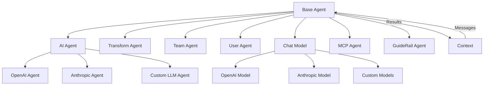
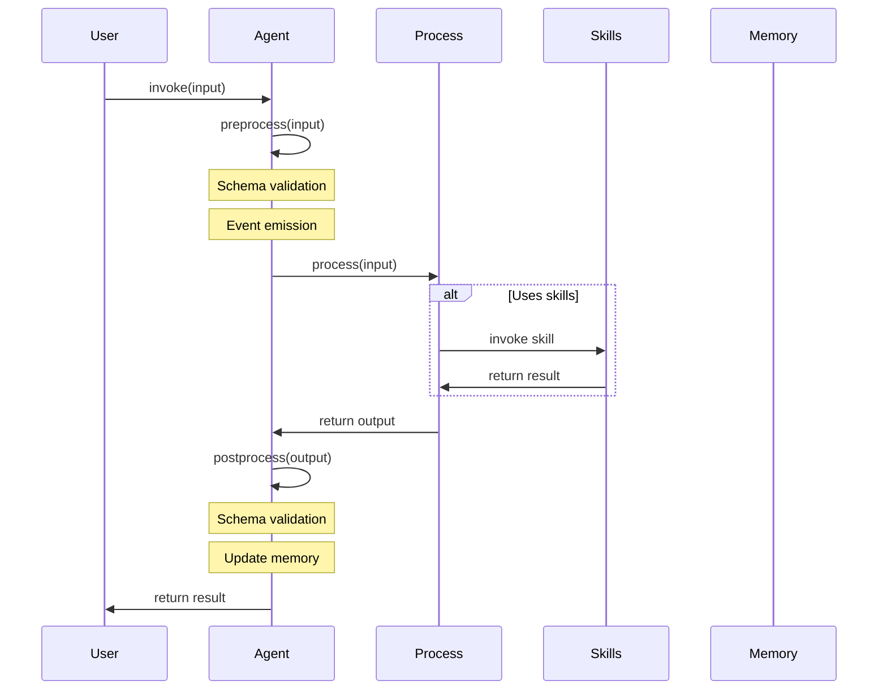

# Agents

欢迎阅读关于 AIGNE Framework 智能体系统的全面指南。智能体是 AIGNE 驱动应用程序的基本构建块，提供模块化、可组合的功能单元。在本指南中，您将了解不同类型的智能体、它们的配置选项和实现模式。

相关文档：
- [核心概念](./core-concepts.md) - 了解 AIGNE 背后的基本概念
- [内存管理](./memory.md) - 了解智能体如何使用内存系统

## 智能体架构概述

AIGNE Framework 将功能组织为通过消息传递架构进行通信的 Agent 组件。每种智能体类型都服务于特定目的，从基本处理到 AI 驱动的对话和团队协调。



## Base Agent

AIGNE 智能体系统的基础是 `Agent` 类。所有其他智能体类型都扩展自这个基类，继承其用于消息处理、验证和通信的核心功能。

基础 Agent 的关键能力包括：
- 使用 Zod 进行输入/输出模式验证
- 事件发送用于监控智能体活动
- 基于主题的订阅和发布
- 集成内存以实现持久性
- 支持技能委派
- 支持流式响应

以下是自定义智能体的简单实现：

```typescript
import { Agent, type AgentInvokeOptions } from "@aigne/core";
import { z } from "zod";

// 定义输入和输出类型
interface GreeterInput {
  name: string;
}

interface GreeterOutput {
  greeting: string;
}

// 通过扩展 Agent 类创建自定义智能体
class GreeterAgent extends Agent<GreeterInput, GreeterOutput> {
  constructor() {
    super({
      // 定义输入验证模式
      inputSchema: z.object({
        name: z.string(),
      }),
      // 定义输出验证模式
      outputSchema: z.object({
        greeting: z.string(),
      }),
      // 提供描述性信息
      name: "GreeterAgent",
      description: "A simple agent that generates greetings",
    });
  }

  // 实现处理方法
  async process(input: GreeterInput, options: AgentInvokeOptions): Promise<GreeterOutput> {
    return {
      greeting: `Hello, ${input.name}!`,
    };
  }
}
```

这个示例创建了一个简单的智能体，它接收一个名称作为输入并返回一个问候语。该智能体使用 Zod 模式验证输入和输出格式。

## Function Agent

对于更简单的情况，AIGNE 提供了一个 `FunctionAgent`，允许您从函数创建智能体，而无需扩展基类：

```typescript
import { FunctionAgent } from "@aigne/core";

// 从函数创建智能体
const adderAgent = FunctionAgent.from(async (input: { a: number; b: number }) => {
  return {
    sum: input.a + input.b,
  };
});

// 使用智能体
const result = await adderAgent.invoke({ a: 5, b: 3 });
console.log(result); // { sum: 8 }
```

`FunctionAgent.from()` 方法提供了一种便捷的方式，将普通函数转换为具有智能体系统所有功能的完整智能体。

## 智能体配置选项

创建智能体时，您可以提供各种配置选项来自定义行为：

```typescript
import { Agent, type AgentOptions } from "@aigne/core";
import { z } from "zod";

// 配置智能体选项
const options: AgentOptions = {
  name: "CustomAgent", 
  description: "Performs custom processing",
  subscribeTopic: ["topic1", "topic2"], // 要监听的主题
  publishTopic: "resultTopic", // 发布结果的位置
  inputSchema: z.object({ query: z.string() }),
  outputSchema: z.object({ result: z.string() }),
  includeInputInOutput: true, // 在输出消息中包含输入
  skills: [otherAgent1, otherAgent2], // 要使用的子智能体
  disableEvents: false, // 是否发送事件
  memory: memoryAgent, // 要使用的内存系统
  maxRetrieveMemoryCount: 10, // 要检索的最大内存项数
  hooks: {
    onStart: async ({ context, input }) => {
      console.log("Agent started:", input);
    },
    onEnd: async ({ context, input, output }) => {
      console.log("Agent finished:", output);
    },
  },
  guideRails: [validationAgent], // 用于验证的 Guide Rails (行为导轨) 智能体
};

// 使用选项创建智能体
class CustomAgent extends Agent {
  // ...实现
}

const agent = new CustomAgent(options);
```

下表总结了可用的智能体选项：

| 选项 | 类型 | 描述 |
|--------|------|-------------|
| `name` | string | 智能体的名称，用于标识和日志记录 |
| `description` | string | 智能体目的的可读描述 |
| `subscribeTopic` | string \| string[] | 智能体订阅以接收消息的主题 |
| `publishTopic` | string \| string[] \| function | 发布输出的主题，或确定主题的函数 |
| `inputSchema` | ZodType | 定义预期输入格式的模式 |
| `outputSchema` | ZodType | 定义预期输出格式的模式 |
| `includeInputInOutput` | boolean | 是否在输出中包含输入字段 |
| `skills` | Agent[] | 此智能体可用作技能的其他智能体列表 |
| `disableEvents` | boolean | 是否禁用发送智能体事件 |
| `memory` | MemoryAgent | 用于持久性的内存系统 |
| `maxRetrieveMemoryCount` | number | 要检索的最大内存项数 |
| `hooks` | AgentHooks | 用于监控和修改行为的生命周期钩子 |
| `guideRails` | GuideRailAgent[] | 用于验证和控制消息流的智能体 |

## 智能体生命周期

智能体生命周期遵循标准模式：



### 生命周期钩子

智能体支持生命周期钩子，用于在关键点自定义行为：

```typescript
import { Agent, type AgentHooks } from "@aigne/core";

const hooks: AgentHooks = {
  // 智能体处理开始时调用
  onStart: async ({ context, input }) => {
    console.log("Starting agent with input:", input);
    // 可选择修改输入
    return { input: { ...input, modified: true } };
  },
  
  // 智能体处理完成或失败时调用
  onEnd: async ({ context, input, output, error }) => {
    if (error) {
      console.error("Agent failed:", error);
    } else {
      console.log("Agent succeeded with output:", output);
      // 可选择修改输出
      return { output: { ...output, enhanced: true } };
    }
  },
  
  // 技能（子智能体）被调用前调用
  onSkillStart: async ({ context, skill, input }) => {
    console.log(`Using skill ${skill.name} with input:`, input);
  },
  
  // 技能（子智能体）完成或失败后调用
  onSkillEnd: async ({ context, skill, input, output, error }) => {
    if (error) {
      console.error(`Skill ${skill.name} failed:`, error);
    } else {
      console.log(`Skill ${skill.name} succeeded with output:`, output);
    }
  },
  
  // 智能体将处理转交给另一个智能体时调用
  onHandoff: async ({ context, source, target, input }) => {
    console.log(`Handoff from ${source.name} to ${target.name} with input:`, input);
  }
};

class MonitoredAgent extends Agent {
  constructor() {
    super({ hooks });
  }
  
  // 实现...
}
```

钩子提供了一种强大的方式，可以在智能体生命周期的关键点添加日志记录、监控和自定义行为，而无需修改核心实现。

## 智能体调用

智能体可以通过两种方式调用：常规（同步）或流式（异步）：

```typescript
import { Agent } from "@aigne/core";

// 常规调用
const result = await agent.invoke(input);

// 流式调用
const stream = await agent.invoke(input, { streaming: true });
for await (const chunk of stream) {
  // 处理增量更新
  if (chunk.delta?.text) {
    console.log("Text update:", chunk.delta.text);
  }
  if (chunk.delta?.json) {
    console.log("JSON update:", chunk.delta.json);
  }
}
```

流式响应对于长时间运行进程的实时显示特别有用，例如 AI 生成的内容。

## 智能体通信

智能体使用基于主题的订阅系统进行通信：

```typescript
import { Agent } from "@aigne/core";

// 创建订阅特定主题的智能体
const listenerAgent = new CustomAgent({
  subscribeTopic: ["notifications", "alerts"],
  // 处理来自这些主题的传入消息
});

// 创建发布到特定主题的智能体
const publisherAgent = new CustomAgent({
  publishTopic: (output) => {
    // 根据输出内容确定主题
    return output.urgent ? "alerts" : "notifications";
  },
});

// 将智能体附加到上下文
context.attach(listenerAgent);
context.attach(publisherAgent);

// 当 publisherAgent 产生输出时，listenerAgent 会通过主题订阅系统接收它
```

这种基于主题的通信支持构建具有组件之间松散耦合的复杂工作流。

## 内存集成

智能体可以连接到内存系统，以实现跨调用的持久性：

```typescript
import { Agent, ConversationMemoryAgent } from "@aigne/core";

// 创建内存系统
const memory = new ConversationMemoryAgent();

// 创建带有内存的智能体
const agentWithMemory = new CustomAgent({
  memory, // 将内存附加到智能体
  maxRetrieveMemoryCount: 10, // 限制内存检索
});

// 每次调用都会自动更新内存
await agentWithMemory.invoke({ query: "First question" });
await agentWithMemory.invoke({ query: "Follow-up question" });

// 检索内存以获取上下文
const memories = await agentWithMemory.retrieveMemories(
  { search: "question" },
  { context }
);
```

内存集成允许智能体维护对话历史，参考先前的输入和输出，并构建上下文感知的应用程序。

## 工具集成

智能体可以定义和使用工具来扩展其功能：

```typescript
import { ChatModel } from "@aigne/core";

// 为智能体定义工具
const tools = [
  {
    type: "function",
    function: {
      name: "get_weather",
      description: "Get the current weather for a location",
      parameters: {
        type: "object",
        properties: {
          location: {
            type: "string",
            description: "The city and state or country",
          },
        },
        required: ["location"],
      },
    },
  },
];

// 处理工具调用的函数
async function handleToolCalls(toolCalls) {
  // 处理工具调用并返回结果
  const results = [];
  
  for (const call of toolCalls) {
    if (call.function.name === "get_weather") {
      const location = call.function.arguments.location;
      results.push({
        role: "tool",
        toolCallId: call.id,
        content: JSON.stringify({ temp: 72, condition: "sunny" }),
      });
    }
  }
  
  return results;
}

// 使用聊天模型的工具
const model = new OpenAIChatModel();
const result = await model.invoke({
  messages: [{ role: "user", content: "What's the weather in New York?" }],
  tools,
  toolChoice: "auto",
});

// 处理响应中的任何工具调用
if (result.toolCalls?.length) {
  const toolResults = await handleToolCalls(result.toolCalls);
  
  // 使用工具结果继续对话
  const followUpResult = await model.invoke({
    messages: [
      { role: "user", content: "What's the weather in New York?" },
      { role: "agent", toolCalls: result.toolCalls },
      ...toolResults,
    ],
  });
}
```

工具使智能体能够与外部系统交互，访问数据库，执行计算，并整合领域特定的功能。

## 智能体转移

智能体可以使用转移模式将控制权转移给其他智能体：

```typescript
import { Agent, transferToAgentOutput } from "@aigne/core";

class RouterAgent extends Agent {
  constructor() {
    super({
      name: "RouterAgent",
      skills: [weatherAgent, calculatorAgent, translationAgent],
    });
  }
  
  async process(input, options) {
    // 确定哪个智能体应该处理此请求
    if (input.query.includes("weather")) {
      // 转移到天气智能体
      return transferToAgentOutput(this.skills.weatherAgent);
    } else if (input.query.includes("calculate")) {
      // 转移到计算器智能体
      return transferToAgentOutput(this.skills.calculatorAgent);
    } else if (input.query.includes("translate")) {
      // 转移到翻译智能体
      return transferToAgentOutput(this.skills.translationAgent);
    }
    
    // 处理默认情况
    return { result: "I couldn't route your request to a specialized agent." };
  }
}
```

这种模式允许创建智能体路由系统，根据内容或意图分析将请求委派给专门的智能体。

## 总结

本指南介绍了 AIGNE Framework 的智能体系统，涵盖了基本智能体类、函数智能体、配置选项、生命周期、调用模式、通信、内存集成和智能体转移。

智能体提供了构建 AI 驱动应用程序的灵活、模块化方法，允许您从简单的构建块组合复杂的行为。

下一步：
- [Base Agent](./agents-base.md) - 深入了解基础 Agent 类的功能
- [AI Agent](./agents-ai-agent.md) - 了解由语言模型驱动的智能体
- [Team Agent](./agents-team-agent.md) - 探索如何在团队中协调多个智能体
- [Memory Management](./memory.md) - 了解如何使用内存系统和智能体