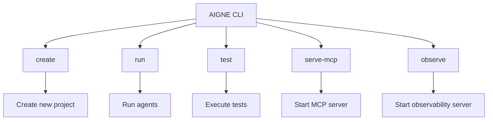
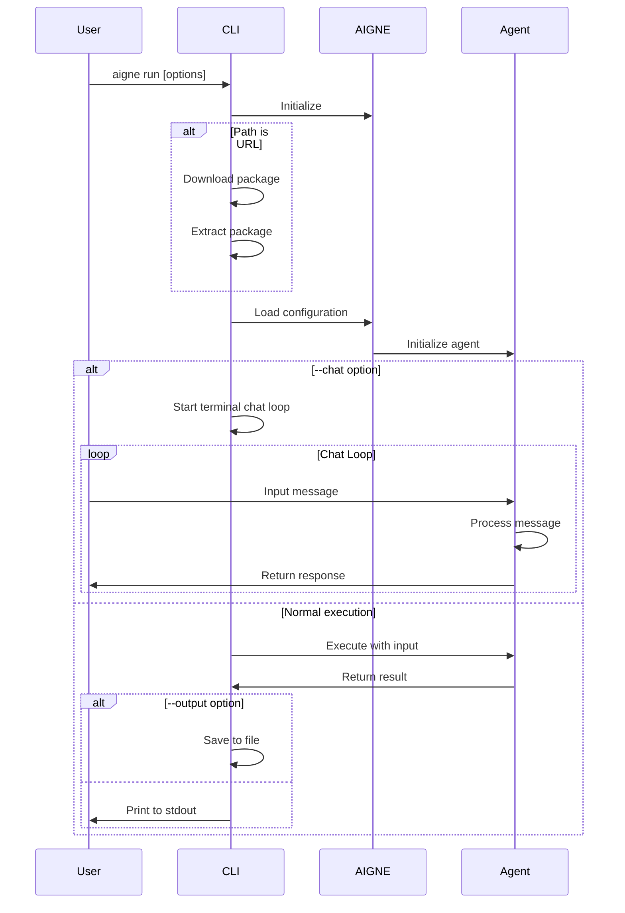
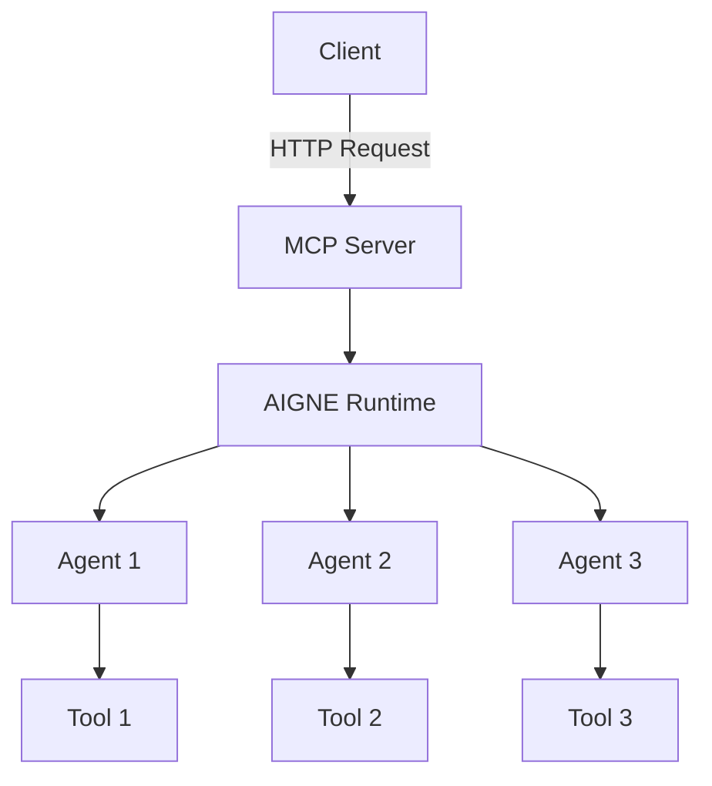
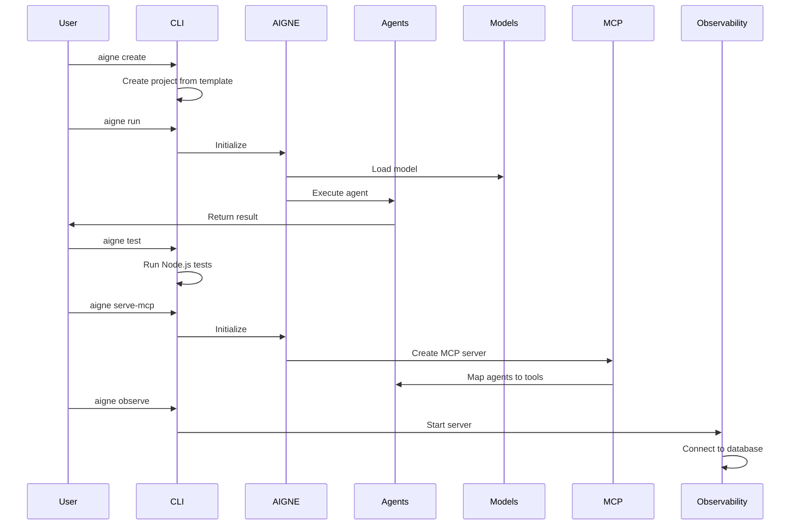

# CLI Commands

Welcome to the AIGNE CLI commands documentation. This section provides detailed information about each command available in the AIGNE CLI, including their options, usage patterns, and examples. The AIGNE CLI provides a comprehensive set of tools to create, run, test, and manage your AIGNE projects.

## Overview

The AIGNE CLI offers several commands to help you work with AIGNE projects:



## Create Command

The `create` command helps you create a new AIGNE project with agent configuration files.

### Basic Usage

```bash
aigne create [path]
```

### Options

| Option | Description | Default |
|--------|-------------|---------|
| `[path]` | Path to create the project directory | `.` (current directory) |

### Example

```bash
# Create a project in a new directory
aigne create my-aigne-project

# Create a project in the current directory
aigne create
```

When you run this command, you'll be prompted to:
1. Enter a project name (if not specified)
2. Confirm overwriting existing files (if the directory is not empty)
3. Select a template for your project

After the project is created, the CLI will show instructions on how to run your new agent:

```
✅ AIGNE project created successfully!

To use your new agent, run:
  cd my-aigne-project && aigne run
```

## Run Command

The `run` command executes an AIGNE agent from the specified directory or URL.

### Basic Usage

```bash
aigne run [options]
```

### Options

| Option | Description | Default |
|--------|-------------|---------|
| `--url, --path <path_or_url>` | Path to the agents directory or URL to AIGNE project | `.` (current directory) |
| `--entry-agent <entry-agent>` | Name of the agent to run | First agent found |
| `--cache-dir <dir>` | Directory to download the package to | `~/.aigne/xxx` |
| `--chat` | Run chat loop in terminal | `false` |
| `--model <provider[:model]>` | AI model to use (e.g., 'openai' or 'openai:gpt-4o-mini') | `openai` |
| `--temperature <temperature>` | Temperature for the model (0.0-2.0) | Model default |
| `--top-p <top-p>` | Top P parameter for the model (0.0-1.0) | Model default |
| `--presence-penalty <presence-penalty>` | Presence penalty for the model (-2.0 to 2.0) | Model default |
| `--frequency-penalty <frequency-penalty>` | Frequency penalty for the model (-2.0 to 2.0) | Model default |
| `--input, -i <input...>` | Input to the agent (use @file to read from file) | - |
| `--format <format>` | Input format (text, json, yaml) | `text` |
| `--output, -o <output>` | Output file to save the result | stdout |
| `--output-key <output-key>` | Key in the result to save to output file | `output` |
| `--force` | Truncate output file if exists, create directory if needed | `false` |
| `--log-level <level>` | Log level for debugging (ERROR, WARN, INFO, DEBUG, TRACE) | `INFO` |

### Examples

```bash
# Run the first agent in the current directory
aigne run

# Run a specific agent with options
aigne run --entry-agent myAgent --model openai:gpt-4 --temperature 0.7

# Run from a URL and save output
aigne run --url https://example.com/my-aigne-project --output result.txt

# Run in chat mode
aigne run --chat

# Run with input from a file
aigne run --input @input.txt

# Run with JSON input
aigne run --input '{"question": "What is AIGNE?"}' --format json
```

The command execution flow is as follows:



## Test Command

The `test` command runs tests in the specified agents directory.

### Basic Usage

```bash
aigne test [options]
```

### Options

| Option | Description | Default |
|--------|-------------|---------|
| `--url, --path <path_or_url>` | Path to the agents directory or URL to AIGNE project | `.` (current directory) |

### Example

```bash
# Run tests in the current directory
aigne test

# Run tests in a specific directory
aigne test --path ./my-aigne-project
```

This command simply executes `node --test` in the specified directory, allowing you to run your Node.js test files using the Node.js built-in test runner.

## Serve MCP Command

The `serve-mcp` command serves the agents in the specified directory as a Model Context Protocol (MCP) server over HTTP.

### Basic Usage

```bash
aigne serve-mcp [options]
```

### Options

| Option | Description | Default |
|--------|-------------|---------|
| `--url, --path <path_or_url>` | Path to the agents directory or URL to AIGNE project | `.` (current directory) |
| `--host <host>` | Host to run the MCP server on | `localhost` |
| `--port <port>` | Port to run the MCP server on | `3000` or value from `PORT` env variable |
| `--pathname <pathname>` | Pathname to the service | `/mcp` |

### Example

```bash
# Start an MCP server on default host and port
aigne serve-mcp

# Start an MCP server with custom settings
aigne serve-mcp --host 0.0.0.0 --port 8080 --pathname /api/mcp
```

When the server starts, it will output the URL where the MCP server is running:

```
MCP server is running on http://localhost:3000/mcp
```

This command creates an HTTP server that exposes your AIGNE agents as MCP tools, allowing other applications to interact with them using the Model Context Protocol.



## Observe Command

The `observe` command starts the AIGNE observability server for monitoring agent execution and performance.

### Basic Usage

```bash
aigne observe [options]
```

### Options

| Option | Description | Default |
|--------|-------------|---------|
| `--host <host>` | Host to run the observability server on | `localhost` |
| `--port <port>` | Port to run the observability server on | `7890` or value from `PORT` env variable |

### Example

```bash
# Start the observability server on default host and port
aigne observe

# Start the observability server with custom settings
aigne observe --host 0.0.0.0 --port 9000
```

When started, the command will output the database path and start the server:

```
Observability database path: /path/to/database
```

The observability server provides a web interface to monitor and analyze agent executions, track performance metrics, and debug issues with your AIGNE applications.

## Command Execution Flow

The following diagram illustrates how the different commands in the AIGNE CLI interact with the AIGNE framework:



## Summary

The AIGNE CLI provides a comprehensive set of commands to help you create, run, test, and monitor your AIGNE projects. These commands make it easy to manage the entire lifecycle of your AI agents, from development to deployment and monitoring.

For more information about the AIGNE CLI and its usage, check out the [AIGNE CLI](./cli.md) page. To learn more about the core concepts behind AIGNE, visit the [Core Concepts](./core-concepts.md) page.