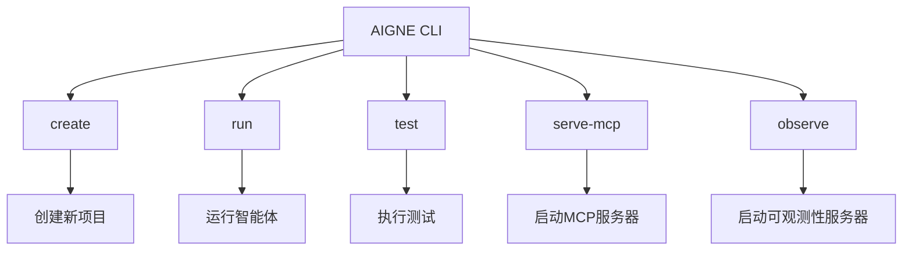
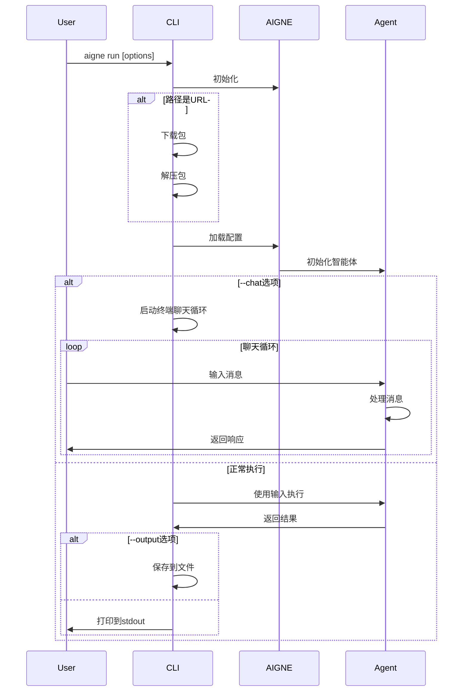
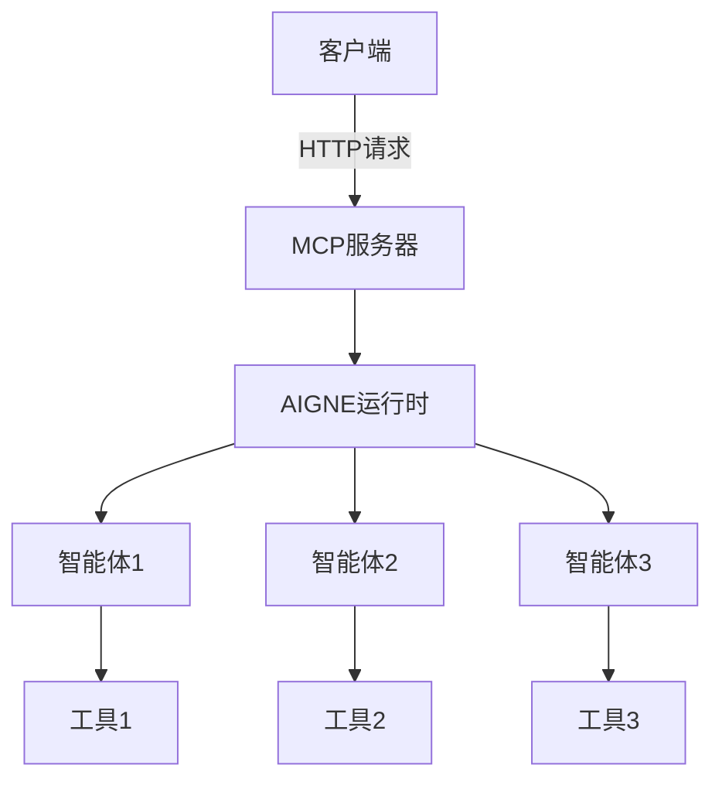
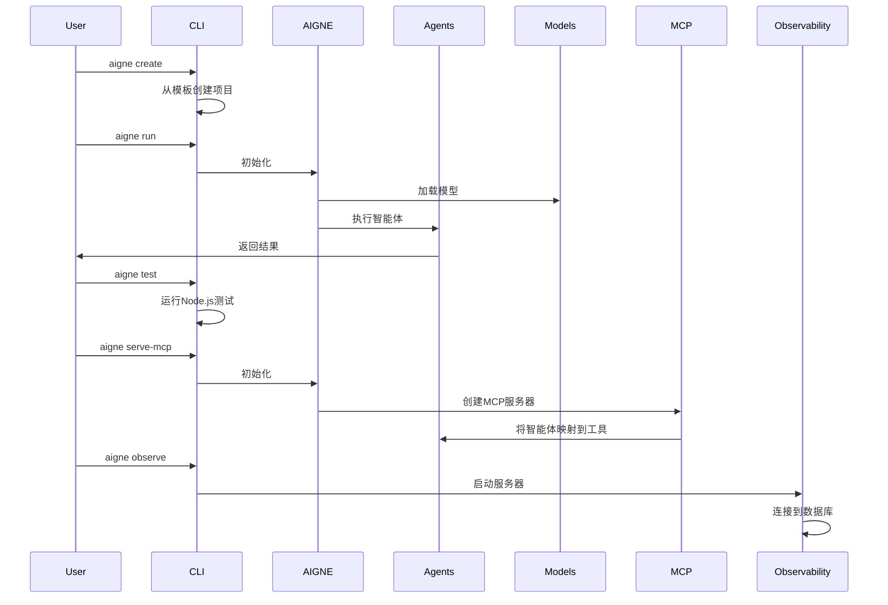

# CLI 命令

欢迎阅读AIGNE CLI命令文档。本节提供了AIGNE CLI中每个可用命令的详细信息，包括它们的选项、使用模式和示例。AIGNE CLI提供了一套全面的工具，用于创建、运行、测试和管理您的AIGNE项目。

## 概述

AIGNE CLI提供了几个命令来帮助您使用AIGNE项目：



## Create命令

`create`命令帮助您创建带有智能体配置文件的新AIGNE项目。

### 基本用法

```bash
aigne create [path]
```

### 选项

| 选项 | 描述 | 默认值 |
|--------|-------------|---------|
| `[path]` | 创建项目目录的路径 | `.`（当前目录） |

### 示例

```bash
# 在新目录中创建项目
aigne create my-aigne-project

# 在当前目录中创建项目
aigne create
```

当您运行此命令时，系统会提示您：
1. 输入项目名称（如果未指定）
2. 确认是否覆盖现有文件（如果目录不为空）
3. 为您的项目选择模板

项目创建后，CLI将显示如何运行您的新智能体的说明：

```
✅ AIGNE项目创建成功！

要使用您的新智能体，请运行：
  cd my-aigne-project && aigne run
```

## Run命令

`run`命令从指定目录或URL执行AIGNE智能体。

### 基本用法

```bash
aigne run [options]
```

### 选项

| 选项 | 描述 | 默认值 |
|--------|-------------|---------|
| `--url, --path <path_or_url>` | 智能体目录的路径或AIGNE项目的URL | `.`（当前目录） |
| `--entry-agent <entry-agent>` | 要运行的智能体名称 | 找到的第一个智能体 |
| `--cache-dir <dir>` | 下载包的目录 | `~/.aigne/xxx` |
| `--chat` | 在终端中运行聊天循环 | `false` |
| `--model <provider[:model]>` | 要使用的AI模型（例如'openai'或'openai:gpt-4o-mini'） | `openai` |
| `--temperature <temperature>` | 模型的温度参数（0.0-2.0） | 模型默认值 |
| `--top-p <top-p>` | 模型的Top P参数（0.0-1.0） | 模型默认值 |
| `--presence-penalty <presence-penalty>` | 模型的存在惩罚参数（-2.0到2.0） | 模型默认值 |
| `--frequency-penalty <frequency-penalty>` | 模型的频率惩罚参数（-2.0到2.0） | 模型默认值 |
| `--input, -i <input...>` | 智能体的输入（使用@file从文件读取） | - |
| `--format <format>` | 输入格式（text, json, yaml） | `text` |
| `--output, -o <output>` | 保存结果的输出文件 | stdout |
| `--output-key <output-key>` | 要保存到输出文件的结果中的键 | `output` |
| `--force` | 如果输出文件存在则截断，如果需要则创建目录 | `false` |
| `--log-level <level>` | 用于调试的日志级别（ERROR, WARN, INFO, DEBUG, TRACE） | `INFO` |

### 示例

```bash
# 运行当前目录中的第一个智能体
aigne run

# 使用特定选项运行特定智能体
aigne run --entry-agent myAgent --model openai:gpt-4 --temperature 0.7

# 从URL运行并保存输出
aigne run --url https://example.com/my-aigne-project --output result.txt

# 在聊天模式下运行
aigne run --chat

# 使用文件输入运行
aigne run --input @input.txt

# 使用JSON输入运行
aigne run --input '{"question": "什么是AIGNE?"}' --format json
```

命令执行流程如下：



## Test命令

`test`命令在指定的智能体目录中运行测试。

### 基本用法

```bash
aigne test [options]
```

### 选项

| 选项 | 描述 | 默认值 |
|--------|-------------|---------|
| `--url, --path <path_or_url>` | 智能体目录的路径或AIGNE项目的URL | `.`（当前目录） |

### 示例

```bash
# 在当前目录中运行测试
aigne test

# 在特定目录中运行测试
aigne test --path ./my-aigne-project
```

此命令只是在指定目录中执行`node --test`，允许您使用Node.js内置测试运行器运行Node.js测试文件。

## Serve MCP命令

`serve-mcp`命令将指定目录中的智能体作为Model Context Protocol (MCP)服务器通过HTTP提供服务。

### 基本用法

```bash
aigne serve-mcp [options]
```

### 选项

| 选项 | 描述 | 默认值 |
|--------|-------------|---------|
| `--url, --path <path_or_url>` | 智能体目录的路径或AIGNE项目的URL | `.`（当前目录） |
| `--host <host>` | 运行MCP服务器的主机 | `localhost` |
| `--port <port>` | 运行MCP服务器的端口 | `3000`或来自`PORT`环境变量的值 |
| `--pathname <pathname>` | 服务的路径名 | `/mcp` |

### 示例

```bash
# 在默认主机和端口上启动MCP服务器
aigne serve-mcp

# 使用自定义设置启动MCP服务器
aigne serve-mcp --host 0.0.0.0 --port 8080 --pathname /api/mcp
```

当服务器启动时，它将输出MCP服务器运行的URL：

```
MCP服务器正在运行，地址为 http://localhost:3000/mcp
```

此命令创建一个HTTP服务器，将您的AIGNE智能体作为MCP工具暴露出来，允许其他应用程序使用Model Context Protocol与它们交互。



## Observe命令

`observe`命令启动AIGNE可观测性服务器，用于监控智能体执行和性能。

### 基本用法

```bash
aigne observe [options]
```

### 选项

| 选项 | 描述 | 默认值 |
|--------|-------------|---------|
| `--host <host>` | 运行可观测性服务器的主机 | `localhost` |
| `--port <port>` | 运行可观测性服务器的端口 | `7890`或来自`PORT`环境变量的值 |

### 示例

```bash
# 在默认主机和端口上启动可观测性服务器
aigne observe

# 使用自定义设置启动可观测性服务器
aigne observe --host 0.0.0.0 --port 9000
```

启动后，命令将输出数据库路径并启动服务器：

```
可观测性数据库路径：/path/to/database
```

可观测性服务器提供了一个Web界面，用于监控和分析智能体执行情况，跟踪性能指标，并调试AIGNE应用程序的问题。

## 命令执行流程

以下图表说明了AIGNE CLI中的不同命令如何与AIGNE框架交互：



## 总结

AIGNE CLI提供了一套全面的命令，帮助您创建、运行、测试和监控AIGNE项目。这些命令使您能够轻松管理AI智能体的整个生命周期，从开发到部署和监控。

有关AIGNE CLI及其用法的更多信息，请查看[AIGNE CLI](./cli.md)页面。要了解有关AIGNE背后的核心概念，请访问[核心概念](./core-concepts.md)页面。