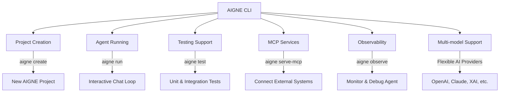

# AIGNE CLI

AIGNE CLI is the official command-line tool for the [AIGNE Framework](https://github.com/AIGNE-io/aigne-framework). It is designed to simplify the development, testing, and deployment processes for your AIGNE applications, providing a convenient and intuitive experience.

To begin your journey with AIGNE, you might want to check out the [Getting Started](./getting-started.md) guide. For detailed usage of each command, refer to the [CLI Commands](./cli/commands.md) section.



## Installation

YouYou can install AIGNE CLI globally using your preferred package manager:

### Using npm

```bash
npm install -g @aigne/cli
```

### Using yarn

```bash
yarn global add @aigne/cli
```

### Using pnpm

```bash
pnpm add -g @aigne/cli
```

After installation, you can use the `aigne` command from anywhere in your terminal.

## Key Features

AIGNE CLI provides a rich set of features to accelerate your AIGNE development workflow:

*   **Project Creation**: Quickly scaffold new AIGNE projects with predefined file structures and configurations.
*   **Agent Running**: Easily run and test your AIGNE Agent in an interactive chat loop.
*   **Testing Support**: Built-in commands for running unit and integration tests for your Agent.
*   **MCP Services**: Support for launching agents as Model Context Protocol (MCP) servers, enabling integration with external systems.
*   **Interactive Interface**: A user-friendly command-line interface designed for an intuitive experience.
*   **Multi-model Support**: Seamlessly switch between various AI model providers, including OpenAI, Anthropic, Bedrock, DeepSeek, Gemini, Ollama, OpenRouter, and XAI.
*   **Observability**: Tools to monitor and debug your Agent, providing insights into their behavior and performance.

## Basic Commands Overview

The AIGNE CLI offers a streamlined set of core commands to manage your projects and agents. Here's a quick overview:

| Command           | Description                                                                 |
|:------------------|:----------------------------------------------------------------------------|
| `aigne --help`    | Displays comprehensive help information about the CLI and its commands.     |
| `aigne create`    | Creates a new AIGNE project with a guided interactive setup.                |
| `aigne run`       | Launches an Agent in an interactive chat loop for testing and interaction.  |
| `aigne test`      | Executes tests defined for your AIGNE Agent.                                |
| `aigne serve-mcp` | Starts an MCP server to expose your Agent to external systems.              |
| `aigne observe`   | Initiates the observability server for monitoring Agent activities.         |

For a detailed explanation of each command, including all available options and practical examples, please proceed to the [CLI Commands](./cli/commands.md) section.

## Multi-model Support Details

AIGNE CLI is designed to be flexible with AI model providers, allowing you to integrate and switch between various large language models (LLMs) effortlessly. This is facilitated by the `--model` option available in commands like `aigne run`.

The CLI supports the following chat models:

| Provider Name   | Description                                                                 | Integration Package                                 |
|:----------------|:----------------------------------------------------------------------------|:----------------------------------------------------|
| `openai`        | OpenAI's powerful language models like GPT-4, GPT-3.5, etc.                 | `@aigne/openai`                                     |
| `anthropic`     | Anthropic's Claude models, known for their safety and performance.          | `@aigne/anthropic`                                  |
| `bedrock`       | Amazon Bedrock, providing access to various foundation models from AWS.     | `@aigne/bedrock`                                    |
| `deepseek`      | DeepSeek AI models.                                                         | `@aigne/deepseek`                                   |
| `gemini`        | Google Gemini models.                                                       | `@aigne/gemini`                                     |
| `ollama`        | Ollama, enabling running open-source LLMs locally.                          | `@aigne/ollama`                                     |
| `open-router`   | OpenRouter, a unified API for various open and closed-source models.        | `@aigne/open-router`                                |
| `xai`           | XAI's models, such as Grok.                                                 | `@aigne/xai`                                        |

You can specify the model provider and optionally the specific model name using the `--model <provider[:model]>` format. For example:

```bash
# Use OpenAI's default model
aigne run --model openai

# Use a specific OpenAI model (e.g., GPT-4o mini)
aigne run --model openai:gpt-4o-mini

# Use Anthropic's Claude model
aigne run --model anthropic

# Use Ollama for local models
aigne run --model ollama:llama2
```

This flexibility ensures that you can leverage the best model for your specific AIGNE application needs, whether it's for performance, cost, or specific capabilities.

## Summary

AIGNE CLI is an indispensable tool for any developer working with the AIGNE Framework. It provides a robust, efficient, and user-friendly way to manage the entire lifecycle of your AIGNE applications, from creation and development to testing and deployment. Its comprehensive features, including multi-model support and observability, make it a powerful companion for building sophisticated AI-powered solutions.

To dive deeper into the specific functionalities of each command, explore the [CLI Commands](./cli/commands.md) guide. If you're looking for more general information on how to build applications with AIGNE, refer to the [Core Concepts](./core-concepts.md).