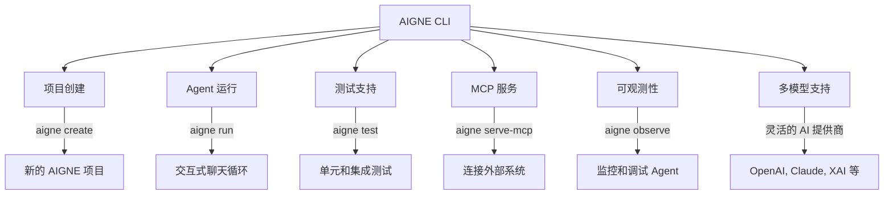

# AIGNE CLI

AIGNE CLI 是 [AIGNE Framework](https://github.com/AIGNE-io/aigne-framework) 的官方命令行工具。它旨在简化您的 AIGNE 应用的开发、测试和部署流程，提供便捷直观的体验。

要开始您的 AIGNE 之旅，您可能需要查看 [入门指南](./getting-started.md)。有关每个命令的详细用法，请参阅 [CLI 命令](./cli/commands.md) 部分。



## 安装

您可以使用您偏好的包管理器全局安装 AIGNE CLI：

### 使用 npm

```bash
npm install -g @aigne/cli
```

### 使用 yarn

```bash
yarn global add @aigne/cli
```

### 使用 pnpm

```bash
pnpm add -g @aigne/cli
```

安装后，您可以在终端的任何位置使用 `aigne` 命令。

## 主要特性

AIGNE CLI 提供了一系列丰富的功能，可加速您的 AIGNE 开发工作流：

*   **项目创建**：快速搭建新的 AIGNE 项目，提供预定义的文件结构和配置。
*   **Agent 运行**：轻松运行和测试您的 AIGNE Agent，在交互式聊天循环中进行。
*   **测试支持**：内置命令，用于运行您的 Agent 的单元和集成测试。
*   **MCP 服务**：支持将 Agent 作为模型上下文协议 (Model Context Protocol, MCP) 服务器启动，从而实现与外部系统的集成。
*   **交互式界面**：一个用户友好的命令行界面，旨在提供直观的体验。
*   **多模型支持**：在各种 AI 模型提供商之间无缝切换，包括 OpenAI、Anthropic、Bedrock、DeepSeek、Gemini、Ollama、OpenRouter 和 XAI。
*   **可观测性**：用于监控和调试您的 Agent 的工具，提供对其行为和性能的深入见解。

## 基本命令概览

AIGNE CLI 提供了一套精简的核心命令来管理您的项目和 Agent。以下是快速概览：

| 命令           | 描述                                                                 |
|:------------------|:----------------------------------------------------------------------------|
| `aigne --help`    | 显示有关 CLI 及其命令的全面帮助信息。     |
| `aigne create`    | 通过引导式交互设置创建一个新的 AIGNE 项目。                |
| `aigne run`       | 启动一个 Agent，在交互式聊天循环中进行测试和交互。  |
| `aigne test`      | 执行为您的 AIGNE Agent 定义的测试。                                |
| `aigne serve-mcp` | 启动一个 MCP 服务器，将您的 Agent 暴露给外部系统。              |
| `aigne observe`   | 启动可观测性服务器，用于监控 Agent 活动。         |

有关每个命令的详细解释，包括所有可用选项和实际示例，请参阅 [CLI 命令](./cli/commands.md) 部分。

## 多模型支持详情

AIGNE CLI 的设计旨在灵活适应 AI 模型提供商，让您能够轻松集成和切换各种大型语言模型 (LLM)。这通过 `aigne run` 等命令中可用的 `--model` 选项实现。

CLI 支持以下聊天模型：

| 提供商名称   | 描述                                                                 | 集成包                                 |
|:----------------|:----------------------------------------------------------------------------|:----------------------------------------------------|
| `openai`        | OpenAI 强大的语言模型，如 GPT-4、GPT-3.5 等。                 | `@aigne/openai`                                     |
| `anthropic`     | Anthropic 的 Claude 模型，以其安全性和性能著称。          | `@aigne/anthropic`                                  |
| `bedrock`       | Amazon Bedrock，提供访问来自 AWS 的各种基础模型。     | `@aigne/bedrock`                                    |
| `deepseek`      | DeepSeek AI 模型。                                                         | `@aigne/deepseek`                                   |
| `gemini`        | Google Gemini 模型。                                                       | `@aigne/gemini`                                     |
| `ollama`        | Ollama，支持在本地运行开源 LLM。                          | `@aigne/ollama`                                     |
| `open-router`   | OpenRouter，一个用于各种开源和闭源模型的统一 API。        | `@aigne/open-router`                                |
| `xai`           | XAI 的模型，例如 Grok。                                                 | `@aigne/xai`                                        |

您可以使用 `--model <provider[:model]>` 格式指定模型提供商，并可选地指定特定模型名称。例如：

```bash
# 使用 OpenAI 的默认模型
aigne run --model openai

# 使用特定的 OpenAI 模型（例如 GPT-4o mini）
aigne run --model openai:gpt-4o-mini

# 使用 Anthropic 的 Claude 模型
aigne run --model anthropic

# 使用 Ollama 进行本地模型
aigne run --model ollama:llama2
```

这种灵活性确保您可以根据特定的 AIGNE 应用需求，利用最佳模型，无论是为了性能、成本还是特定功能。

## 总结

AIGNE CLI 是任何使用 AIGNE Framework 进行开发的开发人员不可或缺的工具。它提供了一种强大、高效且用户友好的方式来管理您的 AIGNE 应用的整个生命周期，从创建、开发到测试和部署。其全面的功能，包括多模型支持和可观测性，使其成为构建复杂 AI 驱动解决方案的强大伴侣。

要深入了解每个命令的具体功能，请查阅 [CLI 命令](./cli/commands.md) 指南。如果您正在寻找有关如何使用 AIGNE 构建应用的更一般信息，请参阅 [核心概念](./core-concepts.md)。