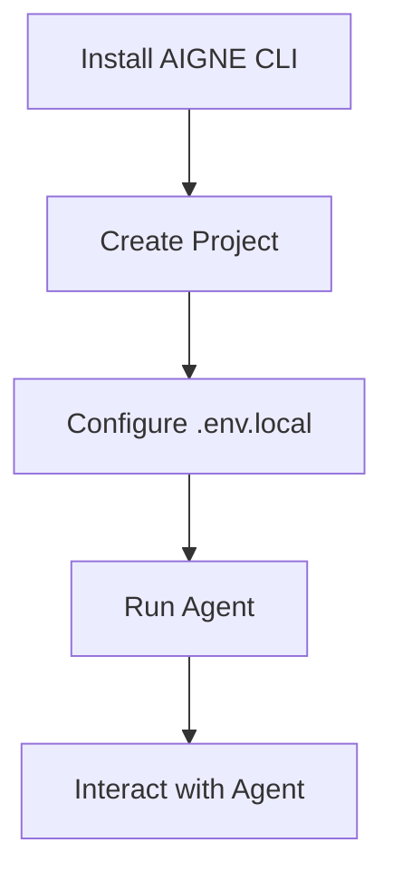
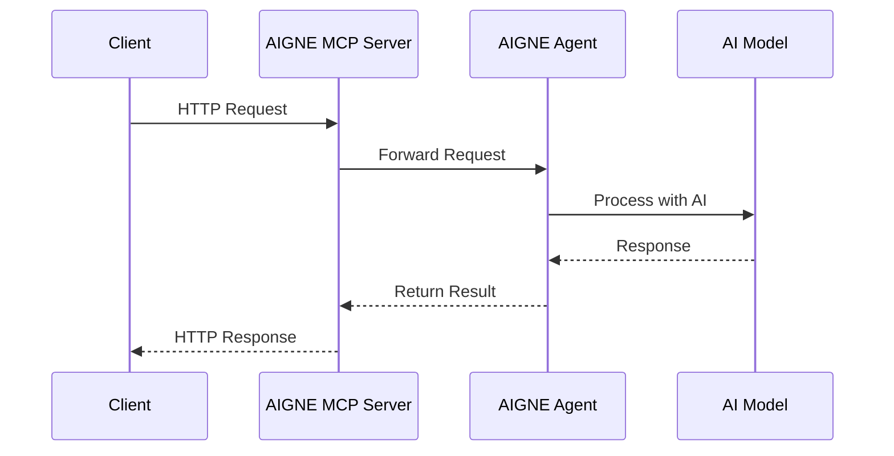

# Getting Started

Welcome to the AIGNE Framework! This guide will help you quickly set up your development environment and build your first AI-powered application using AIGNE. You'll learn how to install the necessary packages, configure your environment, and create a simple project.

## Prerequisites

Before getting started with AIGNE Framework, you need to have the following installed:

- Node.js (v16 or higher)
- npm, yarn, or pnpm

## Installation

You can install AIGNE CLI globally to easily create and manage your AIGNE projects.

```bash
# Using npm
npm install -g @aigne/cli

# Using yarn
yarn global add @aigne/cli

# Using pnpm
pnpm add -g @aigne/cli
```

Alternatively, if you're building an application with AIGNE Core, you can install it as a dependency in your project:

```bash
# Using npm
npm install @aigne/core

# Using yarn
yarn add @aigne/core

# Using pnpm
pnpm add @aigne/core
```

## Creating Your First AIGNE Project

The easiest way to get started is by using the AIGNE CLI to create a new project:

```bash
aigne create my-first-project
```

This command will create a new AIGNE project in the `my-first-project` directory with the default template. The default template includes:

- `aigne.yaml` - Project configuration file
- `chat.yaml` - Chat agent configuration
- `sandbox.js` - JavaScript code execution tool
- `sandbox.test.js` - Test file for the code execution tool

## Setting Up Environment Variables

After creating your project, you need to set up your environment variables. Copy the `.env.local.example` file to `.env.local`:

```bash
cp .env.local.example .env.local
```

Then edit the `.env.local` file to add your AI model provider API key:

```shell
# OpenAI
MODEL="openai:gpt-4.1"
OPENAI_API_KEY="YOUR_OPENAI_API_KEY"
```

AIGNE Framework supports various AI models. You can choose from:

- OpenAI (gpt-4o, gpt-4.1, etc.)
- Anthropic Claude
- Google Gemini
- Amazon Bedrock Nova
- DeepSeek
- OpenRouter
- xAI Grok
- Ollama (local models)

Simply uncomment the appropriate section in your `.env.local` file and add your API key.

## Running Your First Agent

To run your agent, navigate to your project directory and use the AIGNE CLI:

```bash
cd my-first-project
aigne run
```

This will start an interactive chat session with your AI agent.



## Building a Simple Agent Programmatically

If you prefer to create your agent programmatically using the AIGNE Core library, here's a simple example:

```typescript
import { AIAgent, AIGNE } from "@aigne/core";
import { OpenAIChatModel } from "@aigne/core/models/openai-chat-model.js";

// Create AI model instance
const model = new OpenAIChatModel({
  apiKey: process.env.OPENAI_API_KEY,
  model: process.env.DEFAULT_CHAT_MODEL || "gpt-4-turbo",
});

// Create AI agent
const agent = AIAgent.from({
  name: "Assistant",
  instructions: "You are a helpful assistant.",
});

// AIGNE: Main execution engine of AIGNE Framework
const aigne = new AIGNE({ model });

// Use the AIGNE to invoke the agent
const userAgent = await aigne.invoke(agent);

// Send a message to the agent
const response = await userAgent.invoke(
  "Hello, can you help me write a short article?",
);
console.log(response);
```

This example creates a simple AI agent that uses the OpenAI model to respond to user messages. The agent is configured with basic instructions, and the AIGNE engine manages the communication between the user and the agent.

## Running Tests

AIGNE Framework includes built-in testing support. To run tests in your project:

```bash
aigne test
```

This will execute all test files in your project directory, allowing you to verify that your agents are working as expected.

## Understanding the Project Structure

Let's take a closer look at the files created by the default template:

### aigne.yaml

This is the main configuration file for your AIGNE project, which defines the AI model to use and references to your agents:

```yaml
# Example aigne.yaml
version: 1
config:
  model: ${MODEL}
agents:
  - chat.yaml
```

### chat.yaml

This file defines your chat agent, including its instructions and any skills (tools) it can use:

```yaml
# Example chat.yaml
name: ChatAgent
instructions: You are a helpful assistant who can answer questions and execute JavaScript code.
skills:
  - sandbox.js
```

### sandbox.js

This is a JavaScript execution tool that allows your agent to run JavaScript code:

```javascript
// Example sandbox.js
export const name = "runJavaScript";
export const description = "Run JavaScript code and return the result";

export default async function runJavaScript(code) {
  try {
    const result = eval(code);
    return JSON.stringify(result, null, 2);
  } catch (error) {
    return `Error: ${error.message}`;
  }
}
```

## Running as a MCP Server

AIGNE Framework supports the Model Context Protocol (MCP), which allows your agents to be accessed by external systems. To start an MCP server:

```bash
aigne serve-mcp --port 3001
```

This will make your agents available through an HTTP API, which can be used by other applications.



## Next Steps

Now that you've set up your first AIGNE project, you're ready to explore more advanced features:

- Learn about different [Agent types](./agents.md) and how to use them
- Understand the [Core Concepts](./core-concepts.md) of the AIGNE Framework
- Explore the [CLI Commands](./cli-commands.md) in detail
- Dive into [Memory Management](./memory.md) to build agents with persistent memory

By following this guide, you should now have a working AIGNE project and a basic understanding of how to create and run AI agents using the AIGNE Framework.