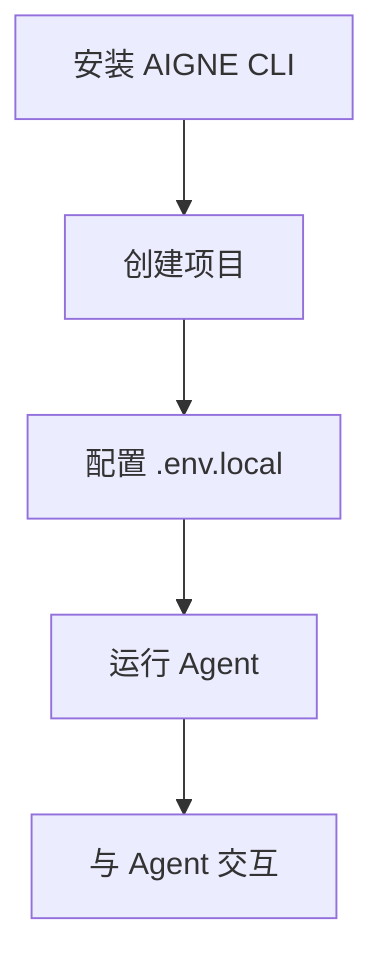
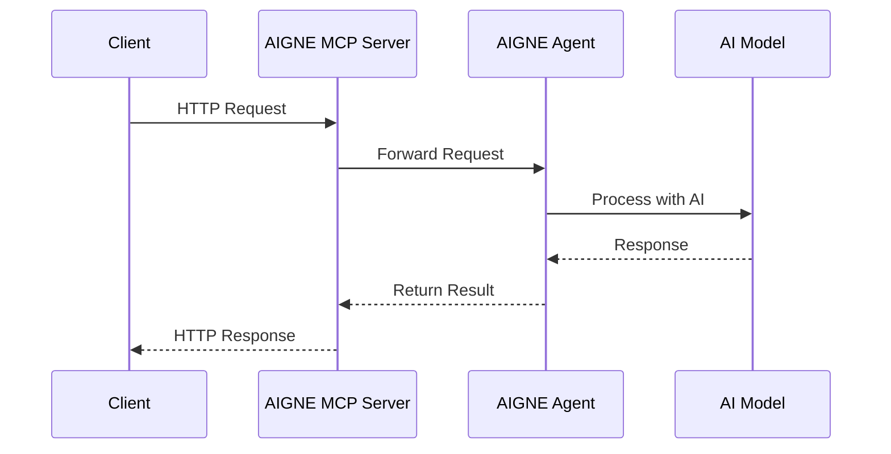

# 入门指南

欢迎使用 AIGNE Framework！本指南将帮助您快速设置开发环境，并使用 AIGNE 构建您的第一个 AI 驱动的应用程序。您将学习如何安装必要的软件包、配置环境以及创建一个简单的项目。

## 前提条件

在开始使用 AIGNE Framework 之前，您需要安装以下内容：

- Node.js（v16 或更高版本）
- npm、yarn 或 pnpm

## 安装

您可以全局安装 AIGNE CLI，以便轻松创建和管理您的 AIGNE 项目。

```bash
# 使用 npm
npm install -g @aigne/cli

# 使用 yarn
yarn global add @aigne/cli

# 使用 pnpm
pnpm add -g @aigne/cli
```

或者，如果您正在使用 AIGNE Core 构建应用程序，可以将其作为依赖项安装到您的项目中：

```bash
# 使用 npm
npm install @aigne/core

# 使用 yarn
yarn add @aigne/core

# 使用 pnpm
pnpm add @aigne/core
```

## 创建您的第一个 AIGNE 项目

开始使用的最简单方法是使用 AIGNE CLI 创建一个新项目：

```bash
aigne create my-first-project
```

该命令将使用默认模板在 `my-first-project` 目录中创建一个新的 AIGNE 项目。默认模板包括：

- `aigne.yaml` - 项目配置文件
- `chat.yaml` - 聊天智能体配置
- `sandbox.js` - JavaScript 代码执行工具
- `sandbox.test.js` - 代码执行工具的测试文件

## 设置环境变量

创建项目后，您需要设置环境变量。将 `.env.local.example` 文件复制到 `.env.local`：

```bash
cp .env.local.example .env.local
```

然后编辑 `.env.local` 文件，添加您的 AI 模型提供商 API 密钥：

```shell
# OpenAI
MODEL="openai:gpt-4.1"
OPENAI_API_KEY="YOUR_OPENAI_API_KEY"
```

AIGNE Framework 支持多种 AI 模型。您可以选择：

- OpenAI（gpt-4o、gpt-4.1 等）
- Anthropic Claude
- Google Gemini
- Amazon Bedrock Nova
- DeepSeek
- OpenRouter
- xAI Grok
- Ollama（本地模型）

只需在 `.env.local` 文件中取消注释相应部分并添加您的 API 密钥即可。

## 运行您的第一个 Agent

要运行您的 Agent，导航到您的项目目录并使用 AIGNE CLI：

```bash
cd my-first-project
aigne run
```

这将启动与您的 AI Agent 的交互式聊天会话。



## 以编程方式构建简单的 Agent

如果您更喜欢使用 AIGNE Core 库以编程方式创建 Agent，这里有一个简单的例子：

```typescript
import { AIAgent, AIGNE } from "@aigne/core";
import { OpenAIChatModel } from "@aigne/core/models/openai-chat-model.js";

// 创建 AI 模型实例
const model = new OpenAIChatModel({
  apiKey: process.env.OPENAI_API_KEY,
  model: process.env.DEFAULT_CHAT_MODEL || "gpt-4-turbo",
});

// 创建 AI Agent
const agent = AIAgent.from({
  name: "Assistant",
  instructions: "You are a helpful assistant.",
});

// AIGNE: AIGNE Framework 的主执行引擎
const aigne = new AIGNE({ model });

// 使用 AIGNE 调用 Agent
const userAgent = await aigne.invoke(agent);

// 向 Agent 发送消息
const response = await userAgent.invoke(
  "Hello, can you help me write a short article?",
);
console.log(response);
```

这个例子创建了一个简单的 AI Agent，使用 OpenAI 模型响应用户消息。Agent 配置了基本指令，AIGNE 引擎管理用户与 Agent 之间的通信。

## 运行测试

AIGNE Framework 包含内置的测试支持。要在您的项目中运行测试：

```bash
aigne test
```

这将执行项目目录中的所有测试文件，让您可以验证您的 Agent 是否按预期工作。

## 了解项目结构

让我们仔细看看默认模板创建的文件：

### aigne.yaml

这是 AIGNE 项目的主配置文件，定义了要使用的 AI 模型和对 Agent 的引用：

```yaml
# 示例 aigne.yaml
version: 1
config:
  model: ${MODEL}
agents:
  - chat.yaml
```

### chat.yaml

此文件定义了您的聊天 Agent，包括其指令和它可以使用的任何技能（工具）：

```yaml
# 示例 chat.yaml
name: ChatAgent
instructions: You are a helpful assistant who can answer questions and execute JavaScript code.
skills:
  - sandbox.js
```

### sandbox.js

这是一个 JavaScript 执行工具，允许您的 Agent 运行 JavaScript 代码：

```javascript
// 示例 sandbox.js
export const name = "runJavaScript";
export const description = "Run JavaScript code and return the result";

export default async function runJavaScript(code) {
  try {
    const result = eval(code);
    return JSON.stringify(result, null, 2);
  } catch (error) {
    return `Error: ${error.message}`;
  }
}
```

## 作为 MCP 服务器运行

AIGNE Framework 支持模型上下文协议（Model Context Protocol，MCP），该协议允许外部系统访问您的 Agent。要启动 MCP 服务器：

```bash
aigne serve-mcp --port 3001
```

这将通过 HTTP API 使您的 Agent 可用，其他应用程序可以使用该 API。



## 下一步

现在您已经设置了第一个 AIGNE 项目，您可以探索更高级的功能：

- 了解不同的 [Agent 类型](./agents.md)及其使用方法
- 理解 AIGNE Framework 的[核心概念](./core-concepts.md)
- 详细探索 [CLI 命令](./cli-commands.md)
- 深入了解[内存管理](./memory.md)，构建具有持久记忆的 Agent

通过本指南，您现在应该有一个可用的 AIGNE 项目，并对如何使用 AIGNE Framework 创建和运行 AI Agent 有基本的了解。