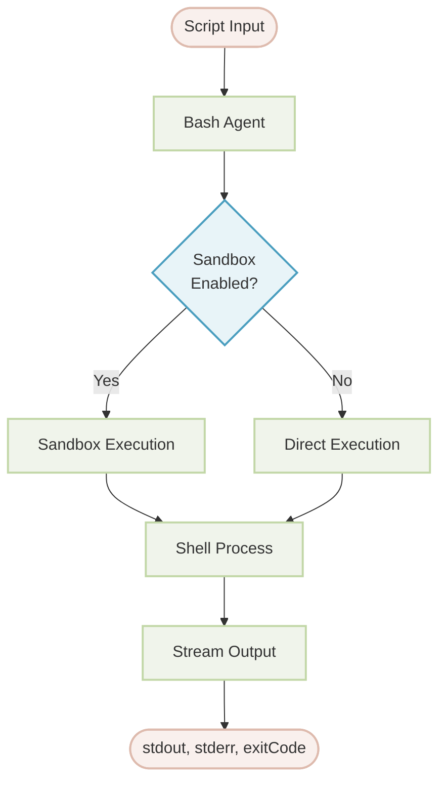
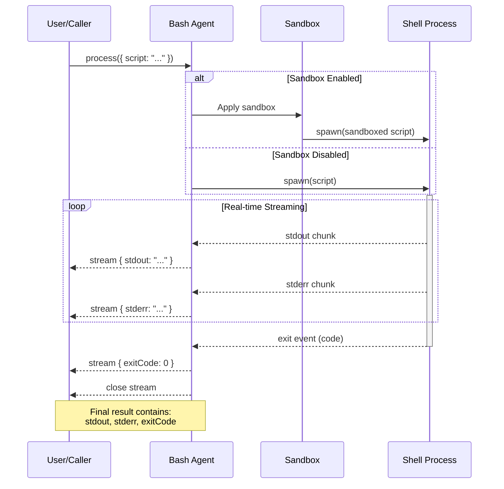

# Bash Agent

The Bash Agent enables secure execution of bash scripts within a sandboxed environment. It provides controlled access to system commands, network resources, and the filesystem while returning comprehensive execution results including stdout, stderr, and exit codes.

## Table of Contents

- [Overview](#overview)
- [Architecture Overview](#architecture-overview)
- [Core Features](#core-features)
- [Usage](#usage)
  - [Basic Usage with YAML](#basic-usage-with-yaml)
  - [Without Sandbox](#without-sandbox)
- [Configuration Reference](#configuration-reference)
- [Sandbox Configuration](#sandbox-configuration)
- [Examples](#examples)
- [Best Practices](#best-practices)

## Overview

The Bash Agent is designed for executing bash scripts in a controlled environment using [Anthropic's Sandbox Runtime](https://github.com/anthropic-experimental/sandbox-runtime). It provides:

- **Sandboxed Execution**: Scripts run in an isolated environment with configurable access controls
- **Network Control**: Specify allowed and denied domains for network access
- **Filesystem Control**: Configure read/write permissions for files and directories
- **Real-time Output**: Stream stdout and stderr as the script executes
- **Exit Code Tracking**: Capture and return the script's exit code for error handling

> **⚠️ Windows Platform Note**: Sandbox mode is **not supported** on Windows. Windows users must set `sandbox: false` in their configuration. See [Platform Support](#platform-support) for details.

## Architecture Overview



### Execution Flow Sequence Diagram



### Key Components

1. **Bash Agent**: Main orchestrator that receives scripts and manages execution
2. **Sandbox**: Provides isolation and security controls (network, filesystem)
3. **Shell Process**: Actual bash process executing the script
4. **Stream Output**: Real-time streaming of stdout, stderr, and exit code

### Execution Modes

- **Sandboxed Mode** (default): Scripts run with security restrictions
- **Direct Mode** (`sandbox: false`): Scripts run without restrictions (trusted environments only)

## Core Features

### Input
- `script` (string, required): The bash script to execute

### Output
- `stdout` (string, optional): Standard output from the script execution
- `stderr` (string, optional): Standard error output from the script execution
- `exitCode` (number, optional): Exit code indicating script execution status (0 = success)

### Sandbox Capabilities
- Network access control by domain (whitelist/blacklist)
- Filesystem read/write restrictions
- Integration with ripgrep for efficient file searching
- Cross-platform support (Linux, macOS, Windows)

## Usage

### Basic Usage with YAML

The simplest way to use the Bash Agent is through YAML configuration:

**bash-agent.yaml**
```yaml
type: "@aigne/agent-library/bash"
name: Bash

# Optional: Configure sandbox restrictions
sandbox:
  network:
    allowedDomains:
      - "*.example.com"
      - "api.github.com"
    deniedDomains:
      - "*.ads.com"
  filesystem:
    allowWrite:
      - "./output"
      - "./logs"
    denyWrite:
      - "/etc"
      - "/usr"
    denyRead:
      - "~/.ssh"

# Input schema defines the script parameter
input_schema:
  type: object
  properties:
    script:
      type: string
      description: The bash script to execute.
  required:
    - script
```

**aigne.yaml**
```yaml
#!/usr/bin/env aigne

model: anthropic/claude-3-5-sonnet-20241022
agents:
  - agents/bash-agent.yaml
```

**Usage Example:**
```bash
aigne run . Bash --script 'echo Hello World'
```

### Without Sandbox

For development, trusted environments, or **Windows users**, you can disable the sandbox:

```yaml
type: "@aigne/agent-library/bash"
name: Bash
sandbox: false  # Disable sandbox completely

input_schema:
  type: object
  properties:
    script:
      type: string
      description: The bash script to execute.
  required:
    - script
```

> **⚠️ Warning**: Disabling the sandbox removes all security protections. Only use this in trusted environments.

> **📝 Note for Windows Users**: Sandbox mode is not supported on Windows. You **must** set `sandbox: false` to use the Bash Agent on Windows.

## Configuration Reference

### BashAgentOptions

| Option | Type | Required | Description |
|--------|------|----------|-------------|
| `sandbox` | `SandboxRuntimeConfig \| boolean` | No | Sandbox configuration or `false` to disable sandboxing (default: enabled with default restrictions) |
| `inputSchema` | `ZodSchema` | No | Schema for input validation |
| `outputSchema` | `ZodSchema` | No | Schema for output validation |

### Input Schema

| Field | Type | Required | Description |
|-------|------|----------|-------------|
| `script` | `string` | Yes | The bash script to execute |

### Output Schema

| Field | Type | Description |
|-------|------|-------------|
| `stdout` | `string` | Standard output from script execution |
| `stderr` | `string` | Standard error output from script execution |
| `exitCode` | `number` | Exit code (0 = success, non-zero = error) |

## Sandbox Configuration

The sandbox configuration uses [Anthropic's Sandbox Runtime](https://github.com/anthropic-experimental/sandbox-runtime). Below are the available options:

### Network Configuration

```yaml
sandbox:
  network:
    # Allowed domains (supports wildcards)
    allowedDomains:
      - "*.example.com"
      - "api.service.com"

    # Denied domains (takes precedence over allowed)
    deniedDomains:
      - "*.ads.com"
      - "tracker.example.com"
```

**Pattern Matching:**
- `*.example.com` - Matches all subdomains of example.com
- `example.com` - Exact match only
- Empty array `[]` - No restrictions (allow all or deny all, depending on the list)

### Filesystem Configuration

```yaml
sandbox:
  filesystem:
    # Paths that can be written to
    allowWrite:
      - "./output"
      - "./temp"
      - "/tmp"

    # Paths that cannot be read
    denyRead:
      - "~/.ssh"
      - "/etc/shadow"
      - "*.key"

    # Paths that cannot be written to
    denyWrite:
      - "/etc"
      - "/usr"
      - "/bin"
```

**Path Patterns:**
- Absolute paths: `/etc/passwd`
- Relative paths: `./output`
- Home directory: `~/.ssh`
- Wildcards: `*.key`, `secrets/*`

### Complete Configuration Example

```yaml
type: "@aigne/agent-library/bash"
name: Bash

sandbox:
  network:
    allowedDomains:
      - "*.npmjs.org"
      - "registry.npmjs.org"
      - "github.com"
      - "api.github.com"
    deniedDomains:
      - "*.ads.com"

  filesystem:
    allowWrite:
      - "./output"
      - "./logs"
      - "/tmp"
    denyRead:
      - "~/.ssh"
      - "~/.aws"
      - "*.pem"
      - "*.key"
    denyWrite:
      - "/etc"
      - "/usr"
      - "/bin"
      - "/sbin"
```

## Examples

### Example 1: Simple Command Execution

Execute a basic command and capture output:

```yaml
type: "@aigne/agent-library/bash"
name: Bash

sandbox:
  network:
    allowedDomains: []
  filesystem:
    denyWrite:
      - "/"
```

**Usage:**
```bash
aigne run . Bash --script 'ls -la'
```

### Example 2: Network Request with API

Make HTTP requests to allowed domains:

```yaml
type: "@aigne/agent-library/bash"
name: Bash

sandbox:
  network:
    allowedDomains:
      - "api.github.com"
      - "*.githubusercontent.com"
  filesystem:
    allowWrite:
      - "./api-results"
```

**Usage:**
```bash
aigne run . Bash --script 'curl -s https://api.github.com/users/github | jq .name'
```

### Example 3: File Processing Pipeline

Process files with controlled filesystem access:

```yaml
type: "@aigne/agent-library/bash"
name: Bash

sandbox:
  network:
    allowedDomains: []
  filesystem:
    allowWrite:
      - "./processed"
      - "./logs"
    denyRead:
      - "*.secret"
      - ".env"
```

**Usage:**
```bash
aigne run . Bash --script 'cat input.txt | grep ERROR > processed/errors.log'
```

### Example 4: System Information Gathering

Gather system information safely:

```yaml
type: "@aigne/agent-library/bash"
name: Bash

sandbox:
  network:
    allowedDomains: []
  filesystem:
    denyWrite:
      - "/"
    denyRead:
      - "~/.ssh"
      - "/etc/shadow"
```

**Usage:**
```bash
aigne run . Bash --script 'uname -a && df -h && free -m'
```

### Example 5: Development Tool Execution

Run development tools with appropriate permissions:

```yaml
type: "@aigne/agent-library/bash"
name: Bash

sandbox:
  network:
    allowedDomains:
      - "*.npmjs.org"
      - "*.yarnpkg.com"
      - "github.com"
  filesystem:
    allowWrite:
      - "./node_modules"
      - "./dist"
      - "./build"
    denyRead:
      - ".env.production"
      - "*.secret"
```

**Usage:**
```bash
aigne run . Bash --script 'npm install && npm run build'
```

## Best Practices

### 1. Always Use Sandbox in Production

Never disable the sandbox in production environments:

**Good:**
```yaml
sandbox:
  network:
    allowedDomains:
      - "api.trusted-service.com"
  filesystem:
    allowWrite:
      - "./output"
```

**Bad:**
```yaml
sandbox: false  # ❌ Security risk in production
```

### 2. Apply Principle of Least Privilege

Only grant the minimum permissions required:

**Good:**
```yaml
sandbox:
  network:
    allowedDomains:
      - "api.specific-service.com"  # Only what's needed
  filesystem:
    allowWrite:
      - "./output"  # Specific directory
```

**Bad:**
```yaml
sandbox:
  network:
    allowedDomains:
      - "*"  # ❌ Too permissive
  filesystem:
    allowWrite:
      - "/"  # ❌ Dangerous
```

### 3. Handle Exit Codes Properly

Always check exit codes to detect failures:

```yaml
# In your orchestrator or consumer agent
worker:
  type: ai
  instructions: |
    When using the bash agent:
    1. Check the exitCode in the response
    2. If exitCode != 0, check stderr for error details
    3. Handle errors appropriately before continuing
```

### 4. Use Wildcards Carefully

Be specific with domain wildcards:

**Good:**
```yaml
network:
  allowedDomains:
    - "api.github.com"           # Specific subdomain
    - "*.githubusercontent.com"  # Specific pattern
```

**Bad:**
```yaml
network:
  allowedDomains:
    - "*.com"  # ❌ Too broad
```

### 5. Protect Sensitive Files

Always deny access to sensitive files:

```yaml
filesystem:
  denyRead:
    - "~/.ssh"
    - "~/.aws"
    - ".env"
    - "*.key"
    - "*.pem"
    - "secrets/*"
```

### 6. Test Scripts Incrementally

Start with simple scripts and add complexity:

1. Test basic command: `echo "hello"`
2. Test file access: `cat test.txt`
3. Test network access: `curl example.com`
4. Combine operations as needed

### 7. Use Absolute Paths When Possible

Avoid ambiguity with absolute paths:

**Good:**
```bash
cat /path/to/project/file.txt
```

**Bad:**
```bash
cat ../../../file.txt  # Unclear, depends on working directory
```

### 8. Capture Both stdout and stderr

Always handle both output streams:

```typescript
// In your code consuming the bash agent
const result = await bashAgent.process({ script: command });

if (result.exitCode !== 0) {
  console.error("Script failed:", result.stderr);
} else {
  console.log("Script output:", result.stdout);
}
```

### 9. Limit Script Complexity

Keep scripts focused and manageable:

**Good:**
```bash
# Single, clear purpose
grep -r "TODO" ./src | wc -l
```

**Better:**
```bash
# Break complex tasks into multiple bash agent calls
# Script 1: Find files
# Script 2: Process results
# Script 3: Generate report
```

### 10. Document Sandbox Requirements

Clearly document required permissions:

```yaml
type: "@aigne/agent-library/bash"
name: Bash

# This agent requires:
# - Network access to GitHub API for repository information
# - Read access to project directory
# - Write access to ./reports for output
sandbox:
  network:
    allowedDomains:
      - "api.github.com"
  filesystem:
    allowWrite:
      - "./reports"
```

## Platform Support

The Bash Agent supports the following platforms:

| Platform | Sandbox Support | Direct Execution |
|----------|----------------|------------------|
| **Linux** | ✅ Full support | ✅ Supported |
| **macOS** | ✅ Full support | ✅ Supported |
| **Windows** | ❌ Not supported | ✅ Supported (requires WSL or Git Bash) |

> **⚠️ Important for Windows Users**:
> - Sandbox mode is **not supported** on Windows
> - You must set `sandbox: false` in your configuration to use the Bash Agent on Windows
> - Direct execution requires WSL (Windows Subsystem for Linux) or Git Bash
> - Without sandbox, all security restrictions are disabled

Platform detection is automatic. If sandboxing is not supported on the current platform and `sandbox: false` is not set, the agent will throw an error.

## Security Considerations

1. **Input Validation**: Always validate script input to prevent injection attacks
2. **Output Sanitization**: Sanitize stdout/stderr before displaying to users
3. **Resource Limits**: Consider implementing timeouts for long-running scripts
4. **Audit Logging**: Log script executions for security auditing
5. **Regular Updates**: Keep sandbox runtime dependencies updated

## Troubleshooting

### Script Exits with Non-Zero Code

Check `stderr` for error messages and verify:
- Required commands are available
- File paths are correct
- Permissions are sufficient

### Network Request Fails

Verify:
- Domain is in `allowedDomains`
- Domain is not in `deniedDomains`
- Network connectivity is available

### File Access Denied

Verify:
- Path is not in `denyRead` or `denyWrite`
- Path is in `allowWrite` if writing
- File permissions are correct

### Sandbox Initialization Fails

**Error**: `Sandboxed execution is not supported on this platform`

**Solutions**:
- **On Windows**: Sandbox is not supported. Set `sandbox: false` in your configuration
- **On Linux/macOS**: Verify required dependencies are installed and you have sufficient system permissions

**Common Issues**:
- Using sandbox mode on Windows (not supported)
- Missing system dependencies for sandbox runtime
- Insufficient permissions to create isolated environments

For more details, see the [Sandbox Runtime documentation](https://github.com/anthropic-experimental/sandbox-runtime).
