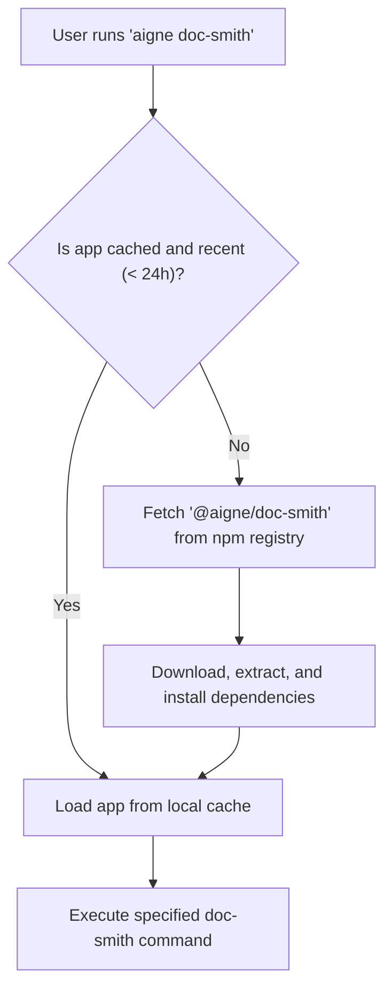

# Built-in Apps

Built-in applications are pre-packaged AIGNE projects designed for specialized tasks. They can be invoked directly from the CLI without requiring a local `aigne.yaml` file. The CLI automatically downloads, caches, and manages these applications from the npm registry, making powerful, agent-driven tools readily accessible.

## Available Apps

Currently, the following built-in application is available:

| Command     | Aliases           | Description                                                 |
|-------------|-------------------|-------------------------------------------------------------|
| `doc-smith` | `docsmith`, `doc` | Generate and maintain project docs — powered by agents.     |

## Usage

To use a built-in app, you follow the pattern `aigne [app-name] [subcommand] [options]`. Each app functions as a self-contained AIGNE project, exposing its defined agents as subcommands and including standard commands for management.

### App-Specific Agents

The core functionality of an app is provided through its agents, which are exposed as subcommands. To see a list of available agents and their options, run the app command with the `--help` flag.

```bash
# Get help and see available agents for doc-smith
aigne doc-smith --help
```

Once you identify an agent to run, you can execute it like any other command.

```bash
# Run a hypothetical 'generate' agent within doc-smith
aigne doc-smith generate --input "./src" --output "./docs"
```

### Common Management Commands

Built-in apps also come with standard subcommands for updates and serving.

#### `upgrade`

This command checks for and installs the latest version of the application from the npm registry.

```bash
aigne doc-smith upgrade
```

#### `serve-mcp`

This command exposes the app's agents through a Model Context Protocol (MCP) server, allowing integration with other systems. For more details, see the [`aigne serve-mcp`](./command-reference-serve-mcp.md) command reference.

```bash
# Serve the doc-smith agents on the default host and port
aigne doc-smith serve-mcp
```

## Execution and Caching Flow

When you run a built-in app for the first time, the CLI downloads it from the npm registry (`@aigne/doc-smith` in this case) and caches it locally in `~/.aigne/registry.npmjs.org/`. Subsequent runs use the cached version until it expires (after 24 hours) or you manually upgrade it.



This process ensures that you are always using a functional and up-to-date version of the application with minimal overhead.