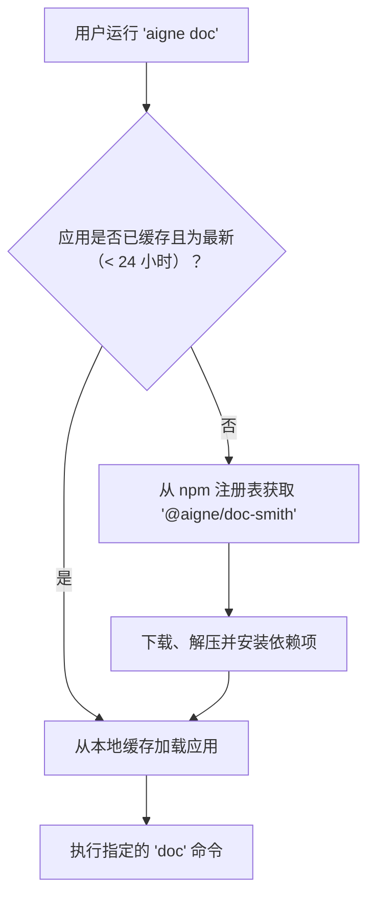

# 内置应用

内置应用是为专门任务而设计的预打包 AIGNE 项目。它们可以直接从 CLI 调用，无需本地 `aigne.yaml` 文件。CLI 会自动从 npm 注册表下载、缓存和管理这些应用，使强大的 agent-driven 工具随时可用。

## 可用应用

目前，提供以下内置应用：

| 命令 | 别名 | 描述 |
|-------------|-------------------|---------------------------------------------------------|
| `doc-smith` | `docsmith`, `doc` | 生成和维护项目文档——由 agents 提供支持。 |

## 使用方法

要使用内置应用，请遵循 `aigne [app-name] [subcommand] [options]` 的模式。每个应用都作为一个独立的 AIGNE 项目运行，将其定义的 agents 作为子命令暴露出来，并包含用于管理的标准命令。

### 应用专属 Agents

应用的核心功能通过其 agents 提供，这些 agents 作为子命令暴露出来。要查看可用 agents 及其选项的列表，请使用 `--help` 标志运行应用命令。

```bash
# 获取帮助并查看 doc-smith 的可用 agents
aigne doc-smith --help
```

许多应用定义了一个默认 agent，在未指定子命令时运行。你可以使用应用的名称或其任何别名来运行此 agent。

```bash
# 运行 doc-smith 的默认 agent
aigne doc-smith generate

# 你也可以使用别名
aigne doc generate
```

### 通用管理命令

内置应用还附带用于更新和服务的标准子命令。

#### `upgrade`

此命令会从 npm 注册表检查并安装应用的最新版本。

```bash
aigne doc-smith upgrade
```

#### `serve-mcp`

此命令通过模型上下文协议 (MCP) 服务器暴露应用的 agents，从而允许与其他系统集成。有关更多详细信息，请参阅 [`aigne serve-mcp`](./command-reference-serve-mcp.md) 命令参考。

```bash
# 在默认主机和端口上为 doc-smith agents 提供服务
aigne doc-smith serve-mcp
```

## 执行与缓存流程

当你首次运行内置应用时，CLI 会从 npm 注册表（例如 `@aigne/doc-smith`）下载它，并将其本地缓存到 `~/.aigne/registry.npmjs.org/`。后续运行将使用缓存的版本。缓存每 24 小时检查一次更新。



此过程可确保你始终以最小的开销使用功能正常且最新的应用版本。