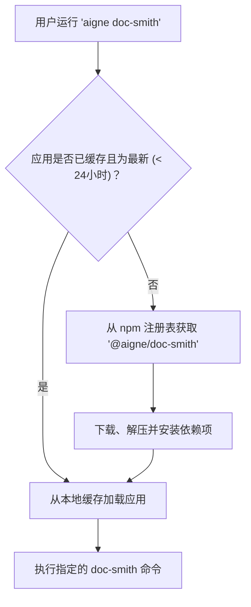

# 内置应用

内置应用是为特定任务而设计的预打包 AIGNE 项目。它们可以直接通过 CLI 调用，无需本地 `aigne.yaml` 文件。CLI 会自动从 npm 注册表下载、缓存和管理这些应用，使强大的、由 Agent 驱动的工具变得触手可及。

## 可用应用

目前，提供以下内置应用：

| Command     | Aliases           | Description                                                 |
|-------------|-------------------|-------------------------------------------------------------|
| `doc-smith` | `docsmith`, `doc` | 生成并维护项目文档——由 Agent 驱动。     |

## 使用方法

要使用内置应用，请遵循 `aigne [app-name] [subcommand] [options]` 的模式。每个应用都作为一个独立的 AIGNE 项目运行，将其定义的 Agent 作为子命令暴露出来，并包含用于管理的标准命令。

### 应用专属 Agent

应用的核心功能由其 Agent 提供，这些 Agent 以子命令的形式暴露。要查看可用的 Agent 及其选项列表，请使用 `--help` 标志运行应用命令。

```bash
# 获取帮助并查看 doc-smith 的可用 Agent
aigne doc-smith --help
```

一旦确定要运行的 Agent，您就可以像执行其他任何命令一样执行它。

```bash
# 在 doc-smith 中运行一个假设的 'generate' Agent
aigne doc-smith generate --input "./src" --output "./docs"
```

### 通用管理命令

内置应用还附带用于更新和服务的标准子命令。

#### upgrade

该命令会从 npm 注册表检查并安装应用的最新版本。

```bash
aigne doc-smith upgrade
```

#### serve-mcp

该命令通过模型上下文协议 (MCP) 服务器暴露应用的 Agent，从而允许与其他系统集成。更多详情，请参阅 [`aigne serve-mcp`](./command-reference-serve-mcp.md) 命令参考。

```bash
# 在默认主机和端口上提供 doc-smith Agent 服务
aigne doc-smith serve-mcp
```

## 执行与缓存流程

当您首次运行内置应用时，CLI 会从 npm 注册表（本例中为 `@aigne/doc-smith`）下载该应用，并将其缓存在本地的 `~/.aigne/registry.npmjs.org/` 目录中。后续运行将使用缓存版本，直到缓存过期（24 小时后）或您手动升级它。



该流程确保您始终以最小的开销使用功能正常且版本最新的应用。