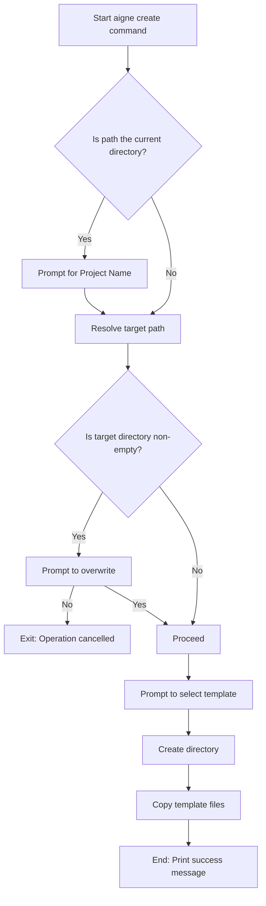

# aigne create

Scaffolds a new AIGNE project from a pre-configured template. This command sets up the necessary directory structure and configuration files to get you started quickly.

## Usage

```bash
aigne create [path]
```

## Arguments

| Argument | Description                                                                   | Type     | Default                |
| :------- | :---------------------------------------------------------------------------- | :------- | :--------------------- |
| `path`     | The file system path where the new project directory will be created.         | `string` | `.` (current directory) |

## Behavior

The `create` command runs an interactive setup process to configure your new project. The exact flow depends on the arguments provided and the state of the target directory.



### Interactive Prompts

-   **Project Name**: If you run `aigne create` without a `path` argument (or with `.`), you will be prompted to enter a name for your project. This name will be used as the directory name.
-   **Overwrite Confirmation**: If the target directory already exists and contains files, the command will ask for confirmation before proceeding to remove its contents. This is a safeguard to prevent accidental data loss.
-   **Template Selection**: You will be prompted to choose a project template. Currently, a `default` template is available.

## Examples

### Create a project in a new directory

This is the most straightforward way to create a new project. A new directory named `my-aigne-project` will be created in the current location.

```bash
aigne create my-aigne-project
```

After selecting the template, the output will be:

```text
✅ AIGNE project created successfully!

To use your new agent, run:
  cd my-aigne-project && aigne run
```

### Create a project in the current directory

Running the command without a path triggers the interactive prompt for the project name.

```bash
aigne create
```

This will initiate a prompt session:

```text
? Project name: my-aigne-project
```

After you provide a name, the process continues as above.

### Create a project in a non-empty directory

If you attempt to create a project in a directory that already has files, you will be asked to confirm.

```bash
# Assume 'existing-project' already contains files
aigne create existing-project
```

The prompt will appear:

```text
? The directory "/path/to/existing-project" is not empty. Do you want to remove its contents? (y/N)
```

If you select `No` (the default), the operation will be cancelled. If you select `Yes`, the existing contents will be removed, and the template files will be copied into the directory.