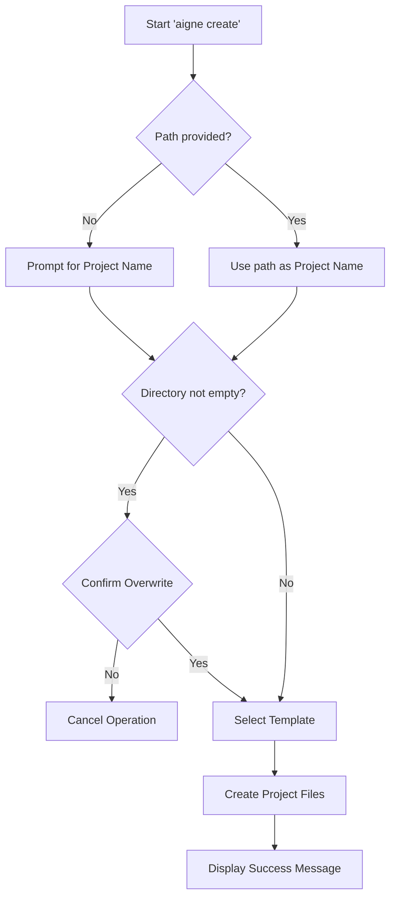

# aigne create

The `aigne create` command initializes a new AIGNE project by scaffolding a directory structure and configuration files from a predefined template. It is the primary way to start building a new agent.



## Usage

To create a project, run the `create` command, optionally specifying a path for the new project directory.

```bash
# Create a project in a new directory named 'my-aigne-project'
aigne create my-aigne-project

# Create a project in the current directory (will prompt for a name)
aigne create
```

## Arguments

| Argument | Description                               | Required | Default                 |
| :------- | :---------------------------------------- | :------- | :---------------------- |
| `path`   | The path to the new project directory.    | No       | `.` (current directory) |

## Interactive Process

The command guides you through a series of prompts to configure the project.

### 1. Project Name

If you run the command without specifying a path (or use `.`), you will be prompted to enter a name for your project. This name will be used for the project directory.


### 2. Handling Non-Empty Directories

If the target directory already exists and contains files, the CLI will ask for confirmation before proceeding to prevent accidental data loss.

```text
The directory "/path/to/my-aigne-project" is not empty. Do you want to remove its contents?
```

If you choose not to overwrite, the operation will be cancelled.

### 3. Template Selection

After confirming the project path, you will be asked to select a project template. Currently, a `default` template is provided to get you started with a basic agent configuration.

## Output

Upon successful completion, the CLI creates the project files and displays a confirmation message with the next steps to run your agent.


```text
✅ AIGNE project created successfully!

To use your new agent, run:
  cd my-aigne-project && aigne run
```

---

Once your project is created, the next step is to execute the agent. See the [`aigne run`](./command-reference-run.md) command reference for details.