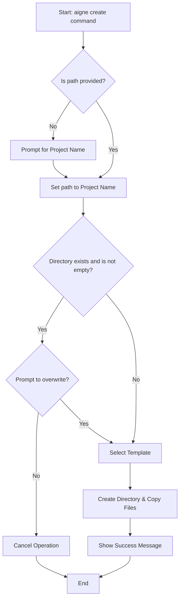

# aigne create

The `aigne create` command scaffolds a new AIGNE project from a template. It sets up the necessary directory structure and configuration files, allowing you to start developing your agent immediately.

## Usage

To create a project in a new directory, provide a path as an argument:

```bash
# Create a project in the 'my-aigne-project' directory
aigne create my-aigne-project
```

If you run the command without an argument, it will create a project in the current directory and prompt you for a project name.

```bash
aigne create
```

## Interactive Process

When you run `aigne create` without a path, or if the target directory already contains files, the CLI guides you through an interactive process.

1.  **Project Name**: If you don't specify a path, you'll be prompted for a project name.

    

2.  **Overwrite Confirmation**: If the target directory exists and is not empty, the CLI will ask for confirmation before proceeding to avoid accidental data loss.

    ```bash
    ? The directory "/path/to/your/my-aigne-project" is not empty. Do you want to remove its contents? › (y/N)
    ```

3.  **Template Selection**: You will be asked to choose a project template. Currently, a `default` template is provided.

    ```bash
    ? Select a template: › - Use arrow-keys. Return to submit.
    ❯   default
    ```

## Arguments

| Argument | Description                                  |
| :------- | :------------------------------------------- |
| `[path]` | Optional. The path where the project directory will be created. Defaults to the current directory (`.`), prompting for a project name if not provided. |

## Command Flow

The following diagram illustrates the process flow for the `aigne create` command.



## Output

Upon successful creation, the CLI prints a confirmation message and provides the next command to run your agent.


After creating your project, you can start the agent by navigating into the new directory and using the `aigne run` command.

For more details on running an agent, see the [aigne run](./command-reference-run.md) command reference.