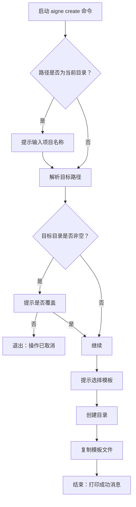

# aigne create

从预配置的模板中搭建一个新的 AIGNE 项目。此命令会设置必要的目录结构和配置文件，帮助你快速上手。

## 用法

```bash
aigne create [path]
```

## 参数

| 参数 | 描述 | 类型 | 默认值 |
| :------- | :---------------------------------------------------------------------------- | :------- | :--------------------- |
| `path` | 文件系统路径，新项目目录将在此创建。 | `string` | `.` (当前目录) |

## 行为

`create` 命令会运行一个交互式设置流程来配置你的新项目。具体的流程取决于所提供的参数和目标目录的状态。



### 交互式提示

-   **项目名称**：如果你运行 `aigne create` 时未提供 `path` 参数（或使用 `.`），系统会提示你输入项目名称。该名称将被用作目录名。
-   **覆盖确认**：如果目标目录已存在且包含文件，该命令会请求确认，然后再继续删除其内容。这是一项防止意外数据丢失的安全措施。
-   **模板选择**：系统会提示你选择一个项目模板。目前，提供一个 `default` 模板。

## 示例

### 在新目录中创建项目

这是创建新项目最直接的方法。系统将在当前位置创建一个名为 `my-aigne-project` 的新目录。

```bash
aigne create my-aigne-project
```

选择模板后，输出将是：

```text
✅ AIGNE 项目创建成功！

要使用你的新 agent，请运行：
  cd my-aigne-project && aigne run
```

### 在当前目录中创建项目

不带路径运行该命令会触发项目名称的交互式提示。

```bash
aigne create
```

这将启动一个提示会话：

```text
? 项目名称： my-aigne-project
```

在你提供名称后，流程将如上继续。

### 在非空目录中创建项目

如果你尝试在已有文件的目录中创建项目，系统会要求你确认。

```bash
# 假设 'existing-project' 已包含文件
aigne create existing-project
```

将出现以下提示：

```text
? 目录 "/path/to/existing-project" 非空。是否要移除其内容？ (y/N)
```

如果你选择 `No`（默认选项），操作将被取消。如果你选择 `Yes`，现有内容将被移除，模板文件将被复制到该目录中。