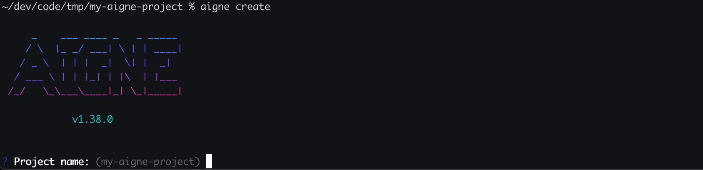
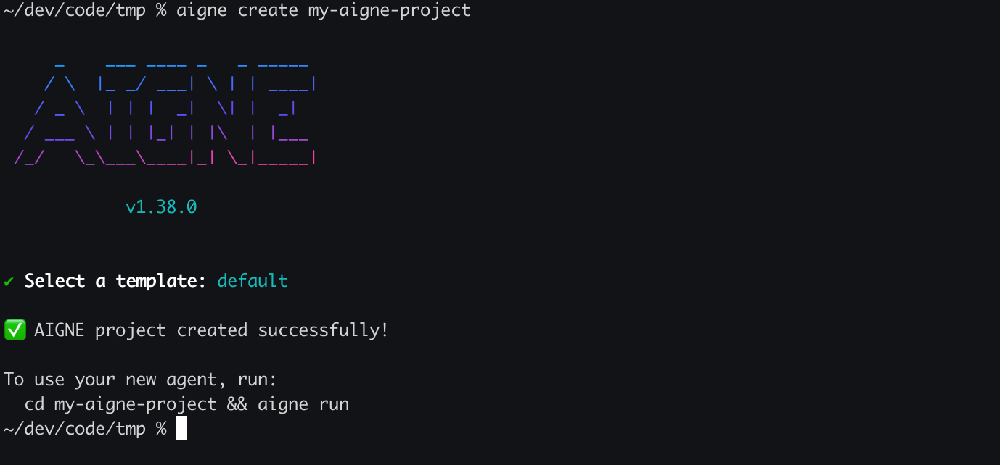

# aigne create

`aigne create` 命令可根据模板搭建一个新的 AIGNE 项目。该命令会设置好必要的目录结构和配置文件，让您能够立即开始开发您的 Agent。

## 用法

要在新目录中创建项目，请提供一个路径作为参数：

```bash
# 在 'my-aigne-project' 目录中创建一个项目
aigne create my-aigne-project
```

如果您未提供路径参数并运行该命令，系统将提示您输入项目名称，并在当前位置的新子目录中创建项目。

```bash
# 在当前工作目录中创建一个项目（交互式）
aigne create
```

## 交互式流程

当您运行 `aigne create` 时未提供路径，或者目标目录已包含文件时，CLI 将引导您完成一个交互式流程。

1.  **项目名称**：如果您未指定路径，系统将提示您输入项目名称。默认名称为 `my-aigne-project`。

    

2.  **覆盖确认**：如果目标目录已存在且不为空，CLI 将在继续操作前请求确认，以避免意外丢失数据。

    ```bash
    ? The directory "/path/to/your/my-aigne-project" is not empty. Do you want to remove its contents? › (y/N)
    ```

3.  **模板选择**：系统将要求您选择一个项目模板。目前提供了一个 `default` 模板。

    ```bash
    ? Select a template: › - Use arrow-keys. Return to submit.
    ❯   default
    ```

## 参数

| 参数 | 描述 |
| :------- | :------------------------------------------- |
| `[path]` | 可选参数。用于创建项目目录的路径。默认为当前目录（`.`），如果未提供，则会提示输入项目名称。 |

## 命令流程

下图阐释了 `aigne create` 命令的处理流程。

```d2
direction: down

start: {
  label: "Start: aigne create"
  shape: circle
}

check_path: {
  label: "Path argument provided?"
  shape: diamond
}

prompt_name: {
  label: "Prompt for Project Name"
  shape: rectangle
}

resolve_path: {
  label: "Resolve Project Path"
  shape: rectangle
}

check_empty: {
  label: "Directory not empty?"
  shape: diamond
}

prompt_overwrite: {
  label: "Confirm Overwrite?"
  shape: diamond
}

cancel: {
  label: "Operation Cancelled"
  shape: rectangle
}

select_template: {
  label: "Select Template"
  shape: rectangle
}

create_files: {
  label: "Create Directory & Copy Files"
  shape: rectangle
}

success_msg: {
  label: "Display Success Message"
  shape: rectangle
}

end: {
  label: "End"
  shape: circle
}

start -> check_path

check_path -- "No" --> prompt_name
prompt_name -> resolve_path
check_path -- "Yes" --> resolve_path

resolve_path -> check_empty
check_empty -- "Yes" --> prompt_overwrite
check_empty -- "No" --> select_template

prompt_overwrite -- "No" --> cancel
prompt_overwrite -- "Yes" --> select_template

select_template -> create_files
create_files -> success_msg

success_msg -> end
cancel -> end
```

## 输出

成功创建后，CLI 会打印一条确认信息，并提供用于运行 Agent 的下一步命令。



创建项目后，您可以进入新目录并使用 `aigne run` 命令来启动 Agent。

有关运行 Agent 的更多详细信息，请参阅 [`aigne run`](./command-reference-run.md) 命令参考。