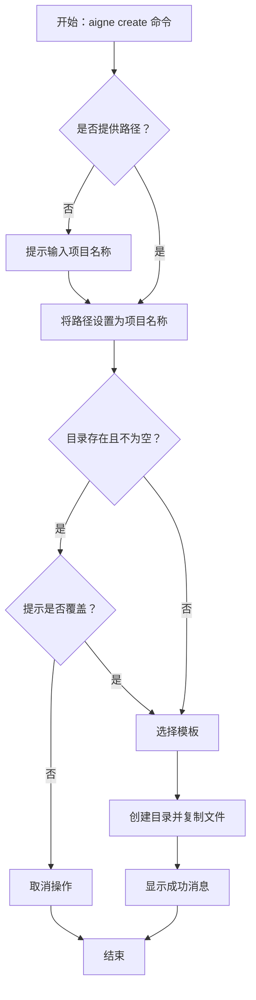

# aigne create

`aigne create` 命令可根据模板搭建一个新的 AIGNE 项目。该命令会设置必要的目录结构和配置文件，让你能立即开始开发 Agent。

## 用法

如需在新的目录中创建项目，请提供一个路径作为参数：

```bash
# 在 'my-aigne-project' 目录中创建一个项目
aigne create my-aigne-project
```

如果不带参数运行该命令，它将在当前目录中创建一个项目，并提示你输入项目名称。

```bash
aigne create
```

## 交互式流程

当你运行 `aigne create` 时未提供路径，或目标目录已包含文件时，CLI 将引导你完成一个交互式流程。

1.  **项目名称**：如果你未指定路径，系统将提示你输入项目名称。

    

2.  **覆盖确认**：如果目标目录已存在且不为空，CLI 将请求确认，以避免意外的数据丢失。

    ```bash
    ? 目录 "/path/to/your/my-aigne-project" 不为空。是否要移除其内容？› (y/N)
    ```

3.  **模板选择**：系统将要求你选择一个项目模板。目前提供一个 `default` 模板。

    ```bash
    ? 选择一个模板: › - 使用方向键选择。按回车键提交。
    ❯   default
    ```

## 参数

| Argument | Description                                  |
| :------- | :------------------------------------------- |
| `[path]` | 可选。创建项目目录的路径。默认为当前目录（`.`），如果未提供，则提示输入项目名称。 |

## 命令流程

下图说明了 `aigne create` 命令的流程。



## 输出

成功创建后，CLI 会打印一条确认消息，并提供运行 Agent 的下一个命令。


创建项目后，你可以进入新目录并使用 `aigne run` 命令来启动 Agent。

有关运行 Agent 的更多详细信息，请参阅 [aigne run](./command-reference-run.md) 命令参考。