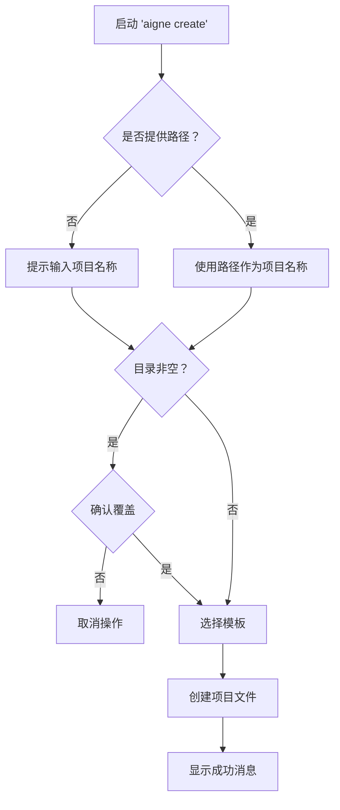

# aigne create

`aigne create` 命令通过预定义模板搭建目录结构和配置文件，从而初始化一个新的 AIGNE 项目。这是开始构建新 agent 的主要方式。



## 用法

要创建项目，请运行 `create` 命令，并可选择性地为新项目目录指定一个路径。

```bash
# 在名为 'my-aigne-project' 的新目录中创建一个项目
aigne create my-aigne-project

# 在当前目录中创建一个项目（将提示输入名称）
aigne create
```

## 参数

| 参数 | 描述 | 是否必需 | 默认值 |
| :------- | :---------------------------------------- | :------- | :---------------------- |
| `path`   | 新项目目录的路径。    | 否       | `.` (当前目录) |

## 交互式流程

该命令将引导您通过一系列提示来配置项目。

### 1. 项目名称

如果您在运行命令时未指定路径（或使用 `.`），系统将提示您输入项目名称。该名称将用作项目目录的名称。


### 2. 处理非空目录

如果目标目录已存在且包含文件，CLI 将在继续操作前请求确认，以防止意外数据丢失。

```text
目录 "/path/to/my-aigne-project" 非空。是否要删除其内容？
```

如果您选择不覆盖，操作将被取消。

### 3. 模板选择

确认项目路径后，系统将要求您选择一个项目模板。目前，我们提供了一个 `default` 模板，以帮助您开始进行基本的 agent 配置。

## 输出

成功完成后，CLI 会创建项目文件并显示一条确认消息，其中包含运行 agent 的后续步骤。


```text
✅ AIGNE 项目创建成功！

要使用您的新 agent，请运行：
  cd my-aigne-project && aigne run
```

---

项目创建后，下一步是执行 agent。有关详细信息，请参阅 [`aigne run`](./command-reference-run.md) 命令参考。