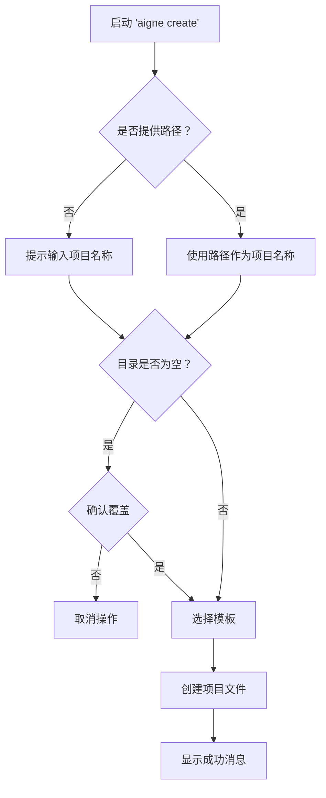

# aigne create

`aigne create` 命令通过预定义的模板搭建目录结构和配置文件来初始化一个新的 AIGNE 项目。这是开始构建新 Agent 的主要方式。



## 用法

要创建一个项目，请运行 `create` 命令，并可选择性地为新项目目录指定一个路径。

```bash
# 在名为 'my-aigne-project' 的新目录中创建一个项目
aigne create my-aigne-project

# 在当前目录中创建一个项目（将提示输入名称）
aigne create .
```

## 参数

| 参数 | 描述 | 是否必需 | 默认值 |
| :------- | :---------------------------------------- | :------- | :---------------------- |
| `path` | 新项目目录的路径。 | 否 | `.` (当前目录) |

## 交互式过程

该命令会引导你通过一系列提示来配置项目。

### 1. 项目名称

如果在运行命令时未指定路径（或使用 `.`），系统将提示你输入项目名称。该名称将用作项目目录的名称。


### 2. 处理非空目录

如果目标目录已存在且包含文件，CLI 在继续操作前会请求确认。这是一项防止意外数据丢失的保护措施。

```bash
目录 "/path/to/my-aigne-project" 非空。是否要移除其内容？
```

如果选择不覆盖，操作将被取消。

### 3. 模板选择

确认项目路径后，系统会要求你选择一个项目模板。目前，提供了一个 `default` 模板，以帮助你开始基本的 Agent 配置。


## 输出

成功完成后，CLI 将创建项目文件，并显示一条确认消息以及运行 Agent 的后续步骤。

```bash

✅ AIGNE 项目创建成功！

要使用你的新 Agent，请运行：
  cd my-aigne-project && aigne run
```

---

创建项目后，下一步是运行它。请继续阅读 [`aigne run`](./command-reference-run.md) 命令参考以了解如何操作。