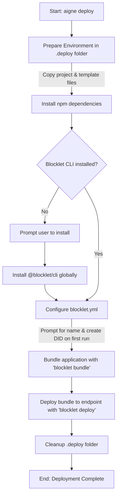

# aigne deploy

The `aigne deploy` command packages and deploys an AIGNE application as a Blocklet to a specified endpoint. This process automates the configuration, bundling, and deployment steps required to run your agent in a production environment.

## Usage

```bash
aigne deploy --path <path-to-project> --endpoint <blocklet-server-endpoint>
```

## Options

| Option     | Description                                                                  | Required |
|------------|------------------------------------------------------------------------------|----------|
| `--path`     | The file path to the AIGNE project directory you want to deploy.               | Yes      |
| `--endpoint` | The URL of the Blocklet Server endpoint where the application will be deployed. | Yes      |

## Deployment Process

When you run `aigne deploy`, the CLI performs a series of automated tasks to prepare and upload your application. The process is designed to be interactive on the first run and fully automated for subsequent deployments.



Here is a breakdown of the steps involved:

1.  **Prepare Environment**: A temporary `.deploy` directory is created in your project root. Your agent's files and a standard Blocklet template are copied into it. If a `package.json` exists in your project, `npm install` is run automatically within this temporary directory.

2.  **Check Blocklet CLI**: The command verifies that `@blocklet/cli` is installed globally. If not, it will prompt you for permission to install it, as it is required for bundling and deployment.

3.  **Configure Blocklet**: The `blocklet.yml` configuration file within the `.deploy` directory is automatically populated.
    *   **Name**: On the first deployment of a project, it prompts for a name for your Blocklet. The default suggestion is taken from the `name` field in your `aigne.yaml` file. This chosen name is then saved for future deployments.
    *   **DID**: A unique Decentralized ID (DID) is created for your Blocklet using the Blocklet CLI. This DID is also saved and reused for subsequent deployments.
    *   Deployment information (name and DID) for each project is stored in `~/.aigne/deployed.yaml`, mapped to your project's absolute path to streamline future updates.

4.  **Bundle Application**: It executes `blocklet bundle --create-release` to package all necessary files into a deployable artifact within a `.blocklet/bundle` directory.

5.  **Deploy to Endpoint**: Finally, it runs `blocklet deploy` to push the bundled artifact to the specified `--endpoint`. The output of this underlying command is streamed directly to your terminal so you can monitor the progress.

6.  **Cleanup**: The temporary `.deploy` directory is removed upon successful deployment.

## Example

Deploy an AIGNE project located in the `my-chat-agent` directory to a Blocklet Server at `https://my-node.blocklet.dev`:

```bash
aigne deploy --path ./my-chat-agent --endpoint https://my-node.blocklet.dev
```

During the first run, you may be asked for input:

```bash
? Please input agent blocklet name: (my-chat-agent) my-production-chat-agent
```

After entering the name and completing the process, subsequent runs of the same command will reuse `my-production-chat-agent` automatically.

---

For a more detailed walkthrough of deploying an agent, see the [Deploying Agents](./guides-deploying-agents.md) guide.