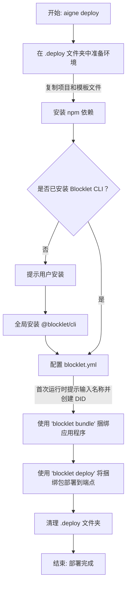

# aigne deploy

`aigne deploy` 命令将 AIGNE 应用程序打包并作为 Blocklet 部署到指定端点。此过程会自动执行在生产环境中运行 Agent 所需的配置、捆绑和部署步骤。

## 用法

```bash
aigne deploy --path <path-to-project> --endpoint <blocklet-server-endpoint>
```

## 选项

| 选项 | 描述 | 是否必需 |
|---|---|---|
| `--path` | 要部署的 AIGNE 项目目录的文件路径。 | 是 |
| `--endpoint` | 应用程序将部署到的 Blocklet Server 端点的 URL。 | 是 |

## 部署流程

运行 `aigne deploy` 时，CLI 会执行一系列自动化任务来准备和上传你的应用程序。该流程设计为首次运行时进行交互，后续部署则完全自动化。



以下是所涉及步骤的详细说明：

1.  **准备环境**：在你的项目根目录中创建一个临时的 `.deploy` 目录。你的 Agent 文件和一个标准的 Blocklet 模板会被复制到其中。如果你的项目中存在 `package.json` 文件，则会自动在此临时目录中运行 `npm install`。

2.  **检查 Blocklet CLI**：该命令会验证 `@blocklet/cli` 是否已全局安装。如果未安装，它将提示你授权安装，因为捆绑和部署需要它。

3.  **配置 Blocklet**：`.deploy` 目录中的 `blocklet.yml` 配置文件会自动填充。
    *   **名称**：在首次部署项目时，它会提示你为 Blocklet 输入一个名称。默认建议取自 `aigne.yaml` 文件中的 `name` 字段。此选定的名称将被保存以供将来部署使用。
    *   **DID**：使用 Blocklet CLI 为你的 Blocklet 创建一个唯一的去中心化 ID (Decentralized ID, DID)。此 DID 也会被保存并在后续部署中重复使用。
    *   每个项目的部署信息（名称和 DID）存储在 `~/.aigne/deployed.yaml` 中，并映射到你项目的绝对路径，以简化未来的更新。

4.  **捆绑应用程序**：它执行 `blocklet bundle --create-release` 将所有必要文件打包到一个可部署的构件中，该构件位于 `.blocklet/bundle` 目录内。

5.  **部署到端点**：最后，它运行 `blocklet deploy` 将捆绑的构件推送到指定的 `--endpoint`。此底层命令的输出会直接流式传输到你的终端，以便你监控进度。

6.  **清理**：成功部署后，临时的 `.deploy` 目录将被移除。

## 示例

将位于 `my-chat-agent` 目录中的 AIGNE 项目部署到 `https://my-node.blocklet.dev` 的 Blocklet Server 上：

```bash
aigne deploy --path ./my-chat-agent --endpoint https://my-node.blocklet.dev
```

在首次运行期间，系统可能会要求你输入信息：

```bash
? 请输入 Agent Blocklet 名称: (my-chat-agent) my-production-chat-agent
```

输入名称并完成流程后，后续运行相同的命令将自动重用 `my-production-chat-agent`。

---

有关部署 Agent 的更详细演练，请参阅 [部署 Agents](./guides-deploying-agents.md) 指南。