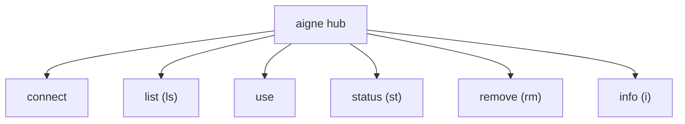

# aigne hub

The `aigne hub` command is the primary tool for managing connections to the AIGNE Hub. The Hub provides access to advanced models, tracks credit usage, and offers other centralized services. This command group allows you to connect to different Hub instances, switch between them, and monitor your account status.

## Command Overview

The `hub` command is a gateway to several subcommands for managing your connections.



---

## `connect [url]`

Connects to a new AIGNE Hub instance. If you run the command without a URL, it will launch an interactive prompt to guide you through connecting to either the official AIGNE Hub or a custom one.

### Usage

**Interactive Mode**

```bash
aigne hub connect
```
This will present the following choice:

```text
? Choose a hub to connect:
❯ Official Hub (https://hub.aigne.io)
  Custom Hub URL
```

**Direct Mode**

Provide the URL as an argument to connect non-interactively.

```bash
aigne hub connect https://your-custom-hub.example.com
```

Upon successful connection, your API key and Hub URL are saved to the configuration file at `~/.config/aigne/env.yaml`.

---

## `list` (or `ls`)

Lists all saved AIGNE Hub connections and indicates which one is currently active.

### Usage

```bash
aigne hub list
```

### Example Output

The command displays a table of all configured Hubs.

```text
Connected AIGNE Hubs:

┌───────────────────────────────────────────┬────────┐
│ URL                                       │ ACTIVE │
├───────────────────────────────────────────┼────────┤
│ https://hub.aigne.io                      │ YES    │
├───────────────────────────────────────────┼────────┤
│ https://your-custom-hub.example.com       │ NO     │
└───────────────────────────────────────────┴────────┘
Use 'aigne hub use' to switch to a different hub.
```

---

## `use`

Switches the active AIGNE Hub connection. The active Hub is used for commands that require Hub services, such as `aigne run` with a Hub-provided model.

### Usage

```bash
aigne hub use
```

This command presents an interactive list of your saved Hubs, allowing you to select which one to set as the active connection.

```text
? Choose a hub to switch to:
❯ https://hub.aigne.io
  https://your-custom-hub.example.com
```

---

## `status` (or `st`)

Shows the URL of the currently active AIGNE Hub.

### Usage

```bash
aigne hub status
```

### Example Output

```text
Active hub: https://hub.aigne.io - online
```

---

## `remove` (or `rm`)

Removes a saved AIGNE Hub connection from your configuration.

### Usage

```bash
aigne hub remove
```

This command launches an interactive prompt, allowing you to select which of your saved Hub connections to delete.

---

## `info` (or `i`)

Displays detailed account and status information for a selected Hub connection.

### Usage

```bash
aigne hub info
```

This command will first prompt you to select one of your configured Hubs. It then fetches and displays your user profile, connection status, credit balance, and relevant links from that Hub.

### Example Output

The output provides a comprehensive summary of your account on the selected Hub. Note that credit and link information will only be displayed if the Hub has this feature enabled.

```text
AIGNE Hub Connection
──────────────────────────────────────────────
Hub:         https://hub.aigne.io
Status:      Connected ✅

User:
  Name:      Jane Doe
  DID:       did:abt:z123abc...
  Email:     jane.doe@example.com

Credits:
  Used:      5,432
  Total:     20,000

Links:
  Payment:   https://hub.aigne.io/billing
  Profile:   https://hub.aigne.io/profile
```

This set of commands provides complete control over your AIGNE Hub connections.